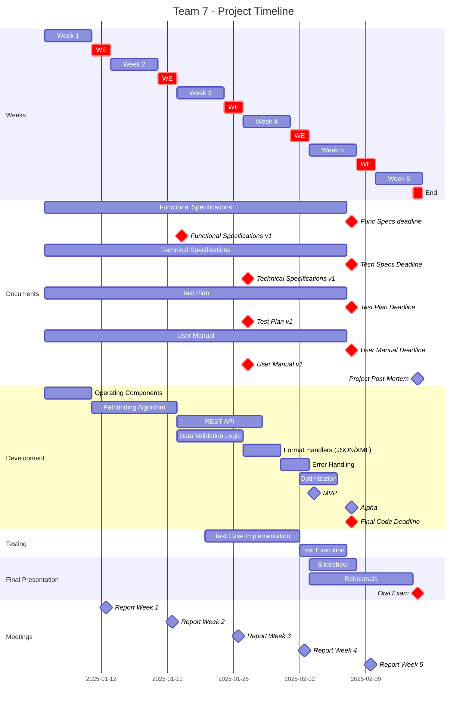
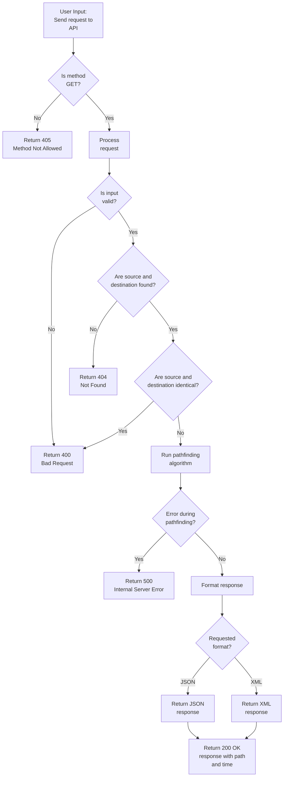

<div align="center">

# Functional Specifications

**Title:** Quickest Path

**Author:** Abderrazaq MAKRAN

**Team:**  7

**Reviewer:** Pierre GORIN

**Created on:** January 6<sup>th</sup>, 2025

**Last updated:** January 30<sup>th</sup>, 2025

---
---
## Document History
| Date       | Version | Document Revision Description | Document Author   |
|------------|---------|-------------------------------|-------------------|
| 01/06/2025 | 0       | Create template               | Abderrazaq MAKRAN |
| 01/16/2025 | 0.5       | Finished Intro (have to check data validation and add back to top) + Doing Functional API Details               | Abderrazaq MAKRAN |
| 01/21/2025 | 1       | First version functional, still needs to be reviewed        | Abderrazaq MAKRAN |
| 01/25/2025 | 1       | Changes in error handling, milestones       | Abderrazaq MAKRAN |
| 01/30/2025 | 1       | Refine graph validation part       | Abderrazaq MAKRAN |
---

## Stakeholders
| Name           | Occupation                  | Links                          |
|----------------|-----------------------------|--------------------------------|
| Franck JEANNIN | Client (ALGOSUP's director) | [Website](https://algosup.com) |

---
</div>

<br><details>
<summary><h2 id="toc"> Table of Contents <i>(Click to expand)</i></h2></summary>

1. [Introduction](#1-introduction)
   - [1.1 Project Scope](#11-project-scope)  
   - [1.2 Project Team](#12-project-team)  
   - [1.3 Project Reviewers](#13-project-reviewers)  
   - [1.4 Deliverables](#14-deliverables)  
   - [1.5 Milestones](#15-milestones)  
   - [1.6 Terms, Acronyms, and Definitions](#16-terms-acronyms-and-definitions)  
2. [System](#2-system)

</details>

---

# 1. Introduction
This document defines the functional specifications of the Quickest Path project, which aims to develop a software solution in C++ that calculates the fastest path between two landmarks in the USA. The system will expose its functionality via a REST API supporting JSON and XML response formats. The main goal is to deliver fast, accurate results within the constraints specified by the client.

## 1.1 Project Scope
| **Feature**                              | **Description**                                                                                 | **In Scope** | **Out of Scope** |
|------------------------------------------|-------------------------------------------------------------------------------------------------|--------------|------------------|
| **Shortest Path Calculation**            | The system must calculate the shortest path between two landmarks using heuristic algorithms.   | ✅            |                  |
| **REST API**                             | The system must expose functionality via a REST API with a single GET endpoint, supporting JSON and XML response formats.   | ✅            |                  |
| **Data Validation**                    | The system must validate the integrity and connectivity of the input dataset.                  | ✅            |                  |
| **Heuristic Optimization**               | The system must use heuristics to maintain performance while staying within the 10% error margin. | ✅            |                  |
| **Multi-Format Support**                 | The API must provide outputs in both JSON and XML formats.                                      | ✅            |                  |
| **Real-Time Responses**                  | The system must deliver responses within 1 second for a standard laptop setup.                 | ✅            |                  |
| **Batch Processing**                     | The system must support batch route calculations for multiple source-destination pairs.         |              | ❌               |
| **User Authentication**                  | The system must authenticate users accessing the API.                                          |              | ❌               |
| **Graphical Interface**                  | The system must provide a graphical user interface for user interaction.                       |              | ❌               |


---
## 1.1.1 Targeted audience
- Software developers
- Logistic companies 

## 1.2 Project Team
| Role              | Description                                                                                                                                                                | Name                                                                 |
|-------------------|--------------------------------------------------------------------------------------------------------------------------------------------------------------------------|----------------------------------------------------------------------|
| Project Manager   | - In charge of organization, planning, and budgeting.<br>- Ensures communication within the team and keeps them motivated.                                                 | [Elone DELILLE](https://www.linkedin.com/in/elonedelille/)           |
| Program Manager   | - Ensures the project meets the client's expectations.<br>- Acts as the intermediary between the client and the development team.<br>- Responsible for writing the Functional Specifications. | [Abderrazaq MAKRAN](https://www.linkedin.com/in/abderrazaq-makran/)  |
| Tech Lead         | - Makes technical decisions for the project.<br>- Translates the Functional Specifications into Technical Specifications.                                  | [Guillaume DERAMCHI](https://www.linkedin.com/in/guillaume-deramchi/)| 
| Technical Writer  | - Writes the documentation for the project.<br>- Based on the specifications, creates a manual for end-users.                                                              | [Tino GABET](https://www.linkedin.com/in/tino-gabet-5794bb32a/)      |
| Software Engineer | - Writes the code and unit tests, comments, and documents the code.<br>- Participates in technical decisions.                                                              | [Benoit DE KEYN](https://www.linkedin.com/in/benoît-de-keyn-71611b293/), [Axel DAVID](https://www.linkedin.com/in/axel-david-6384bb32a/) |
| Quality Assurance | - Tests all product functionalities to find bugs and issues.<br>- Defines the test strategy and writes the Test Plan.<br>- Documents all encountered bugs and ensures their resolution. | [Pierre GORIN](https://www.linkedin.com/in/pierre-gorin-61a784221/)  |

---

## 1.3 Project Reviewers
External project reviewers have been appointed by the project owner to review our specifications and provide feedback.

---

## 1.4 Deliverables
| Deliverable                               | Link to the Document                                          |
|-------------------------------------------|---------------------------------------------------------------|
| Functional Specifications                 | [Functional Specifications](./Functional-Specifications.md)   |
| Technical Specifications                  | [Technical Specifications](./Technical-Specifications.md)     |
| Test Plan                                 | [Test Plan](./Test-Plan.md)                                   |
| User Manual                               | [User Manual](./User-Manual.md)                               |
| Code                                      | [Code Repository](../../Src/software_team3/software_team3.ino)|

---

## 1.5 Milestones

---

## 1.6 Terms, Acronyms, and Definitions
| Term/Acronym                | Definition                                                                                  |
|-----------------------------|----------------------------------------------------------------------------------------------|
| Functional Specifications   | A document explaining what the system needs to do and how it should work.                   |
| Technical Specifications    | A document detailing how the system will be built, including algorithms and data structures.|
| Test Plan                   | A document describing the testing strategy for the system.                                   |
| REST API                    | A web service interface that allows communication using standard HTTP methods.              |
| JSON                        | A lightweight data format that is easy to read and write for both humans and machines.      |
| XML                         | A markup language designed to store and transport data in a structured format.              |
| Heuristic Algorithm         | A problem-solving approach prioritizing speed over precision.                               |
| Dataset                     | A structured collection of data used for analysis and processing.                           |
| Bidirectional Connections   | Connections that allow navigation in both directions between nodes.                         |


## 1.7 Requirements, Constraints, and Assumptions

### 1.7.1 Requirements
<table>
  <thead>
    <tr>
      <th>Category</th>
      <th>Description</th>
    </tr>
  </thead>
  <tbody>
    <tr>
      <td><strong>Language</strong></td>
      <td>The system must be developed in C++ to optimize performance for graph computations and align with project requirements.</td>
    </tr>
    <tr>
      <td><strong>REST API</strong></td>
      <td>
        The system will expose its functionality through a REST API:
        <ul>
          <li><strong>Input:</strong> Accepts the source and destination landmark IDs as query parameters.</li>
          <li><strong>Output:</strong> Returns the total travel time and the ordered list of landmarks along the path.</li>
          <li><strong>Response Formats:</strong> Supports JSON (default) and XML formats.</li>
          <li><strong>Error Handling:</strong> The API must handle and respond with appropriate HTTP status codes (e.g., 200, 400, 404) and descriptive error messages.</li>
        </ul>
      </td>
    </tr>
    <tr>
      <td><strong>Graph Validation (One-Time Check)</strong></td>
      <td>
        The dataset will be processed to generate a graph, which will undergo a one-time validation to:
        <ul>
          <li>Ensure it is free of loops (cycles).</li>
          <li>Verify it is fully connected, ensuring a path exists between any two landmarks.</li>
        </ul>
        This graph will be preloaded into memory and reused for all subsequent queries during the localhost session.
      </td>
    </tr>
    <tr>
      <td><strong>Performance</strong></td>
      <td>
        <ul>
          <li>Respond to all queries within 1 second on a standard development machine (laptop).</li>
          <li>Allow a heuristic margin of up to 10% from the shortest path for performance optimization.</li>
        </ul>
      </td>
    </tr>
    <tr>
      <td><strong>Environment</strong></td>
      <td>
        <ul>
          <li>The system will run exclusively on a localhost environment for development and testing purposes.</li>
        </ul>
      </td>
    </tr>
  </tbody>
</table>


---

### 1.7.2 Constraints
<table>
  <thead>
    <tr>
      <th>Category</th>
      <th>Description</th>
    </tr>
  </thead>
  <tbody>
    <tr>
      <td><strong>Timeline</strong></td>
      <td>The project must adhere to the defined timeline and milestones.</td>
    </tr>
    <tr>
      <td><strong>Hardware</strong></td>
      <td>
        The system must operate efficiently on a standard development laptop with limited computational resources 
        (e.g., 8 GB RAM, quad-core processor).
      </td>
    </tr>
    <tr>
      <td><strong>Graph Validation Frequency</strong></td>
      <td>The graph validation check must only be performed once during the initialization phase and will not be repeated for each query.</td>
    </tr>
    <tr>
      <td><strong>Environment</strong></td>
      <td>
        The system does not require internet connectivity for operation, as all computations are performed locally. 
        Interaction is limited to local API calls (e.g., <code>http://localhost:8080</code>).
      </td>
    </tr>
  </tbody>
</table>

### 1.7.3 Assumptions
<table>
  <thead>
    <tr>
      <th>Assumption</th>
    </tr>
  </thead>
  <tbody>
    <tr>
      <td>The provided dataset is accurate and does not require transformation or corrections beyond loop validation and connectivity checks.</td>
    </tr>
    <tr>
      <td>Users will provide valid and existing landmark IDs for source and destination queries.</td>
    </tr>
    <tr>
      <td>The system is expected to handle only a limited number of concurrent queries during localhost testing.</td>
    </tr>
    <tr>
      <td>The API will not require authentication or encryption for localhost development.</td>
    </tr>
  </tbody>
</table>


---

### 1.8 Risks and Challenges

#### 1.8.1 Risks
<table>
  <thead>
    <tr>
      <th>Risk</th>
      <th>Description</th>
    </tr>
  </thead>
  <tbody>
    <tr>
      <td><strong>Dataset Size</strong></td>
      <td>Large datasets (24 million nodes) may cause performance or memory challenges.</td>
    </tr>
    <tr>
      <td><strong>Algorithm Accuracy</strong></td>
      <td>The use of heuristics for approximations could lead to deviations exceeding the acceptable 10% margin in rare cases.</td>
    </tr>
    <tr>
      <td><strong>System Load</strong></td>
      <td>High query volumes could overload the system, particularly on constrained hardware.</td>
    </tr>
  </tbody>
</table>

#### 1.8.2 Challenges
<table>
  <thead>
    <tr>
      <th>Challenge</th>
      <th>Description</th>
    </tr>
  </thead>
  <tbody>
    <tr>
      <td><strong>Speed vs. Accuracy</strong></td>
      <td>Ensuring that heuristic optimizations maintain a balance between fast response times and acceptable error margins.</td>
    </tr>
    <tr>
      <td><strong>Graph Size Management</strong></td>
      <td>Efficiently managing large datasets in memory for multiple queries without excessive resource consumption.</td>
    </tr>
    <tr>
      <td><strong>Robust Error Handling</strong></td>
      <td>Consistently identifying and communicating errors in input or system operations without impacting the user experience.</td>
    </tr>
  </tbody>
</table>

---

## 1.9 Personas and Use Cases

### 1.9.1 Personas

#### **Persona 1: Sarah, the Backend Developer**
- **Goals**: Integrate the API into a logistics platform for real-time route calculations.  
- **Needs**: Comprehensive API documentation and predictable response times.  
- **Pain Points**: Struggles with datasets that lack clarity or APIs with inconsistent performance.  

#### **Persona 2: Hamid, the Data Scientist**
- **Goals**: Validate the algorithm’s accuracy and analyze performance across large datasets.  
- **Needs**: Clear documentation on heuristic error margins and bulk result validation capabilities.  
- **Pain Points**: Requires well-structured data outputs for downstream processing.  

#### **Persona 3: Leo, the DevOps Engineer**
- **Goals**: Deploy the system on a scalable cloud platform and monitor its performance under heavy load.  
- **Needs**: Precise resource utilization details and robust error handling to ensure uptime.  
- **Pain Points**: Difficulty in deploying systems with unclear technical specifications or insufficient error reporting.  

---

### 1.9.2 Use Case: Calculating the Quickest Path

**Scenario**: A backend developer uses the API to calculate delivery routes for a logistics application.  

#### Input
- Source and destination landmark IDs as query parameters (e.g., `?source=123&destination=456`).  
- Optionally specify response format as `format=json` (default) or `format=xml`.

#### Process
1. The developer submits a GET request with the required parameters.  
2. The system validates the input and checks for errors.  
3. The system retrieves the shortest path from the preloaded graph.  
4. The system formats the result in the requested format (JSON or XML).  
5. The system responds with the calculated travel time and the ordered list of landmarks.

#### Output
##### **200 OK**
- **When**: The query is successful, and the path is found.  
- **Example JSON Response**:  
  ```json
  {
      "time": 120,
      "path": ["123", "234", "345", "456"]
  }
- **Example XML Response**:
  ```XML
        <response>
            <time>120</time>
            <path>
                <landmark>123</landmark>
                <landmark>234</landmark>
                <landmark>345</landmark>
                <landmark>456</landmark>
            </path>
        </response>
  ```
  
# 2. System

## 2.1 Functional API Details

### **2.1.1 Endpoint**

This project will use a single `GET` request method to handle all queries, ensuring simplicity and consistency in the API design.

#### **Endpoint**:
| **Attribute**     | **Description**                                                                                                                                               |
|--------------------|---------------------------------------------------------------------------------------------------------------------------------------------------------------|
| **Description**    | Calculates the quickest path between two landmarks in the graph.                                                                                             |
| **Method**         | `GET`                                                                                                                                                        |
| **Endpoint URL**   | `/quickest-path`                                                                                                                                            |

---

#### **Accepted Headers**
| **Header** | **Description**                             | **Values**                           | **Default**      |
|------------|---------------------------------------------|---------------------------------------|------------------|
| `Accept`   | Specifies the desired response format.      | `application/json`, `application/xml`| `application/json` |

---

#### **Query Parameters**
| **Parameter**  | **Required** | **Description**                                                                                              | **Input Values**         |
|-----------------|-------------|--------------------------------------------------------------------------------------------------------------|-----------------------------|
| `source`       | Yes         | The ID of the starting landmark (A). Must be an integer within the valid range.                              | Integer must be between 1 and 23,947,347      |
| `destination`  | Yes         | The ID of the destination landmark (B). Must be an integer within the valid range.                           | Integer must be between 1 and 23,947,347     |
| `format`       | No          | Overrides the `Accept` header to specify the response format.                                                | `json`, `xml`               |

---

#### **Request Examples**

| **Example**               | **Details**                                                                                     |
|----------------------------|-------------------------------------------------------------------------------------------------|
| **Request with Header**    | ``` GET /quickest-path?source=123&destination=456 HTTP/1.1```<br>```Host: localhost:8080```<br>```Accept: application/json``` |
| **Request with Query Parameter** | ```GET http://localhost:8080/quickest-path?source=123&destination=456&format=xml```                     |

## 2.2 Response Details
### 2.2.1 Success Response

<table>
  <thead>
    <tr>
      <th>HTTP Status</th>
      <th>Condition</th>
      <th>Description</th>
      <th>Example Response</th>
    </tr>
  </thead>
  <tbody>
    <tr>
      <td><strong>200 OK</strong></td>
      <td>Path successfully calculated</td>
      <td>The system calculates the shortest path between the source and destination landmarks.</td>
      <td>
        <strong>JSON:</strong>
        <pre>
{
  "time": 145,
  "path": ["123", "234", "345", "456"]
}
        </pre>
        <strong>XML:</strong>
        <pre>
&lt;response&gt;
  &lt;time&gt;145&lt;/time&gt;
  &lt;path&gt;
    &lt;landmark&gt;123&lt;/landmark&gt;
    &lt;landmark&gt;234&lt;/landmark&gt;
    &lt;landmark&gt;345&lt;/landmark&gt;
    &lt;landmark&gt;456&lt;/landmark&gt;
  &lt;/path&gt;
&lt;/response&gt;
        </pre>
      </td>
    </tr>
  </tbody>
</table>


### 2.2.2 Error Responses
The API returns appropriate error codes with descriptive messages in the requested format (JSON by default):

<table>
  <thead>
    <tr>
      <th>HTTP Status</th>
      <th>Condition</th>
      <th>Description</th>
      <th>Example Response</th>
    </tr>
  </thead>
  <tbody>
    <tr>
      <td><b>400 Bad Request</b></td>
      <td>Malformed request or missing parameters</td>
      <td>The input query is missing required parameters, is incorrectly formatted, or contains identical source and destination landmarks</td>
      <td>
        <b>JSON:</b>
        <pre>
{
  "status": "Invalid or missing parameters.",
  "details": {
    "missing_parameters": ["source", "destination"],
    "resolution": "Ensure both 'source' and 'destination' are included as query parameters.",
    "documentation": "https://example.com/docs#parameters"
  }
}
        </pre>
        <b>XML:</b>
        <pre>
&lt;status&gt;
  &lt;message&gt;Invalid or missing parameters.&lt;/message&gt;
  &lt;details&gt;
    &lt;missing_parameters&gt;
      &lt;parameter&gt;source&lt;/parameter&gt;
      &lt;parameter&gt;destination&lt;/parameter&gt;
    &lt;/missing_parameters&gt;
    &lt;resolution&gt;Ensure both 'source' and 'destination' are included as query parameters.&lt;/resolution&gt;
    &lt;documentation&gt;https://example.com/docs#parameters&lt;/documentation&gt;
  &lt;/details&gt;
&lt;/status&gt;
        </pre>
      </td>
    </tr>
    <tr>
      <td><b>404 Not Found</b></td>
      <td>Invalid source or destination ID</td>
      <td>The <code>source</code> or <code>destination</code> landmark ID does not exist in the dataset.</td>
      <td>
        <b>JSON:</b>
        <pre>
{
  "status": "Landmark not found.",
  "details": {
    "landmark_id": "123",
    "resolution": "Check the dataset for valid landmark IDs.",
    "documentation": "https://example.com/docs#landmarks"
  }
}
        </pre>
        <b>XML:</b>
        <pre>
&lt;status&gt;
  &lt;message&gt;Landmark not found.&lt;/message&gt;
  &lt;details&gt;
    &lt;landmark_id&gt;123&lt;/landmark_id&gt;
    &lt;resolution&gt;Check the dataset for valid landmark IDs.&lt;/resolution&gt;
    &lt;documentation&gt;https://example.com/docs#landmarks&lt;/documentation&gt;
  &lt;/details&gt;
&lt;/status&gt;
        </pre>
      </td>
    </tr>
    <tr>
      <td><b>405 Method Not Allowed</b></td>
      <td>Unsupported HTTP method</td>
      <td>A method other than <code>GET</code> (e.g., <code>POST</code>) is used to access the API.</td>
      <td>
        <b>JSON:</b>
        <pre>
{
  "status": "Method Not Allowed",
  "details": {
    "method_used": "POST",
    "allowed_methods": ["GET"],
    "resolution": "Use the correct HTTP method. Refer to the API documentation for supported methods.",
    "documentation": "https://example.com/docs#http-methods"
  },
  "timestamp": "2025-01-16T14:45:00Z"
}
        </pre>
        <b>XML:</b>
        <pre>
&lt;status&gt;
  &lt;message&gt;Method Not Allowed&lt;/message&gt;
  &lt;details&gt;
    &lt;method_used&gt;POST&lt;/method_used&gt;
    &lt;allowed_methods&gt;
      &lt;method&gt;GET&lt;/method&gt;
    &lt;/allowed_methods&gt;
    &lt;resolution&gt;Use the correct HTTP method. Refer to the API documentation for supported methods.&lt;/resolution&gt;
    &lt;documentation&gt;https://example.com/docs#http-methods&lt;/documentation&gt;
  &lt;/details&gt;
  &lt;timestamp&gt;2025-01-16T14:45:00Z&lt;/timestamp&gt;
&lt;/status&gt;
        </pre>
      </td>
    </tr>
    <tr>
      <td><b>500 Internal Server Error</b></td>
      <td>Unexpected server issue</td>
      <td>The server encountered an error that prevents it from fulfilling the request.</td>
      <td>
        <b>JSON:</b>
        <pre>
{
  "status": "Internal Server Error",
  "details": {
    "error": "Unexpected exception occurred.",
    "resolution": "Check server logs for detailed error information.",
    "documentation": "https://example.com/docs#error-handling"
  }
}
        </pre>
        <b>XML:</b>
        <pre>
&lt;status&gt;
  &lt;message&gt;Internal Server Error&lt;/message&gt;
  &lt;details&gt;
    &lt;error&gt;Unexpected exception occurred.&lt;/error&gt;
    &lt;resolution&gt;Check server logs for detailed error information.&lt;/resolution&gt;
    &lt;documentation&gt;https://example.com/docs#error-handling&lt;/documentation&gt;
  &lt;/details&gt;
&lt;/status&gt;
        </pre>
      </td>
    </tr>
  </tbody>
</table>


## 2.3 Data Validation

### Overview
Graph validation ensures the integrity of the dataset (`USA-roads.csv`) by checking:
1. **DAG Property**: The graph must be a **Directed Acyclic Graph (DAG)**.
2. **Connectivity**: The graph must be **fully connected** (no isolated nodes or subgraphs).
3. **Undirected Interpretation**: After validation, the graph is treated as **undirected** for pathfinding.

### Validation Workflow
The validation process consists of three key stages:

| **Stage**               | **Objective**                                                                 | **Method**                                                                 |
|--------------------------|-------------------------------------------------------------------------------|-----------------------------------------------------------------------------|
| 1. Load the Graph        | Parse the dataset and construct the graph using an adjacency list or matrix. | Efficient data structures for traversal and validation.                    |
| 2. Verify DAG Property   | Ensure the graph contains no cycles.                                         | Use **Depth-First Search (DFS)** for cycle detection.                      |
| 3. Check Connectivity    | Ensure every node is reachable from at least one other node.                 | Use **Breadth-First Search (BFS)** to confirm connectivity.                |
| 4. Transform the Graph   | Convert the graph to undirected for pathfinding.                             | Add reverse edges to every directed edge if not already present.           |

---

### 1. Load the Graph
**Steps**:
- Parse the `USA-roads.csv` file.
- Construct the graph using:
  - **Adjacency List**: A space-efficient representation for large datasets.

**Output**:
- A directed graph ready for validation.

---

### 2. Verify DAG Property
**Objective**: Ensure the graph contains no cycles.

**Method**: Perform cycle detection using **Depth-First Search (DFS)**:
- During traversal, maintain a "visited" list and a "recursion stack."
- If a node is revisited while it is still in the recursion stack, a cycle is detected.

**Steps**:
1. Start DFS from an arbitrary node.
2. Mark the node as "visited" and add it to the recursion stack.
3. Traverse its neighbors:
   - If a neighbor is already in the recursion stack, a cycle exists.
4. Remove the node from the stack after processing all neighbors.
5. Repeat for unvisited nodes.

**Output**:
- **Success**: No cycles detected.
- **Failure**: A cycle is found. Halt validation with an error.

---

### 3. Check Connectivity
**Objective**: Ensure every node is reachable.

**Method**: Perform a connectivity check using **Breadth-First Search (BFS)**:
- Start from an arbitrary node.
- Traverse all reachable nodes, marking them as "visited."
- After traversal, check if all nodes have been visited:
  - If any node remains unvisited, the graph is not fully connected.

**Steps**:
1. Pick a starting node and initialize an empty "visited" list.
2. Use BFS to traverse all connected nodes.
3. After traversal, verify if all nodes are in the "visited" list.
4. If not, report disconnected nodes or subgraphs.

**Output**:
- **Success**: All nodes are connected.
- **Failure**: Isolated nodes or subgraphs detected. Halt validation with an error.

---

### 4. Transform the Graph
**Objective**: Prepare the graph for undirected pathfinding algorithms.

**Steps**:
1. For every directed edge `(A → B)`:
   - Add a reverse edge `(B → A)` if not already present.
2. Save the modified graph in memory.

**Output**:
- A fully undirected graph for use in algorithms.

---

### Final Workflow Summary
| **Stage**               | **Action**                                                                 | **Outcome**                                                             |
|--------------------------|----------------------------------------------------------------------------|-------------------------------------------------------------------------|
| Load the Graph           | Parse the dataset and construct the graph.                                | Graph ready for validation.                                             |
| Verify DAG Property      | Perform cycle detection using DFS.                                        | Confirm acyclicity or halt on failure.                                  |
| Check Connectivity       | Use BFS to ensure all nodes are connected.                                | Confirm connectivity or halt on failure.                                |
| Transform the Graph      | Add reverse edges for undirected interpretation.                          | Undirected graph ready for pathfinding algorithms.                      |

---

### Key Considerations
- **Single-Time Validation**:
  - Validation is conducted only once during system initialization.
  - If validation fails, the system halts to prevent errors in downstream computations.
- **Performance**:
  - DFS and BFS are efficient algorithms for these tasks, making the process scalable for large datasets.

**Error Handling**:
- If cycles are detected:
  - Error: The dataset is not a valid DAG. Cycles detected.
- If connectivity fails:
  - Error: The graph is not fully connected. Isolated nodes detected.

## 2.4 Process Flow

As we explored earlier in this document, here is a small recap of how the process flow for the **Quickest Path REST API** is structured:

| **Step**               | **Description**                                                                                      | **Response**                     |
|------------------------|------------------------------------------------------------------------------------------------------|----------------------------------|
| **Method Validation**  | Ensures the request method is `GET`. If not, the API rejects the request.                            | **405 Method Not Allowed**       |
| **Input Validation**   | Validates `source` and `destination` parameters for presence and correctness.                        | **400 Bad Request**              |
| **Landmark Check**     | Checks if the `source` and `destination` exist in the dataset:                                       |                                  |
|                        | - If either is missing from the dataset, the API returns an error.                                   | **404 Not Found**                |
|                        | - If `source` equals `destination`, the API returns an error indicating identical landmarks.         | **400 Bad Request**              |
| **Pathfinding**        | Executes the A* algorithm to compute the shortest path:                                              |                                  |
|                        | - If an internal error occurs during computation, the API returns an error.                          | **500 Internal Server Error**    |
|                        | - If successful, the calculated path and travel time are processed.                                  | **200 OK**                       |
| **Response Formatting**| Formats the output based on the requested format (JSON by default, or XML if specified).             | **200 OK**                       |
| **Send Response**      | Sends the formatted response with the shortest path and travel time to the user.                     | **200 OK**                       |





### Approvals

| Full name           | Occupation               |Aprovals| Date| 
| ---------------     | ------------------------ |--------| --------| 
| Elone DELILLE       | Project manager          | ✅ ❌  |  02//2025  | 
|  Abderrazaq MAKRAN  | Program manager          | ✅ ❌  |  02//2025  | 
| Guillaume DERAMCHI  | Tech lead                | ✅ ❌  |  02//2025  | 
| Benoit DE KEYN      | Software engineer 1      | ✅ ❌  |  02//2025  | 
| Axel DAVID          | Software engineer 2      | ✅ ❌  |  02//2025  | 
| Pierre GORIN        | Quality assurance        | ✅ ❌  |  02//2025  | 
| Tino GABET          | Technical writer         | ✅ ❌  |  02//2025  | 
