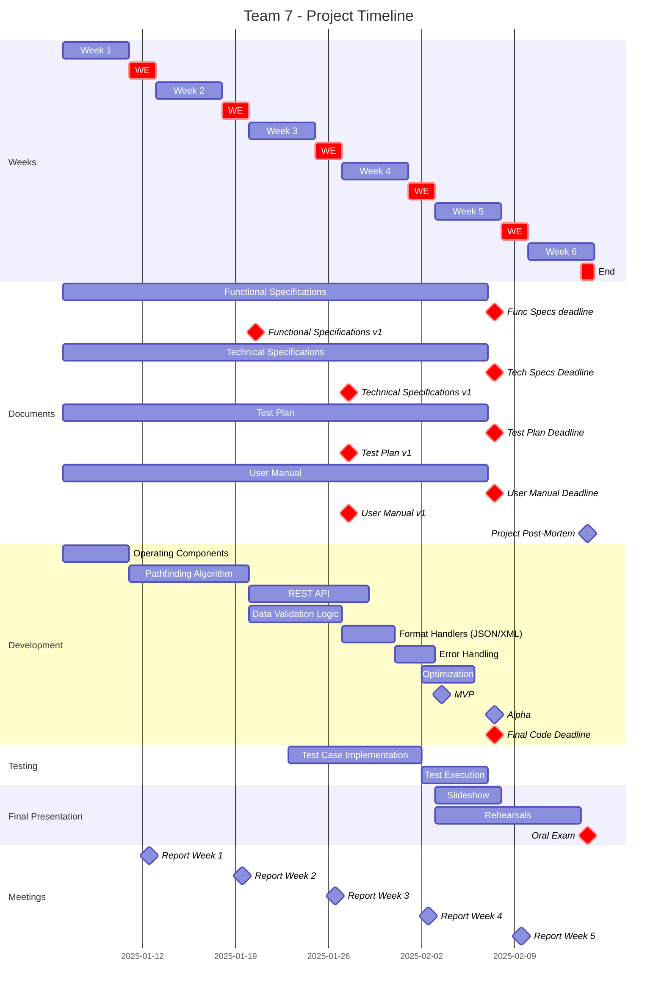
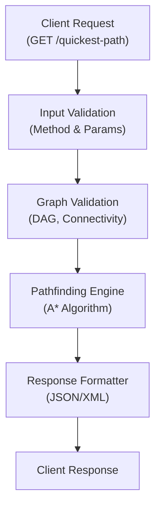
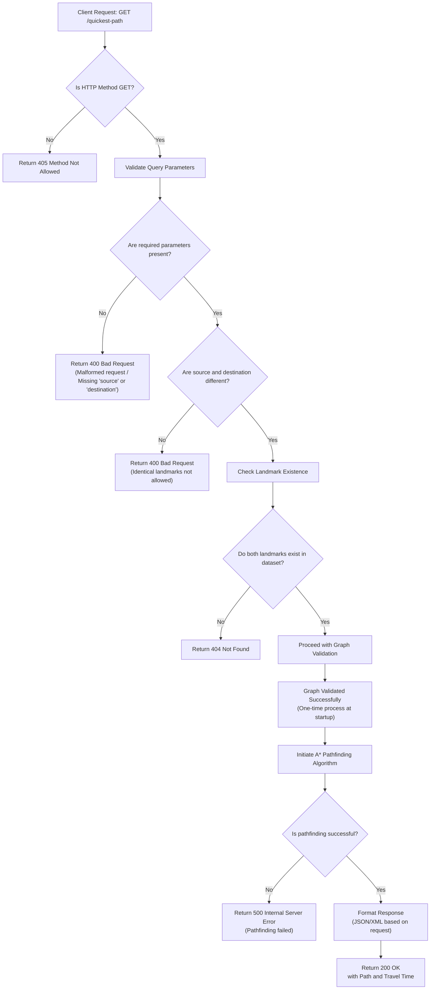
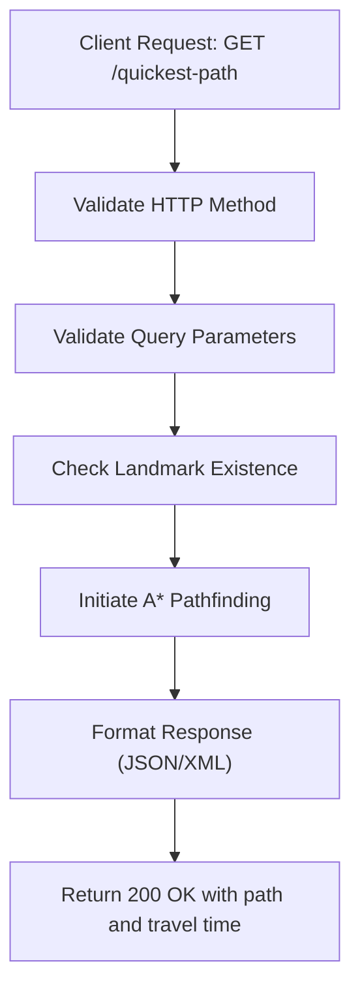
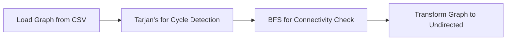

<div align="center">

**Title:** Quickest Path  
**Author:** Abderrazaq MAKRAN  
**Team:** 7  
**Reviewer:** Pierre GORIN  

**Created on:** January 6<sup>th</sup>, 2025  
**Last updated:** February 07<sup>th</sup>, 2025  

</div>

---
# Table of Contents
<details>
  <summary><h2>Expand</h2></summary>

- [Table of Contents](#table-of-contents)
  - [Introduction](#introduction)
    - [Project Scope](#project-scope)
    - [Targeted Audience](#targeted-audience)
    - [Personas](#personas)
    - [Use Case: Calculate the Quickest Path](#use-case-calculate-the-quickest-path)
    - [Project](#project)
    - [Project Reviewers](#project-reviewers)
    - [Deliverables](#deliverables)
    - [Milestones](#milestones)
  - [Requirements](#requirements)
    - [Functional Requirements](#functional-requirements)
    - [Non-Functional Requirements](#non-functional-requirements)
  - [Risks and Assumptions](#risks-and-assumptions)
    - [Risks](#risks)
    - [Assumptions](#assumptions)
  - [System Overview](#system-overview)
    - [Programming language](#programming-language)
    - [Architecture \& Interactions](#architecture--interactions)
    - [Process Flow](#process-flow)
    - [Explanation of Steps](#explanation-of-steps)
  - [API Details](#api-details)
    - [**Basic Shortest Path**](#basic-shortest-path)
    - [**Debug Path**](#debug-path)
    - [**Comparator Path**](#comparator-path)
    - [**Command Endpoint**](#command-endpoint)
    - [API response Handling](#api-response-handling)
      - [Success Case (HTTP 200)](#success-case-http-200)
      - [Error handling](#error-handling)
  - [Data Validation](#data-validation)
    - [Data Validation Process](#data-validation-process)
  - [Algorithm](#algorithm)
    - [Algorithm Selection and Workflow](#algorithm-selection-and-workflow)
    - [Performance Considerations](#performance-considerations)
  - [Interactions and Diagrams](#interactions-and-diagrams)
    - [API Request Process Flow](#api-request-process-flow)
    - [Graph Validation Workflow](#graph-validation-workflow)
  - [Glossary](#glossary)
  - [Document History](#document-history)
  - [Aprovals](#aprovals)

</details>


## Introduction
[⬆ Back to Top](#table-of-contents)

This document describes both the functional and non-functional requirements for the **Quickest Path** project. The system is designed to compute the fastest route between two landmarks in the USA using C++ and expose its functionality via a REST API that supports JSON and XML. In addition to outlining the system’s functionality, we detail performance constraints, error handling, and usability factors so that the document reads as a cohesive article for both technical and non-technical readers.

### Project Scope
| **Feature**                     | **Description**                                                                                 | **In Scope** | **Out of Scope** |
|---------------------------------|-------------------------------------------------------------------------------------------------|--------------|------------------|
| **Shortest Path Calculation**   | Calculate the quickest path using heuristic-based algorithms.                                 | ✅           |                  |
| **REST API**                    | Provide a single GET endpoint supporting JSON and XML formats.                                | ✅           |                  |
| **Data Validation**             | Validate dataset integrity, ensuring no cycles and full connectivity.                         | ✅           |                  |
| **Heuristic Optimization**      | Use heuristics to maintain performance within a 10% error margin.                               | ✅           |                  |
| **Real-Time Responses**         | Deliver responses within 1 second on a standard development laptop.                           | ✅           |                  |
| **Batch Processing**            | Support multiple route queries in a single request.                                           |            | ❌                |
| **User Authentication**         | Authenticate users accessing the API.                                                         |            | ❌                |
| **Graphical Interface**         | Provide a GUI for user interaction.                                                           |            | ❌                |

### Targeted Audience
- **Software Developers:** Integrate the API into logistics platforms.
- **Logistics Companies:** Use calculated routes for efficient delivery.
- **Data Scientists and DevOps Engineers:** Validate algorithm performance and manage deployments.

### Personas

---
 **Persona 1: Sarah Dubois – The Backend Developer**  
- **Age:** 29  
- **Role:** Backend Developer at a Logistics Tech Company  
- **Technical Level:** Advanced (Software Engineering, APIs, Databases)  

**Background & Experience:**  
Sarah has been working as a backend developer for six years, focusing on building APIs and integrating third-party services. She works at a logistics tech company that optimizes delivery routes for e-commerce businesses. She is comfortable working with REST APIs, databases, and server-side optimizations.  

**Goals & Motivations:**  
- Wants a **reliable and efficient API** for calculating the fastest delivery routes.  
- Needs an **easy-to-integrate API** that fits into her company's logistics platform.  
- Prefers **well-documented APIs** to minimize development time and debugging efforts.  

**Pain Points & Frustrations:**  
- **Slow APIs** that cause delays in route calculations.  
- **Poorly documented APIs** that require trial and error to integrate.  
- **Inaccurate route estimations** that lead to delivery inefficiencies.  

**How *Quickest Path* Helps:**  
✅ **Fast API response times** (under 1 second) improve logistics efficiency.  
✅ **Simple REST API integration** with clear documentation reduces development time.  
✅ **Accurate route calculations** (within 10% error margin) ensure reliable delivery planning.  

---

**Persona 2: Marc Lefevre – The Logistics Manager**  
- **Age:** 42  
- **Role:** Logistics Manager at a National Delivery Company  
- **Technical Level:** Low (Basic IT skills, Uses logistics software)  

**Background & Experience:**  
Marc has been managing delivery operations for over 15 years. He oversees a fleet of drivers and ensures that deliveries arrive on time. While he is comfortable using logistics software, he **does not code** and relies on user-friendly tools for decision-making.  

**Goals & Motivations:**  
- Needs a system that **optimizes delivery routes in real-time**.  
- Wants to **reduce fuel costs and delivery times** for better efficiency.  
- Prefers a solution that is **accurate and does not require technical knowledge**.  

**Pain Points & Frustrations:**  
- **Inefficient routing** causes unnecessary delays and increases costs.  
- **Complicated software** that requires technical knowledge to use.  
- **Slow response times** from routing systems, leading to poor real-time decisions.  

**How *Quickest Path* Helps:**  
✅ **Accurate shortest path calculations** help optimize delivery schedules.  
✅ **Fast response times** allow real-time decision-making for rerouting.  
✅ **Simple API integration** means his company’s logistics software can use it without complex configurations.

---

### Use Case: Calculate the Quickest Path

| **Use Case ID**   | UC-01 |
|------------------|-----------|
| **Use Case Name** | Calculate the Quickest Path Between Two Landmarks |
| **Actor**        | User (Backend System or Developer) |
| **Preconditions** | The API is running, and the dataset is loaded. |
| **Trigger**      | The user sends a GET request to `/quickest-path` with `source` and `destination` parameters. |
| **Main Flow**    | 1. The system receives the request. <br> 2. It validates the query parameters. <br> 3. It checks if the landmarks exist in the dataset. <br> 4. It calculates the quickest path using the A* algorithm. <br> 5. The system returns the result in JSON or XML format. |
| **Alternative Flow** | If invalid input is detected, the system returns an error response (e.g., `400 Bad Request`, `404 Not Found`). |
| **Postconditions** | The system provides the shortest path and estimated travel time. |
| **Exceptions** | If an unexpected issue occurs, return `500 Internal Server Error`. |

---

### Project
[⬆ Back to Top](#table-of-contents)
| **Role**              | **Description**                                                                                                                                       | **Name**                                                                 |
|-----------------------|-------------------------------------------------------------------------------------------------------------------------------------------------------|--------------------------------------------------------------------------|
| Project Manager       | Oversees project organization and communication.                                                                                                    | [Elone DELILLE](https://www.linkedin.com/in/elonedelille/)               |
| Program Manager       | Acts as the liaison between the client and development team; compiles specifications.                                                                 | [Abderrazaq MAKRAN](https://www.linkedin.com/in/abderrazaq-makran/)      |
| Tech Lead             | Oversees technical decisions and architecture.                                                                                                       | [Guillaume DERAMCHI](https://www.linkedin.com/in/guillaume-deramchi/)      |
| Technical Writer      | Develops user and technical documentation.                                                                                                             | [Tino GABET](https://www.linkedin.com/in/tino-gabet-5794bb32a/)          |
| Software Engineers    | Develop code, write tests, and maintain documentation.                                                                                                 | [Benoit DE KEYN](https://www.linkedin.com/in/benoît-de-keyn-71611b293/), [Axel DAVID](https://www.linkedin.com/in/axel-david-6384bb32a/) |
| Quality Assurance     | Test and document product functionalities and issues.                                                                                                  | [Pierre GORIN](https://www.linkedin.com/in/pierre-gorin-61a784221/)       |

### Project Reviewers
External reviewers have been appointed to ensure the document meets quality and clarity standards.

### Deliverables
| **Deliverable**                | **Link**                                           |
|--------------------------------|----------------------------------------------------|
| Functional & Non-Functional Specifications | [Functional & Non-Functional Specifications](../Functional/FunctionalSpecifications.md) |
| Technical Specifications       | [Technical Specifications](../Technical/TechnicalSpecifications.md) |
| Test Plan                      | [Test Startegy](../QA/TestStrategy.md)                        |
| User Manual                    | [User Manual](https://quickest-path-team-7.gitbook.io/quickest-path-team-7-docs/)                    |
| Code Repository                | [Code Repository](../../) |

### Milestones

---

## Requirements
[⬆ Back to Top](#table-of-contents)
### Functional Requirements
- **Route Calculation:**  
  The API computes the quickest path between two given landmarks using an A* algorithm.
- **REST API Interface:**  
  A single `GET` endpoint `/quickest-path` accepts query parameters (`source`, `destination`, and optional `format`) and returns results in JSON (default) or XML.
- **Data Validation:**  
  The system performs a one-time validation of the dataset to ensure it is a Directed Acyclic Graph (DAG) and fully connected.
- **Error Handling:**  
  The API provides clear error responses with HTTP status codes (400, 404, 405, 500) and descriptive messages.
- **Response Time:**  
  Each query is processed within 1 second on a standard development laptop.

### Non-Functional Requirements
- **Performance:**
  - **Execution Time:** Queries are processed within 1 second.
  - **Scalability:** The system scales efficiently to handle increasing dataset sizes (up to 24 million nodes) while managing memory consumption.
- **Reliability and Robustness:**
  - The system consistently produces meaningful error messages with appropriate HTTP status codes.
  - Graph validation is performed only once during system startup to reduce processing overhead.
- **Usability:**
  - Comprehensive API documentation and clear error messages ensure ease of integration.
  - The API supports both JSON and XML response formats.
- **Maintainability:**
  - A modular and well-commented codebase facilitates future enhancements and debugging.
- **Security:**
  - Since the system is developed and tested in a local environment, advanced security measures (e.g., authentication and encryption) are not implemented.
- **Portability:**
  - Developed in C++ to leverage performance in graph computations and to ensure cross-platform compatibility.

---

## Risks and Assumptions
### Risks
- **Large Dataset:**  
  Handling up to 24 million nodes may lead to performance and memory issues if the system is not properly optimized.
- **Heuristic Accuracy:**  
  The use of approximations in the A* algorithm might produce paths that exceed the acceptable 10% error margin.
- **High System Load:**  
  A surge in query volume or concurrent requests could overwhelm the system, particularly on limited-resource hardware.
- **Data Quality:**  
  Inaccuracies or inconsistencies in the dataset might compromise the correctness of the computed paths.

### Assumptions
- **Dataset Integrity:**  
  The provided dataset is assumed to be accurate, complete, and requires only a one-time validation.
- **Valid Inputs:**  
  Users will supply valid, existing landmark IDs for both the source and destination.
- **Static Graph:**  
  The graph remains static during a session, making the one-time validation sufficient.
- **Local Environment:**  
  The system operates in a localhost environment, so advanced security measures are not necessary.
- **Limited Concurrency:**  
  It is assumed that initial usage will involve a limited number of concurrent queries.


## System Overview
[⬆ Back to Top](#table-of-contents)
### Programming language
- **C++ Implementation**: Optimized for performance using STL libraries.
- **REST Server**: Lightweight HTTP server for localhost deployment.
### Architecture & Interactions
The system is designed in modular layers:

- **Input Layer:** Receives HTTP GET requests and validates the method and query parameters.
- **Validation Layer:** Loads and validates the dataset (graph parsing, DAG and connectivity checks).
- **Processing Layer:** Executes the A* algorithm using the pre-validated and transformed (undirected) graph.
- **Response Layer:** Formats the results into JSON or XML as requested and handles error responses.

**Interactions Diagram:**



### Process Flow
The following diagram illustrates the complete process flow for handling a request to the `/quickest-path` endpoint. It details each step from request reception to final response, including error handling at every stage.



### Explanation of Steps
1. **Request Reception:**
   - The client sends a GET request to `/quickest-path`.

2. **HTTP Method Validation:**
   - The system verifies that the HTTP method is GET; if not, it returns a **405 Method Not Allowed** error.

3. **Query Parameter Validation:**
   - The system checks that both `source` and `destination` parameters are provided.
   - If any are malformed or missing, a **400 Bad Request** error is returned.

4. **Input Consistency:**
   - The system ensures that the `source` and `destination` values are not identical.
   - If they are identical, a **400 Bad Request** error is returned.

5. **Landmark Existence Check:**
   - The system confirms that both landmarks exist in the dataset.
   - If either landmark is missing, a **404 Not Found** error is returned.

6. **Graph Validation:**
   - The system validates the graph (ensuring it is a Directed Acyclic Graph and fully connected), which is performed once during system initialization.

7. **Pathfinding Execution:**
   - The A* algorithm is initiated to compute the quickest path.

8. **Error Handling in Pathfinding:**
   - If the pathfinding process fails, a **500 Internal Server Error** is returned.

9. **Response Formatting:**
   - If the computation is successful, the response is formatted in JSON or XML based on the request.

10. **Final Response:**
    - The system returns a **200 OK** response that includes the computed path and travel time.

---

## API Details
[⬆ Back to Top](#table-of-contents)

The following endpoints are available for interacting with the server:

### **Basic Shortest Path**
- **Endpoint**: `/quickest-path`
- **Description**: Calculates the shortest path between two nodes using A*.
- **Parameters**:
  - `start` (integer): The starting node.
  - `end` (integer): The ending node.
  - `format` (optional): Response format (`json` or `xml`).
- **Example**:
  ```
  GET http://localhost:<port>/path?start=1&end=5
  ```
  **Response** (JSON):
  ```json
  {
    "path": [1, 3, 5], 
    "total_time": 42,  
    "approximation": "9.8% above optimal"  
  }
  ```


---

### **Debug Path**
- **Endpoint**: `/debug_path`
- **Description**: Provides detailed information about the calculated path, including heuristic weight, computation time, and more.
- **Parameters**: Same as `/quickest-path`.
- **Example**:
  ```
  GET http://localhost:<port>/debug_path?start=1&end=5
  ```
  **Response** (JSON):
  ```json
  {
    "path": [1, 3, 5],
    "distance": 12.5,
    "time_ms": 1.2,
    "heuristic_weight": 1.5
  }
  ```

---

### **Comparator Path**
- **Endpoint**: `/comp_path`
- **Description**: Compares the shortest paths calculated by A* and Dijkstra algorithms.
- **Parameters**: Same as `/quickest-path`.
- **Example**:
  ```
  GET http://localhost:<port>/comp_path?start=1&end=5
  ```
  **Response** (JSON):
  ```json
  {
    "a_star": {
      "path": [1, 3, 5],
      "distance": 12.5,
      "time_ms": 1.2
    },
    "dijkstra": {
      "path": [1, 3, 5],
      "distance": 12.5,
      "time_ms": 1.8
    }
  }
  ```

---

### **Command Endpoint**
- **Endpoint**: `/cmd`
- **Description**: Sends a command to the application via the API.
- **Parameters**:
  - `command` (string): The CLI command to execute.
  - `format` (optional): Response format (`json` or `xml`).
- **Example**:
  ```
  GET http://localhost:<port>/cmd?command=build%20graph
  ```

### API response Handling
#### Success Case (HTTP 200)
Example JSON:
```json
{  
  "path": [1, 3, 5], 
  "total_time": 42,  
  "approximation": "9.8% above optimal"  
} 
```
Example XML:
```xml
<path>  
  <landmarks>  
    <landmark>1</landmark>  
    <landmark>2</landmark>  
    <landmark>5</landmark>  
  </landmarks>  
  <total_time>42</total_time>  
  <approximation>9.8% above optimal</approximation>  
</path> 
```
#### Error handling
The API returns appropriate error codes and descriptive messages in the requested format (JSON by default):
| HTTP Status | Condition | Example Response (JSON) |
|-------------|-----------|-------------------------|
|400|Identical source/destination|`{ "status": "Invalid parameters", "details": "Source and destination must differ" }`|
|400|Missing parameters|`{ "status": "Missing 'source' and 'destination' parameters" }`|
|404|Invalid landmark ID|`{ "status": "Landmark 0 not found in dataset" }`|
|405|Unsupported HTTP method|`{ "status": "GET method required" }`|
|500|Internal server error|`{ "status": "Path calculation service unavailable" }`|


## Data Validation
The system validates the dataset by:
- **DAG verification** during preprocessing to ensure no cycles exist in the directed graph representation.
- **Connectivity check** to confirm the graph forms a single connected component (no isolated subgraphs).
- **Runtime interpretation** of the graph as undirected for pathfinding, even though verification treats edges as directed.

*Note: This validation is performed once during system initialization.*

### Data Validation Process
- **Cycle Detection**: Uses Tarjan's algorithm O(V + E) to verify acyclicity
- **Connectivity Check**: Employ BFS algorithm to confirm single strongly connected component
- Validation is performed once during system initialization

While the dataset is validated as a directed acyclic graph (DAG), all pathfinding algorithms treat connections as bidirectional to reflect real-world road networks.

## Algorithm
[⬆ Back to Top](#table-of-contents)
### Algorithm Selection and Workflow

The system uses the **A\*** algorithm due to its balance of efficiency and accuracy. Optionally, the ALT heuristic (landmarks-based) may be applied to further optimize performance. Additionally, a **Dijkstra algorithm** is implemented to compare paths and computation times against A*.

**Workflow:**

1. **Load Graph Data:** Parse the dataset and build the adjacency list.
2. **Validate Graph:** Ensure the graph is acyclic and fully connected.
3. **Initialize Search:** Begin A\* from the source node.
4. **Compute Path:** Expand nodes based on `f(n) = g(n) + h(n)` until the destination is reached.
5. **Format Response:** Return the total travel time and the ordered list of landmarks.

### Performance Considerations

- **Time Complexity:**
  - Graph Parsing & Validation: O(V + E)
  - A\* Search: O(E log V)
- **Memory Efficiency:** Optimized to handle large datasets (up to 24 million nodes) without excessive resource consumption.
- **Accuracy:** The computed path must remain within a 10% error margin compared to the optimal path.

---

## Interactions and Diagrams

### API Request Process Flow



### Graph Validation Workflow


## Glossary
[⬆ Back to Top](#table-of-contents)
| **Term**                                | **Definition**                                                                                                                                                                                                                                                                       |
|-----------------------------------------|--------------------------------------------------------------------------------------------------------------------------------------------------------------------------------------------------------------------------------------------------------------------------------------|
| **Adjacency List**                      | A data structure used to represent a graph by listing each node and its directly connected neighbors. This structure is efficient for traversing and processing large graphs.                                                                                                  |
| **A\* Algorithm**                       | A pathfinding algorithm that uses both the actual cost from the start and a heuristic estimate to efficiently find the shortest path between two points.                                                                                                                           |
| **ALT Heuristic**                       | An enhancement to the A* algorithm that uses precomputed distances from selected landmark points to improve the accuracy of the heuristic and further speed up the search process.                                                                                             |
| **API (Application Programming Interface)** | A set of rules and protocols that allow different software systems to communicate and exchange data.                                                                                                                                                                               |
| **BFS (Breadth-First Search)**          | An algorithm that explores a graph level by level, ensuring that all nodes at a given distance are processed before moving on. It is commonly used to check connectivity in a graph.                                                                                            |
| **C++**                                 | A high-performance programming language used to build complex and efficient systems. It is particularly well-suited for tasks that require fast computations, such as graph processing in the Quickest Path project.                                                            |
| **Connectivity**                        | A measure of how well nodes in a graph are connected, meaning every node can be reached from any other node. This ensures that the network of landmarks is complete and functional.                                                                                           |
| **Cycle**                               | A path in a graph that starts and ends at the same node, forming a loop. The system ensures that the graph is acyclic (has no cycles) to avoid infinite loops during processing.                                                                                               |
| **Dataset**                             | A structured collection of data. In this project, the dataset includes information about landmarks and the roads connecting them, which is used to build the graph for pathfinding.                                         |
| **Dijkstra’s Algorithm**                 | A graph search algorithm that finds the shortest path from a source node to all other nodes by expanding the lowest-cost paths first. Unlike A*, it does not use heuristics, making it optimal but potentially slower in large graphs. |
| **Directed Acyclic Graph (DAG)**        | A type of graph where each edge has a direction and there are no cycles (i.e., no way to start at one node and return to it by following the directed edges). This ensures the graph can be processed without getting caught in loops.                                     |
| **Edge**                                | A connection between two nodes in a graph, representing a road or route between landmarks.                                                                                                                                                                                          |
| **Error Handling**                      | The process of detecting, managing, and reporting errors within a system. It ensures that users receive clear, helpful feedback when something goes wrong, such as an invalid request or a system failure.                                                                       |
| **Gantt Chart**                         | A visual tool used in project management that displays tasks, durations, and deadlines over a timeline, helping teams plan and track project progress.                                                                                                                           |
| **Graph**                               | A collection of nodes (or vertices) connected by edges. In this context, it represents the network of landmarks (nodes) and the roads connecting them (edges).                                                                                                                    |
| **Heuristic**                           | An educated guess used by algorithms (like A*) to estimate the cost from a current node to the destination. It helps speed up the search for the shortest path by reducing unnecessary calculations.                                                                           |
| **JSON (JavaScript Object Notation)**   | A lightweight data format that represents data as key-value pairs. It is easy for both humans and machines to read and write, making it popular for data exchange between servers and web applications.                                                                          |
| **Latency**                             | The delay between when a request is made and when the response is received. In the Quickest Path system, ensuring low latency is critical for real-time performance.                                                                                                           |
| **Localhost**                           | The local computer or server on which the system is running. During development and testing, the application typically operates on localhost rather than over a public network.                                                                                                |
| **Milestone**                           | A significant checkpoint or goal in a project timeline that marks the completion of important tasks or phases.                                                                                                                                                                      |
| **Node**                                | A single point or vertex in a graph. For the Quickest Path system, each node represents a landmark.                                                                                                                                                                                 |
| **Priority Queue**                      | A special data structure that always removes the element with the highest priority (often the smallest cost in pathfinding) first. It is used in algorithms like A* to efficiently determine the next node to process.                                                     |
| **Process Flow**                        | A diagram or detailed description that outlines the sequence of steps or stages in a system’s operation, from receiving an input to generating the final output.                                                                                                               |
| **REST API**                            | A web service that uses standard HTTP methods (e.g., GET, POST) to allow applications to interact over the internet, typically returning data in formats like JSON or XML.                                                                                                        |
|**Tarjan's algorithm**|A linear-time graph traversal method that identifies strongly connected components (SCCs) in a directed graph, enabling cycle detection and validating Directed Acyclic Graph (DAG) properties during data integrity checks|
| **XML (eXtensible Markup Language)**    | A markup language that uses custom tags to structure data in a readable format. It is widely used for storing and transporting data.                                                                                                                                                  |

## Document History
[⬆ Back to Top](#table-of-contents)
| **Date**       | **Version** | **Description**                                             | **Author**           |
|----------------|-------------|-------------------------------------------------------------|----------------------|
| 01/06/2025     | 0           | Create template                                             | Abderrazaq MAKRAN    |
| 01/16/2025     | 0.5         | Finished Introduction and started Functional API Details    | Abderrazaq MAKRAN    |
| 01/21/2025     | 1           | First version functional                                    | Abderrazaq MAKRAN    |
| 01/25/2025     | 1.2           | Updated error handling and milestones                       | Abderrazaq MAKRAN    |
| 01/30/2025     | 1.4           | Refined graph validation section                            | Abderrazaq MAKRAN    |
| 02/03/2025     | 1.6         | Added algorithm details and updated non-functional section   | Abderrazaq MAKRAN    |
| 02/04/2025     | 1.8         | Reviewed the doc   | Abderrazaq MAKRAN    |
| 02/06/2025     | 1.9         | Pre-final version   | Abderrazaq MAKRAN    |
| 02/07/2025     | 2        | Final version   | Abderrazaq MAKRAN    |


## Aprovals 

| Full name           | Occupation               |Aprovals| Date| 
| ---------------     | ------------------------ |--------| --------| 
| Elone DELILLE       | Project manager          | ✅  |  02/07/2025  | 
|  Abderrazaq MAKRAN  | Program manager          | ✅  |  02/07/2025  | 
| Guillaume DERAMCHI  | Tech lead                | ✅  |  02/07/2025  | 
| Benoit DE KEYN      | Software engineer 1      | ✅  |  02/07/2025  | 
| Axel DAVID          | Software engineer 2      | ✅  |  02/07/2025  | 
| Pierre GORIN        | Quality assurance        | ✅  |  02/07/2025  | 
| Tino GABET          | Technical writer         | ✅  |  02/07/2025  | 

