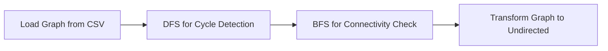

<div align="center">

**Title:** Quickest Path  
**Author:** Abderrazaq MAKRAN  
**Team:** 7  
**Reviewer:** Pierre GORIN  

**Created on:** January 6<sup>th</sup>, 2025  
**Last updated:** February 04<sup>th</sup>, 2025  

</div>

---

<details>
  <summary><h2>Expand Table of Contents</h2></summary>

- [Introduction](#introduction)
  - [Project Scope](#project-scope)
  - [Targeted Audience](#targeted-audience)
  - [Project](#project)
  - [Project Reviewers](#project-reviewers)
  - [Deliverables](#deliverables)
  - [Milestones](#milestones)
  - [Document History](#document-history)
- [| 02/06/2025     | 1.9         | Pre-final version   | Abderrazaq MAKRAN    |](#-02062025------19----------pre-final-version----abderrazaq-makran----)
- [Requirements](#requirements)
  - [Functional Requirements](#functional-requirements)
  - [Non-Functional Requirements](#non-functional-requirements)
- [Risks and Assumptions](#risks-and-assumptions)
  - [Risks](#risks)
  - [Assumptions](#assumptions)
- [System Overview](#system-overview)
  - [Architecture \& Interactions](#architecture--interactions)
  - [Process Flow](#process-flow)
  - [Explanation of Steps](#explanation-of-steps)
- [API Details](#api-details)
  - [Endpoint and Request/Response Details](#endpoint-and-requestresponse-details)
  - [Error Responses](#error-responses)
  - [Data Validation](#data-validation)
- [Algorithm](#algorithm)
  - [Algorithm Selection and Workflow](#algorithm-selection-and-workflow)
  - [Performance Considerations](#performance-considerations)
- [Interactions and Diagrams](#interactions-and-diagrams)
  - [API Request Process Flow](#api-request-process-flow)
  - [Graph Validation Workflow](#graph-validation-workflow)
- [Glossary](#glossary)
- [Aprovals](#aprovals)

</details>


## Introduction

This document describes both the functional and non-functional requirements for the **Quickest Path** project. The system is designed to compute the fastest route between two landmarks in the USA using C++ and expose its functionality via a REST API that supports JSON and XML. In addition to outlining the system’s functionality, we detail performance constraints, error handling, and usability factors so that the document reads as a cohesive article for both technical and non-technical readers.

### Project Scope
| **Feature**                     | **Description**                                                                                 | **In Scope** | **Out of Scope** |
|---------------------------------|-------------------------------------------------------------------------------------------------|--------------|------------------|
| **Shortest Path Calculation**   | Calculate the quickest path using heuristic-based algorithms.                                 | ✅           |                  |
| **REST API**                    | Provide a single GET endpoint supporting JSON and XML formats.                                | ✅           |                  |
| **Data Validation**             | Validate dataset integrity, ensuring no cycles and full connectivity.                         | ✅           |                  |
| **Heuristic Optimization**      | Use heuristics to maintain performance within a 10% error margin.                               | ✅           |                  |
| **Real-Time Responses**         | Deliver responses within 1 second on a standard development laptop.                           | ✅           |                  |
| **Batch Processing**            | Support multiple route queries in a single request.                                           |            | ❌                |
| **User Authentication**         | Authenticate users accessing the API.                                                         |            | ❌                |
| **Graphical Interface**         | Provide a GUI for user interaction.                                                           |            | ❌                |

### Targeted Audience
- **Software Developers:** Integrate the API into logistics platforms.
- **Logistics Companies:** Use calculated routes for efficient delivery.
- **Data Scientists and DevOps Engineers:** Validate algorithm performance and manage deployments.

### Project
| **Role**              | **Description**                                                                                                                                       | **Name**                                                                 |
|-----------------------|-------------------------------------------------------------------------------------------------------------------------------------------------------|--------------------------------------------------------------------------|
| Project Manager       | Oversees project organization and communication.                                                                                                    | [Elone DELILLE](https://www.linkedin.com/in/elonedelille/)               |
| Program Manager       | Acts as the liaison between the client and development team; compiles specifications.                                                                 | [Abderrazaq MAKRAN](https://www.linkedin.com/in/abderrazaq-makran/)      |
| Tech Lead             | Oversees technical decisions and architecture.                                                                                                       | [Guillaume DERAMCHI](https://www.linkedin.com/in/guillaume-deramchi/)      |
| Technical Writer      | Develops user and technical documentation.                                                                                                             | [Tino GABET](https://www.linkedin.com/in/tino-gabet-5794bb32a/)          |
| Software Engineers    | Develop code, write tests, and maintain documentation.                                                                                                 | [Benoit DE KEYN](https://www.linkedin.com/in/benoît-de-keyn-71611b293/), [Axel DAVID](https://www.linkedin.com/in/axel-david-6384bb32a/) |
| Quality Assurance     | Test and document product functionalities and issues.                                                                                                  | [Pierre GORIN](https://www.linkedin.com/in/pierre-gorin-61a784221/)       |

### Project Reviewers
External reviewers have been appointed to ensure the document meets quality and clarity standards.

### Deliverables
| **Deliverable**                | **Link**                                           |
|--------------------------------|----------------------------------------------------|
| Functional & Non-Functional Specifications | [Functional & Non-Functional Specifications](./Functional-Specifications.md) |
| Technical Specifications       | [Technical Specifications](./Technical-Specifications.md) |
| Test Plan                      | [Test Plan](./Test-Plan.md)                        |
| User Manual                    | [User Manual](./User-Manual.md)                    |
| Code Repository                | [Code Repository](../../Src/software_team3/software_team3.ino) |

### Milestones

---

### Document History
| **Date**       | **Version** | **Description**                                             | **Author**           |
|----------------|-------------|-------------------------------------------------------------|----------------------|
| 01/06/2025     | 0           | Create template                                             | Abderrazaq MAKRAN    |
| 01/16/2025     | 0.5         | Finished Introduction and started Functional API Details    | Abderrazaq MAKRAN    |
| 01/21/2025     | 1           | First version functional                                    | Abderrazaq MAKRAN    |
| 01/25/2025     | 1.2           | Updated error handling and milestones                       | Abderrazaq MAKRAN    |
| 01/30/2025     | 1.4           | Refined graph validation section                            | Abderrazaq MAKRAN    |
| 02/03/2025     | 1.6         | Added algorithm details and updated non-functional section   | Abderrazaq MAKRAN    |
| 02/04/2025     | 1.8         | Reviewed the doc   | Abderrazaq MAKRAN    |
| 02/06/2025     | 1.9         | Pre-final version   | Abderrazaq MAKRAN    |
---

## Requirements

### Functional Requirements
- **Route Calculation:**  
  The API computes the quickest path between two given landmarks using an A* algorithm.
- **REST API Interface:**  
  A single `GET` endpoint `/quickest-path` accepts query parameters (`source`, `destination`, and optional `format`) and returns results in JSON (default) or XML.
- **Data Validation:**  
  The system performs a one-time validation of the dataset to ensure it is a Directed Acyclic Graph (DAG) and fully connected.
- **Error Handling:**  
  The API provides clear error responses with HTTP status codes (400, 404, 405, 500) and descriptive messages.
- **Response Time:**  
  Each query is processed within 1 second on a standard development laptop.

### Non-Functional Requirements
- **Performance:**
  - **Execution Time:** Queries are processed within 1 second.
  - **Scalability:** The system scales efficiently to handle increasing dataset sizes (up to 24 million nodes) while managing memory consumption.
- **Reliability and Robustness:**
  - The system consistently produces meaningful error messages with appropriate HTTP status codes.
  - Graph validation is performed only once during system startup to reduce processing overhead.
- **Usability:**
  - Comprehensive API documentation and clear error messages ensure ease of integration.
  - The API supports both JSON and XML response formats.
- **Maintainability:**
  - A modular and well-commented codebase facilitates future enhancements and debugging.
- **Security:**
  - Since the system is developed and tested in a local environment, advanced security measures (e.g., authentication and encryption) are not implemented.
- **Portability:**
  - Developed in C++ to leverage performance in graph computations and to ensure cross-platform compatibility.

---

## Risks and Assumptions

### Risks
- **Large Dataset:**  
  Handling up to 24 million nodes may lead to performance and memory issues if the system is not properly optimized.
- **Heuristic Accuracy:**  
  The use of approximations in the A* algorithm might produce paths that exceed the acceptable 10% error margin.
- **High System Load:**  
  A surge in query volume or concurrent requests could overwhelm the system, particularly on limited-resource hardware.
- **Data Quality:**  
  Inaccuracies or inconsistencies in the dataset might compromise the correctness of the computed paths.

### Assumptions
- **Dataset Integrity:**  
  The provided dataset is assumed to be accurate, complete, and requires only a one-time validation.
- **Valid Inputs:**  
  Users will supply valid, existing landmark IDs for both the source and destination.
- **Static Graph:**  
  The graph remains static during a session, making the one-time validation sufficient.
- **Local Environment:**  
  The system operates in a localhost environment, so advanced security measures are not necessary.
- **Limited Concurrency:**  
  It is assumed that initial usage will involve a limited number of concurrent queries.


## System Overview

### Architecture & Interactions
The system is designed in modular layers:

- **Input Layer:** Receives HTTP GET requests and validates the method and query parameters.
- **Validation Layer:** Loads and validates the dataset (graph parsing, DAG and connectivity checks).
- **Processing Layer:** Executes the A* algorithm using the pre-validated and transformed (undirected) graph.
- **Response Layer:** Formats the results into JSON or XML as requested and handles error responses.

**Interactions Diagram:**


### Process Flow
The following diagram illustrates the complete process flow for handling a request to the `/quickest-path` endpoint. It details each step from request reception to final response, including error handling at every stage.


### Explanation of Steps

1. **Request Reception:**
   - The client sends a GET request to `/quickest-path`.

2. **HTTP Method Validation:**
   - The system verifies that the HTTP method is GET; if not, it returns a **405 Method Not Allowed** error.

3. **Query Parameter Validation:**
   - The system checks that both `source` and `destination` parameters are provided.
   - If any are malformed or missing, a **400 Bad Request** error is returned.

4. **Input Consistency:**
   - The system ensures that the `source` and `destination` values are not identical.
   - If they are identical, a **400 Bad Request** error is returned.

5. **Landmark Existence Check:**
   - The system confirms that both landmarks exist in the dataset.
   - If either landmark is missing, a **404 Not Found** error is returned.

6. **Graph Validation:**
   - The system validates the graph (ensuring it is a Directed Acyclic Graph and fully connected), which is performed once during system initialization.

7. **Pathfinding Execution:**
   - The A* algorithm is initiated to compute the quickest path.

8. **Error Handling in Pathfinding:**
   - If the pathfinding process fails, a **500 Internal Server Error** is returned.

9. **Response Formatting:**
   - If the computation is successful, the response is formatted in JSON or XML based on the request.

10. **Final Response:**
    - The system returns a **200 OK** response that includes the computed path and travel time.

---

## API Details

### Endpoint and Request/Response Details

**Endpoint**  
- **Method:** GET  
- **URL:** `/quickest-path`  

**Accepted Headers**  
| Header | Values | Default |
|--------|--------|---------|
| `Accept` | `application/json`, `application/xml` | `application/json` |

**Query Parameters**  
| Parameter   | Required | Description |
|-------------|----------|-------------|
| `source`      | Yes      | The starting landmark ID (integer between `1` and `23,947,347`). |
| `destination` | Yes      | The destination landmark ID (integer between `1` and `23,947,347`). |
| `format`      | No       | Overrides the Accept header to return either `json` or `xml`. |

**Request Examples**

- **Using Headers:**
    ```bash
    GET /quickest-path?source=123&destination=456 HTTP/1.1
    Host: localhost:8080
    Accept: application/json
    ```
- **Using Query Parameter:**
    ```pgsql
    GET http://localhost:8080/quickest-path?source=123&destination=456&format=xml
    ```

### Error Responses

The API returns appropriate error codes and descriptive messages in the requested format (JSON by default):

<table>
  <thead>
    <tr>
      <th>HTTP Status</th>
      <th>Condition</th>
      <th>Description</th>
      <th>Example Response</th>
    </tr>
  </thead>
  <tbody>
    <tr>
      <td><b>400 Bad Request</b></td>
      <td>Malformed request or missing parameters</td>
      <td>The input query is missing required parameters, is incorrectly formatted, or contains identical source and destination landmarks</td>
      <td>
        <b>JSON:</b>
        <pre>
{
  "status": "Invalid or missing parameters.",
  "details": {
    "missing_parameters": ["source", "destination"],
    "resolution": "Ensure both 'source' and 'destination' are included as query parameters.",
    "documentation": "https://example.com/docs#parameters"
  }
}
        </pre>
        <b>XML:</b>
        <pre>
&lt;status&gt;
  &lt;message&gt;Invalid or missing parameters.&lt;/message&gt;
  &lt;details&gt;
    &lt;missing_parameters&gt;
      &lt;parameter&gt;source&lt;/parameter&gt;
      &lt;parameter&gt;destination&lt;/parameter&gt;
    &lt;/missing_parameters&gt;
    &lt;resolution&gt;Ensure both 'source' and 'destination' are included as query parameters.&lt;/resolution&gt;
    &lt;documentation&gt;https://example.com/docs#parameters&lt;/documentation&gt;
  &lt;/details&gt;
&lt;/status&gt;
        </pre>
      </td>
    </tr>
    <tr>
      <td><b>404 Not Found</b></td>
      <td>Invalid source or destination ID</td>
      <td>The <code>source</code> or <code>destination</code> landmark ID does not exist in the dataset.</td>
      <td>
        <b>JSON:</b>
        <pre>
{
  "status": "Landmark not found.",
  "details": {
    "landmark_id": "123",
    "resolution": "Check the dataset for valid landmark IDs.",
    "documentation": "https://example.com/docs#landmarks"
  }
}
        </pre>
        <b>XML:</b>
        <pre>
&lt;status&gt;
  &lt;message&gt;Landmark not found.&lt;/message&gt;
  &lt;details&gt;
    &lt;landmark_id&gt;123&lt;/landmark_id&gt;
    &lt;resolution&gt;Check the dataset for valid landmark IDs.&lt;/resolution&gt;
    &lt;documentation&gt;https://example.com/docs#landmarks&lt;/documentation&gt;
  &lt;/details&gt;
&lt;/status&gt;
        </pre>
      </td>
    </tr>
    <tr>
      <td><b>405 Method Not Allowed</b></td>
      <td>Unsupported HTTP method</td>
      <td>A method other than <code>GET</code> (e.g., <code>POST</code>) is used to access the API.</td>
      <td>
        <b>JSON:</b>
        <pre>
{
  "status": "Method Not Allowed",
  "details": {
    "method_used": "POST",
    "allowed_methods": ["GET"],
    "resolution": "Use the correct HTTP method. Refer to the API documentation for supported methods.",
    "documentation": "https://example.com/docs#http-methods"
  },
  "timestamp": "2025-01-16T14:45:00Z"
}
        </pre>
        <b>XML:</b>
        <pre>
&lt;status&gt;
  &lt;message&gt;Method Not Allowed&lt;/message&gt;
  &lt;details&gt;
    &lt;method_used&gt;POST&lt;/method_used&gt;
    &lt;allowed_methods&gt;
      &lt;method&gt;GET&lt;/method&gt;
    &lt;/allowed_methods&gt;
    &lt;resolution&gt;Use the correct HTTP method. Refer to the API documentation for supported methods.&lt;/resolution&gt;
    &lt;documentation&gt;https://example.com/docs#http-methods&lt;/documentation&gt;
  &lt;/details&gt;
  &lt;timestamp&gt;2025-01-16T14:45:00Z&lt;/timestamp&gt;
&lt;/status&gt;
        </pre>
      </td>
    </tr>
    <tr>
      <td><b>500 Internal Server Error</b></td>
      <td>Unexpected server issue</td>
      <td>The server encountered an error that prevents it from fulfilling the request.</td>
      <td>
        <b>JSON:</b>
        <pre>
{
  "status": "Internal Server Error",
  "details": {
    "error": "Unexpected exception occurred.",
    "resolution": "Check server logs for detailed error information.",
    "documentation": "https://example.com/docs#error-handling"
  }
}
        </pre>
        <b>XML:</b>
        <pre>
&lt;status&gt;
  &lt;message&gt;Internal Server Error&lt;/message&gt;
  &lt;details&gt;
    &lt;error&gt;Unexpected exception occurred.&lt;/error&gt;
    &lt;resolution&gt;Check server logs for detailed error information.&lt;/resolution&gt;
    &lt;documentation&gt;https://example.com/docs#error-handling&lt;/documentation&gt;
  &lt;/details&gt;
&lt;/status&gt;
        </pre>
      </td>
    </tr>
  </tbody>
</table>

### Data Validation

The system validates the dataset by:

- **Loading the Graph:** Parsing the `USA-roads.csv` file into an adjacency list.
- **Verifying the DAG Property:** Using Depth-First Search (DFS) to detect cycles.
- **Checking Connectivity:** Using Breadth-First Search (BFS) to ensure every node is reachable.
- **Transforming the Graph:** Converting the graph into an undirected version by adding reverse edges.

*Note: This validation is performed once during system initialization.*

---

## Algorithm

### Algorithm Selection and Workflow

The system uses the **A\*** algorithm due to its balance of efficiency and accuracy. Optionally, the ALT heuristic (landmarks-based) may be applied to further optimize performance.

**Workflow:**

1. **Load Graph Data:** Parse the dataset and build the adjacency list.
2. **Validate Graph:** Ensure the graph is acyclic and fully connected.
3. **Initialize Search:** Begin A\* from the source node.
4. **Compute Path:** Expand nodes based on `f(n) = g(n) + h(n)` until the destination is reached.
5. **Format Response:** Return the total travel time and the ordered list of landmarks.

### Performance Considerations

- **Time Complexity:**
  - Graph Parsing & Validation: O(V + E)
  - A\* Search: O(E log V)
- **Memory Efficiency:** Optimized to handle large datasets (up to 24 million nodes) without excessive resource consumption.
- **Accuracy:** The computed path must remain within a 10% error margin compared to the optimal path.

---

## Interactions and Diagrams

### API Request Process Flow


### Graph Validation Workflow


## Glossary

| **Term**                                | **Definition**                                                                                                                                                                                                                                                                       |
|-----------------------------------------|--------------------------------------------------------------------------------------------------------------------------------------------------------------------------------------------------------------------------------------------------------------------------------------|
| **Adjacency List**                      | A data structure used to represent a graph by listing each node and its directly connected neighbors. This structure is efficient for traversing and processing large graphs.                                                                                                  |
| **A\* Algorithm**                       | A pathfinding algorithm that uses both the actual cost from the start and a heuristic estimate to efficiently find the shortest path between two points.                                                                                                                           |
| **ALT Heuristic**                       | An enhancement to the A* algorithm that uses precomputed distances from selected landmark points to improve the accuracy of the heuristic and further speed up the search process.                                                                                             |
| **API (Application Programming Interface)** | A set of rules and protocols that allow different software systems to communicate and exchange data.                                                                                                                                                                               |
| **BFS (Breadth-First Search)**          | An algorithm that explores a graph level by level, ensuring that all nodes at a given distance are processed before moving on. It is commonly used to check connectivity in a graph.                                                                                            |
| **C++**                                 | A high-performance programming language used to build complex and efficient systems. It is particularly well-suited for tasks that require fast computations, such as graph processing in the Quickest Path project.                                                            |
| **Cycle**                               | A path in a graph that starts and ends at the same node, forming a loop. The system ensures that the graph is acyclic (has no cycles) to avoid infinite loops during processing.                                                                                               |
| **Dataset**                             | A structured collection of data. In this project, the dataset includes information about landmarks and the roads connecting them, which is used to build the graph for pathfinding.                                                                                           |
| **DFS (Depth-First Search)**            | An algorithm that explores as far along a branch as possible before backtracking, used for tasks like detecting cycles in a graph.                                                                                                                                                     |
| **Directed Acyclic Graph (DAG)**        | A type of graph where each edge has a direction and there are no cycles (i.e., no way to start at one node and return to it by following the directed edges). This ensures the graph can be processed without getting caught in loops.                                     |
| **Edge**                                | A connection between two nodes in a graph, representing a road or route between landmarks.                                                                                                                                                                                          |
| **Error Handling**                      | The process of detecting, managing, and reporting errors within a system. It ensures that users receive clear, helpful feedback when something goes wrong, such as an invalid request or a system failure.                                                                       |
| **Gantt Chart**                         | A visual tool used in project management that displays tasks, durations, and deadlines over a timeline, helping teams plan and track project progress.                                                                                                                           |
| **Graph**                               | A collection of nodes (or vertices) connected by edges. In this context, it represents the network of landmarks (nodes) and the roads connecting them (edges).                                                                                                                    |
| **Heuristic**                           | An educated guess used by algorithms (like A*) to estimate the cost from a current node to the destination. It helps speed up the search for the shortest path by reducing unnecessary calculations.                                                                           |
| **JSON (JavaScript Object Notation)**   | A lightweight data format that represents data as key-value pairs. It is easy for both humans and machines to read and write, making it popular for data exchange between servers and web applications.                                                                          |
| **Latency**                             | The delay between when a request is made and when the response is received. In the Quickest Path system, ensuring low latency is critical for real-time performance.                                                                                                           |
| **Localhost**                           | The local computer or server on which the system is running. During development and testing, the application typically operates on localhost rather than over a public network.                                                                                                |
| **Milestone**                           | A significant checkpoint or goal in a project timeline that marks the completion of important tasks or phases.                                                                                                                                                                      |
| **Node**                                | A single point or vertex in a graph. For the Quickest Path system, each node represents a landmark.                                                                                                                                                                                 |
| **Connectivity**                        | A measure of how well nodes in a graph are connected, meaning every node can be reached from any other node. This ensures that the network of landmarks is complete and functional.                                                                                           |
| **Priority Queue**                      | A special data structure that always removes the element with the highest priority (often the smallest cost in pathfinding) first. It is used in algorithms like A* to efficiently determine the next node to process.                                                     |
| **Process Flow**                        | A diagram or detailed description that outlines the sequence of steps or stages in a system’s operation, from receiving an input to generating the final output.                                                                                                               |
| **REST API**                            | A web service that uses standard HTTP methods (e.g., GET, POST) to allow applications to interact over the internet, typically returning data in formats like JSON or XML.                                                                                                        |
| **XML (eXtensible Markup Language)**    | A markup language that uses custom tags to structure data in a readable format. It is widely used for storing and transporting data.                                                                                                                                                  |


## Aprovals 

| Full name           | Occupation               |Aprovals| Date| 
| ---------------     | ------------------------ |--------| --------| 
| Elone DELILLE       | Project manager          | ✅ ❌  |  02//2025  | 
|  Abderrazaq MAKRAN  | Program manager          | ✅ ❌  |  02//2025  | 
| Guillaume DERAMCHI  | Tech lead                | ✅ ❌  |  02//2025  | 
| Benoit DE KEYN      | Software engineer 1      | ✅ ❌  |  02//2025  | 
| Axel DAVID          | Software engineer 2      | ✅ ❌  |  02//2025  | 
| Pierre GORIN        | Quality assurance        | ✅ ❌  |  02//2025  | 
| Tino GABET          | Technical writer         | ✅ ❌  |  02//2025  | 

