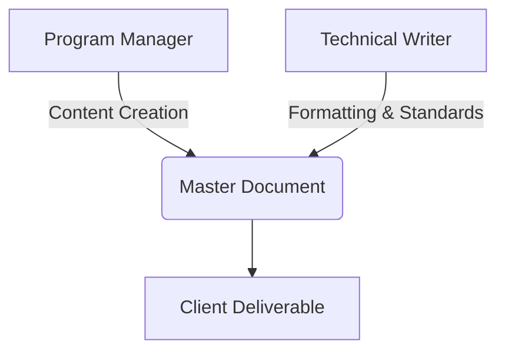

# 2025 Project-3 Quickest Path - Management Artifacts

## Tasks & Schedule  
[View task breakdown](https://docs.google.com/spreadsheets/d/1XBGgOjMhQ_CW64SqnH2uuRP3tVOOQJplV8oolVPCH8s/edit?usp=sharing)  

## RACI Matrix  
| Name                     | Project Manager | Program Manager | Software Engineer | QA Engineer | Technical Writer | Client |
|--------------------------|-----------------|-----------------|--------------------|-------------|-------------------|--------|
| Project kick-off         | I               | R/A             | I                  | I           | I                 | C      |
| Requirement Analysis     | R               | A               | C                  | C           | C                 | I      |
| API Development          | A               | C               | R                  | I           | I                 | /      |
| Algorithm Optimization   | C               | I               | R/A                | C           | /                 | /      |
| System Testing           | A               | I               | C                  | R           | C                 | I      |
| Documentation            | C               | R/A             | I                  | I           | R/A               | I      |

**Legend:** R=Responsible, A=Accountable, C=Consulted, I=Informed

## Risks & Assumptions
| ID | Risk Description               | Impact  | Likelihood | Mitigation Strategy                          |
|----|---------------------------------|---------|------------|----------------------------------------------|
| 1  | Dataset size affecting performance | High   | Medium     | Implement memory-efficient data structures  |
| 2  | Algorithm accuracy deviations   | Critical| Medium     | Regular validation against reference datasets|
| 3  | High query volume strain        | High    | Low        | Load testing with simulated traffic patterns |

## Key Performance Indicators

### Core Technical KPIs
**1. API Response Time**

$$ \text{avg}(t_{response}) < 1000\text{ms} $$ 

[Target: <1s]
- **Definition**: Average time between request receipt and response delivery  
- **Rationale**: Ensures real-time usability for navigation systems  
- **Measurement**: Automated logging of 100 sample requests/hour  

**2. Algorithm Accuracy**  

$$ \frac{\text{calculated path}}{\text{shortest path}} \leq 1.1 $$ 

[Max 10% deviation]
- **Definition**: Max 10% deviation from optimal route  
- **Rationale**: Balances speed with acceptable detour margins  
- **Measurement**: Weekly validation against 50 benchmark routes  

**3. System Availability**  

$$ \frac{\text{operational time}}{\text{total time}} \geq 0.999 $$ 

[99.9% availability] 
- **Definition**: 24/7 operational reliability  
- **Rationale**: Critical for emergency service integrations  
- **Measurement**: Ping checks every 5 minutes  

### Team Performance KPIs
**4. Team Mood Index**  

$$
\text{Mood Score} = \left( \frac{\sum \text{Weekly Member Ratings}}{\text{Team Size}} \right) \times 10
$$

- Current Score: 8.5/10 🌟  
- **Definition**: Weekly anonymous survey (1-10 scale)  
- **Rationale**: High morale correlates with productivity  
- **Measurement**: Google Form survey every Friday  

**5. Task Efficiency**  

$$
\text{Completion Rate} = \left( \frac{\text{Completed Tasks}}{\text{Planned Tasks}} \right) \times 100 = 92\%
$$

- **Definition**: Weekly milestone achievement ratio  
- **Rationale**: Tracks planning accuracy and execution speed  
- **Measurement**: Jira task tracking with daily standup updates  

**6. Progress Velocity**  

$$
\text{Weekly Progress} = \left( \frac{\text{Achieved Milestones}}{\text{Planned Milestones}} \right) \times 100 = 95\%
$$

- **Definition**: Feature completion against roadmap  
- **Rationale**: Ensures predictable delivery timeline  
- **Measurement**: GitHub project board tracking  

### Supplemental Metrics
| KPI | Current Value | Target | Measurement Frequency |
|-----|---------------|--------|------------------------|
| Code Quality | 88% | 90% | SonarQube (Server) weekly scans |
| Documentation Coverage | 95% | 100% | Bi-weekly audits |
| Bug Resolution Time | 4.2h | <6h | Bug detection on our side, bug resolution time. |

### Documentation Progress
$$ \text{Completion} = \left(\frac{\text{completed sections}}{\text{total sections}}\right) \times 100 $$

## Weekly Reports
- [Week 1 Report](/weekly/week1.md)
- [Week 2 Report](/weekly/week2.md) 
- [Week 3 Report](/weekly/week3.md)
- [Week 4 Report](/weekly/week4.md)
- [Week 5 Report](/weekly/week5.md)
- [Week 6 Report](/weekly/week6.md) - Not done yet

## Post Mortem Analysis
[View retrospective analysis](./post_mortem.md) - Not done yet

## Addendum: Program Manager/Technical Writer Collaboration
The merged documentation approach will use:

**Collaboration Process:**
1. Weekly sync meetings every Monday
2. Shared Google Doc with revision history
3. Unified style guide for documentation
4. Joint approval process for final versions