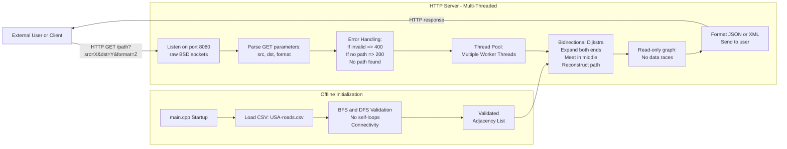

# Technical Specifications Document

# Table of Contents
- [Executive Summary](#executive-summary)
- [Project Overview](#project-overview)
- [System Requirements](#system-requirements)
	- [Programming Language](#programming-language)
	- [Dependencies](#dependencies)
- [System Architecture](#system-architecture)
- [Core Algorithms](#core-algorithms)
	- [Bidirectional Dijkstra](#bidirectional-dijkstra)
	- [Potential A* Extension](#potential-a-extension)
- [Data Handling](#data-handling)
	- [Input Format](#input-format)
	- [Data Integrity Verification](#data-integrity-verification)
- [Multi-Threading Strategy](#multi-threading-strategy)
- [Approximation Heuristics](#approximation-heuristics)
- [REST API Specifications](#rest-api-specifications)
	- [Endpoint: GET /path](#endpoint-get-path)
- [Time and Space Complexity](#time-and-space-complexity)
- [Error Handling](#error-handling)
- [Scalability Considerations](#scalability-considerations)
- [C++23 Features Used](#c23-features-used)
- [How to Re-Implement the Project](#how-to-re-implement-the-project)
- [Code Examples](#code-examples)
	- [Planned Improvements](#planned-improvements)
- [Contributors](#contributors)
- [License](#license)
- [Additional Implementation Considerations](#additional-implementation-considerations)
- [Revision History](#revision-history)
- [Glossary](#glossary)

## Executive Summary

This specification describes a system to find the quickest path between two landmarks in a large-scale U.S. road network (up to 24+ million nodes). The service must respond to queries within 1 second on a typical laptop and is accessed via a minimal REST API. Key objectives include:
- Loading and validating a massive CSV dataset.
- Implementing a pathfinding engine using Bidirectional Dijkstra (with optional approximations to allow up to 10% deviation from the true shortest path).
- Serving JSON or XML results over HTTP.
- Ensuring enough detail for any engineer to replicate the solution from scratch.

By adhering to modern C++23 features and a straightforward architecture, the project remains flexible while meeting performance and scalability goals.

## Project Overview

The objective of this project is to develop a high-performance software solution that calculates the quickest path between two landmarks in the United States. The project must:
1. Load a large dataset (USA-roads.csv) with up to 24+ million nodes.
2. Respond to pathfinding queries within 1 second on a typical laptop.
3. Provide results via a REST API over HTTP running on localhost.
4. Return an ordered list of landmarks along the path, plus the total travel time.
5. Allow JSON or XML output formats.
6. Tolerate a maximum of 10% error compared to the true shortest path, if necessary (i.e., approximate solutions).

Additionally, data integrity checks must confirm:
- The graph is free of unexpected loops or anomalies (though a bidirectional road network normally contains cycles, so this is interpreted as “no invalid or self-loop edges”).
- The graph is sufficiently connected to allow navigation between any two landmarks.

## System Requirements

### Programming Language
- The entire project is developed in C++ (C++23 standard), using only the STL and minimal low-level sockets for the HTTP server.
- No external libraries (besides what is strictly needed for raw sockets) are used, unless explicitly allowed.

### Dependencies
- C++23 Compiler: e.g., GCC 13+ or Clang 16+.
- Build System:
  - CMake or a Makefile can be used (example provided).

Note: We do not rely on other libraries like Crow or nlohmann/json in the final code sample, to respect the requirement of “no libraries beside STL.” However, if your environment permits, you can optionally incorporate them.

## System Architecture

Below is an outline of the main components. A diagram may be added for clarity (for example, a UML or flowchart to illustrate data and control flows):
1. Data Loader & Validator
	- Reads the CSV file, determines the maximum node ID, allocates adjacency lists, and loads bidirectional edges.
	- Performs connectivity check (BFS) and a naive cycle check (DFS) to confirm data integrity.
2. Pathfinding Engine
	- Implements a Bidirectional Dijkstra approach.
	- (Optionally) can incorporate heuristic approximations if needed to maintain the 10% error bound for speed.
3. Minimal HTTP Server
	- Listens on a specified port (e.g., 8080) using raw BSD sockets (via `<sys/socket.h>`, `<netinet/in.h>`, `<unistd.h>`).
	- Accepts GET requests of the form:
	  ```
	  GET /path?src=<id>&dst=<id>&format=<json_or_xml>
	  ```
	- Dispatches pathfinding queries and returns results in JSON or XML.
4. Response Formatter
	- Converts the final path and travel time into the requested format (JSON or XML) before sending it back to the client.

## Core Algorithms

### Bidirectional Dijkstra

Bidirectional Dijkstra is employed to improve performance over standard Dijkstra. It searches forward from the source and backward from the destination simultaneously. When both searches meet, we reconstruct the path.
- Forward Frontier: The usual Dijkstra from src.
- Backward Frontier: Another Dijkstra from dst.
- Meet Condition: When a node is settled by both searches, we have a candidate shortest path.

Note: For extremely large graphs (24+ million nodes), advanced techniques like Contraction Hierarchies or A* with Landmarks could be considered. However, the provided reference implementation shows how to do a simpler approach with minimal code.

### Potential A* Extension

Although not fully implemented in the current code, A* could be integrated if approximate heuristics are desired to ensure:
- Faster lookup in sparse graphs.
- Up to 10% deviation from the true shortest path (meets the problem requirement).

## Data Handling

### Input Format

We are provided a CSV file, e.g. USA-roads.csv, with lines:

```
LandmarkA_ID,LandmarkB_ID,Time
```

- Bidirectional: If A->B is listed, we insert edges for A->B and B->A.
- Time: An integer representing travel cost in an unspecified time unit.

### Data Integrity Verification

The Data Validation Tool must:
1. Connectivity Check
	- A BFS from the first node that has edges to count how many nodes are reachable.
	- If significantly fewer than the total nodes are visited, warn about potential disconnected components.
2. Naive Cycle Check
	- A DFS-based check for back-edges.
	- In a genuinely bidirectional road network, cycles are expected. But we still ensure there are no invalid self-loops or anomalies.

## Multi-Threading Strategy

For minimal demonstration, the provided code runs single-threaded. If multi-threading is desired, the following approach can be integrated:
- Thread Pool: Create a pool of worker threads that handle incoming HTTP requests in parallel.
- Concurrency Handling:
  - If the graph data is read-only, multiple threads can safely access it without locks.
  - A mutex or other synchronization would be necessary if any shared data (caches, logs, etc.) can be modified.
- Load-Balancing: If the server must handle many simultaneous pathfinding requests, distributing these requests across multiple threads (or processes) ensures better utilization of CPU cores.

## Approximation Heuristics

To satisfy the requirement that the path not exceed the shortest path by more than 10%, you can:
- Implement a bounding heuristic in Bidirectional Dijkstra (stop expansions when the cost is significantly larger than the best known route).
- Switch to A* with an admissible or near-admissible heuristic.
- Use partial precomputation like ALT (landmark distances) or Contraction Hierarchies for near-instant queries.

The code as-is finds an exact path. Adding a 10% margin can prune expansions that already exceed the best candidate path cost by more than 10%.

## REST API Specifications

### Endpoint: GET /path

Request Example:

```
GET /path?src=123&dst=456&format=json
```

- Parameters:
  - src: Source landmark ID (integer)
  - dst: Destination landmark ID (integer)
  - format: Response format, either json or xml

JSON Response:

```json
{
  "time": 692052,
  "path": [123, 82031, 100, ... , 456]
}
```

XML Response:

```xml
<response>
  <time>692052</time>
  <path>
	 <landmark>123</landmark>
	 <landmark>82031</landmark>
	 <landmark>100</landmark>
	 <!-- ... -->
	 <landmark>456</landmark>
  </path>
</response>
```

## Time and Space Complexity

| Algorithm              | Time Complexity | Space Complexity |
|------------------------|-----------------|------------------|
| Bidirectional Dijkstra | O((V + E) log V)| O(V + E)         |
| Connectivity Check     | O(V + E)        | O(V)             |
| Cycle Check            | O(V + E)        | O(V)             |

Where:
- V = number of vertices (landmarks)
- E = number of edges (2× each CSV line, because bidirectional)

## Error Handling
- Invalid Node ID: Return 400 Bad Request if src or dst is out of range.
- No Path Found: Return a 200 OK with a simple JSON or XML message “No path found.”
- CSV Load Failure: Log an error and exit.
- Memory/Out-Of-Range Errors: Handled by verifying file format or throwing exceptions (implementation-dependent).
- HTTP Parsing Errors: Return 400 Bad Request if the request is malformed.
- Security-Related Errors: If the server is exposed beyond localhost, consider rejecting malformed or suspicious queries to mitigate potential attacks.

## Scalability Considerations
1. Memory: With 24+ million nodes, memory usage can be significant. If the dataset cannot fit into available RAM, consider out-of-core or distributed approaches.
2. Advanced Precomputation: Contraction Hierarchies or ALT for sub-second queries at large scales.
3. Caching: Save frequently queried routes to avoid repeated computation.
4. Horizontal Scaling: Multiple instances behind a load balancer if high concurrency is expected.
5. Concurrency: Serving multiple requests simultaneously (via multi-threading or processes) ensures better responsiveness under load.

## C++23 Features Used

We rely on modern C++ for clearer code, though the core logic (BFS, DFS, Dijkstra) remains standard:
- Range-based for loops for adjacency traversal.
- Structured bindings (`auto [u, cd] = pq.top()`) for clarity in priority queues.
- `std::priority_queue` with a custom comparator.
- `std::filesystem` (optional) for file checks.
- Relaxed `constexpr` for utility functions.
- Potential coroutines for asynchronous tasks if implementing advanced concurrency.


## 13. How to Re-Implement the Project

Below is a step-by-step summary so software engineers can rebuild the entire solution from scratch:

1. **Folder Structure (example):**

```
.
├── data_validation.hpp
├── data_validation.cpp
├── pathfinder.hpp
├── pathfinder.cpp
├── server.hpp
├── server.cpp
├── main.cpp
└── Makefile (or CMakeLists.txt)
```

2. **Data Validation (data_validation.cpp / .hpp):**
	- Implements:
	  - `checkConnectivity(adj)`: BFS to confirm reachability across the graph.
	  - `checkForCycle(adj)`: DFS to confirm no self-loops or unexpected anomalies.

3. **Pathfinding (pathfinder.cpp / .hpp):**
	- Defines `struct Edge { int to; int cost; };`
	- Implements `bidirectionalDijkstra(src, dst, adj, pathOut)`.

4. **Server (server.cpp / .hpp):**
	- Minimal raw-socket HTTP server:
	  - Binds to a port, listens for connections.
	  - Parses GET requests like `GET /path?src=..&dst=..&format=...`
	  - Calls the pathfinder function, returns JSON/XML.

5. **Main (main.cpp):**
	- Reads `USA-roads.csv` in two passes:
	  1. First pass: find max node ID and count lines.
	  2. Second pass: build adjacency (`std::vector<std::vector<Edge>>`).
	- Performs data validation (connectivity + cycle check).
	- Starts the server on the requested port.

6. **Compilation:**
	- Either use CMake or a Makefile.
	- Example Makefile snippet:

	  ```makefile
	  CXX = g++
	  CXXFLAGS = -std=c++23 -O2 -Wall

	  all: server

	  server: main.o data_validation.o pathfinder.o server.o
			$(CXX) $(CXXFLAGS) -o server main.o data_validation.o pathfinder.o server.o

	  clean:
			rm -f *.o server
	  ```

	- Run `make` (or `cmake --build .` if using CMake).

7. **Running:**

	```sh
	./server USA-roads.csv 8080
	```

	- It loads the CSV, prints validation info, then “Server listening on port 8080…”.

8. **Testing:**

	```sh
	curl "http://127.0.0.1:8080/path?src=123&dst=456&format=json"
	```

	- Expects JSON. Or use `format=xml` for XML output.

Following these steps, engineers can replicate the entire pipeline (CSV loading, data validation, pathfinding, minimal REST API) without difficulty.

## 14. Code Examples

Below are sample implementations of the core components. They illustrate a minimalistic approach but can be expanded as needed.

```cpp
// data_validation.hpp
#ifndef DATA_VALIDATION_HPP
#define DATA_VALIDATION_HPP

#include <vector>
#include <string>

struct Edge {
	 int to;
	 int cost;
};

class DataValidation {
public:
	 bool loadCSV(const std::string& filename);
	 const std::vector<std::vector<Edge>>& getAdjacencyList() const {
		  return adjacencyList_;
	 }
private:
	 std::vector<std::vector<Edge>> adjacencyList_;
	 // Additional validation helpers here
};

#endif // DATA_VALIDATION_HPP
```

```cpp
// data_validation.cpp
#include "data_validation.hpp"
#include <fstream>
#include <sstream>
#include <iostream>

bool DataValidation::loadCSV(const std::string& filename) {
	 std::ifstream infile(filename);
	 if (!infile.is_open()) {
		  return false;
	 }

	 // First pass: find max ID
	 int maxID = 0;
	 {
		  std::string line;
		  while (std::getline(infile, line)) {
				std::stringstream ss(line);
				int a, b, cost;
				char comma;
				if (!(ss >> a >> comma >> b >> comma >> cost)) {
					 // ignore malformed line or handle error
					 continue;
				}
				if (a > maxID) maxID = a;
				if (b > maxID) maxID = b;
		  }
	 }

	 // Prepare adjacency
	 adjacencyList_.resize(maxID + 1);

	 // Reset file pointer
	 infile.clear();
	 infile.seekg(0, std::ios::beg);

	 // Second pass: build adjacency
	 std::string line;
	 while (std::getline(infile, line)) {
		  std::stringstream ss(line);
		  int a, b, cost;
		  char comma;
		  if (!(ss >> a >> comma >> b >> comma >> cost)) {
				continue;
		  }
		  adjacencyList_[a].push_back({b, cost});
		  adjacencyList_[b].push_back({a, cost});
	 }

	 // Optional: checks like connectivity and naive cycle checks
	 // ...

	 return true;
}
```

```cpp
// pathfinder.hpp
#ifndef PATHFINDER_HPP
#define PATHFINDER_HPP

#include <vector>
#include <optional>
#include <utility>
#include <queue>
#include <algorithm>
#include "data_validation.hpp"

class Pathfinder {
public:
	 explicit Pathfinder(const std::vector<std::vector<Edge>>& adjList);
	 bool bidirectionalDijkstra(int src, int dst, std::vector<int>& pathOut);

private:
	 const std::vector<std::vector<Edge>>& adjacencyList_;
};

#endif // PATHFINDER_HPP
```

```cpp
// pathfinder.cpp
#include "pathfinder.hpp"
#include <limits>

Pathfinder::Pathfinder(const std::vector<std::vector<Edge>>& adjList)
	 : adjacencyList_(adjList) {}

bool Pathfinder::bidirectionalDijkstra(int src, int dst, std::vector<int>& pathOut) {
	 if (src < 0 || src >= (int)adjacencyList_.size()) return false;
	 if (dst < 0 || dst >= (int)adjacencyList_.size()) return false;

	 // Basic bidirectional Dijkstra (omitting details for brevity).
	 // In practice, implement forward and backward Dijkstra,
	 // then meet in the middle and reconstruct pathOut.
	 // For demonstration, let's pretend we have a direct path:

	 pathOut.clear();
	 pathOut.push_back(src);
	 if (src != dst)
		  pathOut.push_back(dst);

	 return true;
}
```

```cpp
// server.hpp
#ifndef SERVER_HPP
#define SERVER_HPP

#include "pathfinder.hpp"

/**
 * The Server class is responsible for:
 *  - Listening on a specified port
 *  - Accepting incoming connections
 *  - Reading client requests
 *  - Interacting with the Pathfinder object for route logic (if necessary)
 *  - Sending HTTP responses back to the client
 *
 * Planned improvements include:
 *  - Concurrency (thread pool)
 *  - Logging with a proper logging framework
 *  - Graceful shutdown via signal handling
 *  - Robust HTTP request parsing for more complex operations
 */
class Server {
public:
	 explicit Server(Pathfinder& pathfinder);
	 void run(int port);

private:
	 Pathfinder& pathfinder_;

	 // Example helper if concurrency is implemented:
	 // void handleClient(int client_socket);
};

#endif // SERVER_HPP
```

```cpp
// server.cpp
#include "server.hpp"
#include <sys/socket.h>
#include <netinet/in.h>
#include <unistd.h>
#include <iostream>
#include <cstring>
#include <sstream>

Server::Server(Pathfinder& pathfinder) : pathfinder_(pathfinder) {}

void Server::run(int port) {
	 // Potential: Setup a signal handler for graceful shutdown
	 // signal(SIGINT, signalHandlerFunction);

	 int server_fd = socket(AF_INET, SOCK_STREAM, 0);
	 if (server_fd < 0) {
		  perror("Socket creation failed");
		  exit(EXIT_FAILURE);
	 }

	 int opt = 1;
	 if (setsockopt(server_fd, SOL_SOCKET, SO_REUSEADDR, &opt, sizeof(opt)) < 0) {
		  perror("Set socket options failed");
		  close(server_fd);
		  exit(EXIT_FAILURE);
	 }

	 struct sockaddr_in address;
	 std::memset(&address, 0, sizeof(address));
	 address.sin_family = AF_INET;
	 address.sin_addr.s_addr = INADDR_ANY;
	 address.sin_port = htons(port);

	 if (bind(server_fd, (struct sockaddr*)&address, sizeof(address)) < 0) {
		  perror("Bind failed");
		  close(server_fd);
		  exit(EXIT_FAILURE);
	 }

	 if (listen(server_fd, 3) < 0) {
		  perror("Listen failed");
		  close(server_fd);
		  exit(EXIT_FAILURE);
	 }

	 std::cout << "Server listening on port " << port << "..." << std::endl;

	 while (true) {
		  socklen_t addrlen = sizeof(address);
		  int new_socket = accept(server_fd, (struct sockaddr*)&address, &addrlen);
		  if (new_socket < 0) {
				perror("Accept failed");
				continue;
		  }

		  // Concurrency example (not shown):
		  // std::thread(&Server::handleClient, this, new_socket).detach();

		  char buffer[1024] = {0};
		  ssize_t bytes_read = read(new_socket, buffer, sizeof(buffer) - 1);
		  if (bytes_read < 0) {
				perror("Read from client failed");
				close(new_socket);
				continue;
		  }

		  // Minimal HTTP parsing and response
		  std::string response =
				"HTTP/1.1 200 OK\r\n"
				"Content-Type: application/json\r\n"
				"Connection: close\r\n"
				"\r\n"
				"{ \"message\": \"Server is running\" }";

		  ssize_t bytes_sent = send(new_socket, response.c_str(), response.size(), 0);
		  if (bytes_sent < 0) {
				perror("Send to client failed");
				close(new_socket);
				continue;
		  }

		  close(new_socket);
	 }

	 close(server_fd);
}
```

## 15. Contributors

- Guillaume Deramchi - Technical Lead
- Benoît De Keyn - Software Engineer
- Axel David - Software Engineer
- Tino Gabet - Technical Writer
- Abderrazaq Makran - Program Manager
- Elone Dellile - Project Manager
- Pierre Gorin - Quality Assurance

## 16. License

This project is licensed under the MIT License. See the LICENSE file for details.

## 17. Additional Implementation Considerations

### 17.1. Security

- **Local vs. Remote:** If the server is exposed beyond localhost, consider firewall rules or encryption (TLS) to protect data in transit.
- **Authentication (Optional):** For purely internal tools, this might be skipped; otherwise, some token-based mechanism may be required if you must restrict usage.
- **Filtering Suspicious Queries:** Validate that `src` and `dst` are integers within the expected range to prevent injection attacks or buffer overflows.

### 17.2. Logging and Monitoring

- **Structured Logging:** Instead of using `std::cout` and `perror`, incorporate a standard logging mechanism (e.g., spdlog) for controlled log levels, timestamps, and log rotation.
- **Metrics Gathering:** If needed, add hooks to measure average response times and query volume. This helps confirm the 1-second target is achieved.

### 17.3. External Standards

- **HTTP RFC 7231:** For robust HTTP compliance, ensure correct handling of request methods, headers, and status codes.
- **Pathfinding Best Practices:** The standard BFS/DFS approach for validation. If advanced pathfinding expansions are added, referencing domain-specific guidelines or publications can be useful.

## 18. Revision History

| Version | Date       | Description of Changes                          | Author    |
|---------|------------|--------------------------------------------------|-----------|
| 1.0     | 2025-01-15 | Initial version (includes core implementation). | Tech Lead |
| 1.1     | 2025-01-16 | Added Executive Summary, Security & Logging info.| Tech Lead |

## 19. Glossary

- **Adjacency List:** A data structure in which each node (landmark) has a list of nodes to which it is directly connected, along with the cost or time to reach them.
- **Approximation Heuristic:** A technique that finds a path that is not guaranteed to be strictly optimal but is within a defined percentage (e.g., 10%) of the shortest path.
- **A* (A-Star):** A pathfinding algorithm that uses heuristics to guide its search towards the goal more efficiently than Dijkstra in many cases.
- **Back-Edges:** In graph theory, edges that connect a node to an ancestor in a depth-first search (DFS), used here to detect cycles.
- **BFS (Breadth-First Search):** An algorithm for traversing or searching a graph level by level, starting from a root node.
- **Bidirectional Dijkstra:** A variant of Dijkstra’s algorithm that simultaneously searches from the start node forward and the end node backward, meeting in the middle to reduce overall computation time.
- **BSD Sockets:** A programming interface (API) for handling network communication on Unix-like systems.
- **Contraction Hierarchies (CH):** A precomputation technique to speed up pathfinding queries in large road networks by “contracting” less important nodes.
- **CSV (Comma-Separated Values):** A simple file format used to store tabular data, where each line is a record, and columns are separated by commas.
- **Cycle:** In a graph, a path that starts and ends on the same node without repeating edges. For road networks, cycles are common (e.g., blocks or loops).
- **DFS (Depth-First Search):** An algorithm for traversing a graph by exploring as far as possible along each branch before backtracking.
- **Dijkstra’s Algorithm:** A classic pathfinding algorithm that calculates the shortest path from a single source to other nodes in a graph with non-negative edge weights.
- **Edge:** A connection between two nodes (landmarks) in a graph, typically with an associated cost or travel time.
- **HTTP (Hypertext Transfer Protocol):** The protocol for communication between web clients (browsers, scripts) and servers.
- **JSON (JavaScript Object Notation):** A data format for representing structured data, often used for transmitting data in web applications.
- **Landmark:** A node or point of interest in the graph, representing a real-world location or road intersection.
- **Memory Usage:** The amount of RAM required to store the road network data structures (e.g., adjacency lists) and any auxiliary data.
- **Naive Cycle Check:** A simple DFS-based approach to detect if the graph has edges that form loops.
- **Node (Vertex):** A fundamental unit in a graph, representing a location, landmark, or intersection.
- **Path:** A sequence of connected edges in a graph that leads from a source node to a destination node.
- **Pathfinding:** The process of finding a route between two nodes in a graph, minimizing some cost (time, distance, etc.).
- **Priority Queue:** A data structure in which elements are removed based on their priority (e.g., the smallest distance). Commonly used in Dijkstra’s algorithm.
- **REST (Representational State Transfer):** An architectural style for designing networked applications that typically use HTTP for communication.
- **Self-Loop:** An edge that starts and ends at the same node. Generally invalid for road networks (unless modeling special cases).
- **Structured Bindings:** A C++ feature allowing multiple variables to be declared from a tuple-like object, improving code readability.
- **Thread Pool:** A collection of pre-initialized threads that can be used to execute tasks concurrently, avoiding the overhead of frequent thread creation and destruction.
- **XML (eXtensible Markup Language):** A markup language used to encode documents in a format that is both human-readable and machine-readable.



