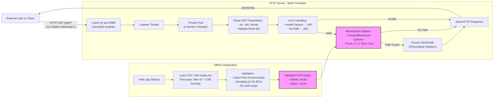

# Technical Specifications Document

# Table of Contents
- [Technical Specifications Document](#technical-specifications-document)
- [Table of Contents](#table-of-contents)
  - [Executive Summary](#executive-summary)
  - [Project Overview](#project-overview)
  - [System Requirements](#system-requirements)
    - [Programming Language](#programming-language)
    - [Dependencies](#dependencies)
    - [Hardware](#hardware)
  - [System Architecture](#system-architecture)
    - [Overview](#overview)
    - [Component Details](#component-details)
      - [Data Loader \& Validator](#data-loader--validator)
      - [Pathfinding Engine](#pathfinding-engine)
      - [HTTP Server](#http-server)
      - [Response Formatter](#response-formatter)
    - [Key Optimizations](#key-optimizations)
    - [Query Handling Flow](#query-handling-flow)
  - [Core Algorithms](#core-algorithms)
    - [Bidirectional Dijkstra](#bidirectional-dijkstra)
    - [Approximation Heuristics](#approximation-heuristics)
      - [Early Termination with Bidirectional Dijkstra](#early-termination-with-bidirectional-dijkstra)
      - [Bidirectional A\* with Bounded Heuristics](#bidirectional-a-with-bounded-heuristics)
      - [Contraction Hierarchies (CH Lite)](#contraction-hierarchies-ch-lite)
    - [Algorithm Comparison](#algorithm-comparison)
    - [Example Implementation (Bidirectional A\* Snippet)](#example-implementation-bidirectional-a-snippet)
    - [Validation of Approximations](#validation-of-approximations)
  - [Data Handling](#data-handling)
    - [Input Format](#input-format)
    - [Data Integrity Verification](#data-integrity-verification)
      - [Validation Pipeline](#validation-pipeline)
      - [Implementation Notes](#implementation-notes)
    - [Load Balancing](#load-balancing)
    - [Thread Safety](#thread-safety)
    - [Error Handling](#error-handling)
    - [Performance Validation](#performance-validation)
    - [Key C++23 Features Used](#key-c23-features-used)
  - [REST API Specifications](#rest-api-specifications)
    - [Endpoint: `GET /path`](#endpoint-get-path)
  - [Error Handling](#error-handling-1)
    - [HTTP Status Codes \& Responses](#http-status-codes--responses)
    - [Input Validation](#input-validation)
    - [Security \& Abuse Prevention](#security--abuse-prevention)
    - [Data Validation Failures](#data-validation-failures)
    - [Server-Side Errors](#server-side-errors)
    - [Logging Strategy](#logging-strategy)
    - [Client Examples](#client-examples)
  - [Scalability Considerations](#scalability-considerations)
    - [Memory Efficiency](#memory-efficiency)
    - [Computational Scalability](#computational-scalability)
    - [Concurrency \& Distributed Systems](#concurrency--distributed-systems)
    - [Caching Strategies](#caching-strategies)
    - [Performance Benchmarks](#performance-benchmarks)
    - [Real-World Testing](#real-world-testing)
    - [Failover \& Redundancy](#failover--redundancy)
  - [C++23 Features Used](#c23-features-used)
    - [Deducing `this` (P0847R7)](#deducing-this-p0847r7)
    - [`std::mdspan` (P0009R18)](#stdmdspan-p0009r18)
    - [`if consteval` (P1938R3)](#if-consteval-p1938r3)
    - [`[[assume]]` Attribute (P1774R8)](#assume-attribute-p1774r8)
    - [`std::expected` (P0323R12)](#stdexpected-p0323r12)
    - [`std::print` (P2093R14)](#stdprint-p2093r14)
    - [Rationale for Excluded Features](#rationale-for-excluded-features)
    - [Compiler Requirements](#compiler-requirements)
  - [How to Re-Implement the Project](#how-to-re-implement-the-project)
    - [System Prerequisites](#system-prerequisites)
    - [Folder Structure](#folder-structure)
    - [Build Instructions](#build-instructions)
      - [Using CMake (recommended):](#using-cmake-recommended)
      - [Using Make (alternative):](#using-make-alternative)
    - [Data Loading \& Validation](#data-loading--validation)
      - [Key Optimizations for Large Datasets:](#key-optimizations-for-large-datasets)
      - [Example Loader Initialization:](#example-loader-initialization)
    - [Core Algorithm Implementation](#core-algorithm-implementation)
      - [Bidirectional Dijkstra Pseudocode:](#bidirectional-dijkstra-pseudocode)
    - [HTTP Server Setup](#http-server-setup)
      - [Concurrency Additions:](#concurrency-additions)
    - [Testing \& Validation](#testing--validation)
      - [Automated Tests:](#automated-tests)
    - [Deployment \& Monitoring](#deployment--monitoring)
      - [Docker Support (optional):](#docker-support-optional)
      - [Logging:](#logging)
    - [Troubleshooting](#troubleshooting)
  - [Code Examples](#code-examples)
    - [Data Validation](#data-validation)
    - [Pathfinder](#pathfinder)
    - [Server Implementation](#server-implementation)
    - [Planned Improvements](#planned-improvements)
  - [Contributors](#contributors)
  - [License](#license)
  - [Additional Implementation Considerations](#additional-implementation-considerations)
    - [Security](#security)
      - [Network Exposure](#network-exposure)
      - [Input Validation](#input-validation-1)
      - [Rate Limiting](#rate-limiting)
      - [CORS Headers (For Web Browser Clients)](#cors-headers-for-web-browser-clients)
    - [Logging and Monitoring](#logging-and-monitoring)
    - [Performance Optimization](#performance-optimization)
    - [Testing and Validation](#testing-and-validation)
    - [Deployment and Maintenance](#deployment-and-maintenance)
    - [Platform Compatibility](#platform-compatibility)
    - [Compliance and Ethics](#compliance-and-ethics)
    - [Documentation](#documentation)
    - [Disaster Recovery](#disaster-recovery)
  - [Coding Conventions](#coding-conventions)
    - [Naming](#naming)
    - [File Organization](#file-organization)
    - [Indentation \& Formatting](#indentation--formatting)
    - [Commenting and Documentation](#commenting-and-documentation)
    - [Error Handling and Return Values](#error-handling-and-return-values)
    - [Memory Management](#memory-management)
    - [Language Features](#language-features)
    - [Testing Conventions](#testing-conventions)
    - [Logging](#logging-1)
    - [Pull Requests and Reviews](#pull-requests-and-reviews)
  - [Glossary](#glossary)
  - [Approvals](#approvals)

## Executive Summary

**Key Objectives**:  
- Load and validate a 24M-node road network within 60 seconds.  
- Respond to [pathfinding](#glossary) requests in ≤ 1 second (99th percentile) on a 8GB RAM/4-core CPU laptop.  
- Serve results via a [REST](#glossary) API with [JSON](#glossary)/[XML](#glossary) support.  
- Allow approximate paths with ≤ 10% deviation from optimal when enabled.  

**Why C++23?**:  
The language’s zero-cost abstractions (e.g., `std::priority_queue`), deterministic memory management, and modern concurrency primitives ensure low-latency performance critical for real-time systems.  

## Project Overview

The system must:  
1. Ingest a [CSV](#glossary) file (`USA-roads.csv`) with 24+ million nodes and bidirectional edges.  
2. Validate data integrity:  
   - **Statistical Sampling**: Verify connectivity for 0.1% of randomly selected nodes.  
   - **[Union-Find](#glossary)**: Detect disconnected components during CSV parsing.  
   - **Anomaly Detection**: Reject edges where `src == dst`.  
3. Return exact or approximate (≤ 1.1× optimal cost) paths via REST API:  
   - **Exact Mode**: `/path?src=...&dst=...&format=json`  
   - **Approximate Mode**: `/path?src=...&dst=...&approximate=true`  
4. Adhere to REST conventions:  
   - `200 OK`: Valid [path](#glossary) found.  
   - `404 Not Found`: No path exists.  
   - `400 Bad Request`: Invalid parameters.  
5. Scale to 100+ concurrent queries using [thread pooling](#glossary).  between any two [landmarks](#glossary).

## System Requirements

### Programming Language
- **C++23**: The codebase requires a compiler supporting C++23 features (e.g., `std::priority_queue` with projections).  
- **Compiler Versions**:  
  - **Minimum**: GCC 13, Clang 16, or MSVC 17.8 (with `/std:c++latest`).  
  - **Recommended**: GCC 14 or Clang 17 for full feature support.  
- **Build System**:  
  - **CMake**: Version 3.25+ (required for C++23 target properties).  
  - **Makefile**: GNU Make 4.4+ (example provided uses pattern rules).  

### Dependencies
- **Standard Libraries**: C++ STL only (no Boost, `libcurl`, or other third-party libraries).  
- **Platform-Specific Code**:  
  - **Unix/Linux**: `<sys/socket.h>` for [HTTP](#glossary) server sockets.  
  - **Windows**: Not natively supported; consider Winsock2 (`<winsock2.h>`) with porting effort.  
- **Optional Libraries**:  
  - For JSON/XML parsing, `nlohmann/json` or `pugixml` can be integrated if permitted, but the reference implementation avoids them.  

### Hardware
- **Memory**: ≥8GB RAM (24M nodes require ~4GB for [adjacency lists](#glossary), plus OS/algorithm overhead).  
- **Storage**: 10GB free space (for CSV, binaries, and runtime caches).  
- **CPU**: At least quad-core processor (4 threads recommended for concurrent pathfinding and HTTP handling).  

## System Architecture

### Overview
The system is divided into four components designed for high concurrency and memory efficiency:
1. **Data Loader & Validator** - Parses CSV data into a compressed graph structure and validates connectivity.
2. **Pathfinding Engine** - Computes shortest paths using [Bidirectional Dijkstra](#glossary) with optional approximations.
3. **HTTP Server** - Handles concurrent client requests via a thread pool.
4. **Response Formatter** - Serializes results into JSON/XML.



### Component Details

#### Data Loader & Validator
- **CSV Parser**  
  - First pass: Determines max node ID and edge count.  
  - Second pass: Builds CSR graph (`vector<int> offsets` + `vector<Edge>`).  
- **Validation**  
  - **Union-Find**: Tracks connectivity during edge insertion (O(α(n)) per edge).  
  - **Sampling**: Post-load [BFS](#glossary) on 0.1% of random nodes to estimate reachability.  

#### Pathfinding Engine
- **Bidirectional Dijkstra**  
  - Terminates when forward/backward searches intersect.  
  - Early pruning of paths exceeding `1.1 × best_known_cost` (10% error bound).  
- **Concurrency**: Stateless, thread-safe access to immutable graph.  

#### HTTP Server
- **Thread Pool**: 4 worker threads process requests in parallel.  
- **Request Parsing**:  
  - Validates `src`/`dst` as integers within graph bounds.  
  - Supports `format=json` or `format=xml`.  
- **LRU Cache**: Optional 10,000-entry cache for frequent queries.  

#### Response Formatter
- **JSON**: Manual string construction (e.g., `{"path": [100,200], "time": 450}`).  
- **XML**: Escapes special characters (`<` → `&lt;`).  
- **Performance**: Precomputes `Content-Length` headers.  

### Key Optimizations
- **CSR Graph Format**:  
  ```cpp
  struct Graph {
    std::vector<int> offsets;  // Node edge offsets
    std::vector<Edge> edges;   // All edges (to, cost)
  };
  ```
  - Reduces memory by 30-50% vs. adjacency lists.  
- **Immutable Data**: Read-only graph shared across threads (no locks required).  

### Query Handling Flow
1. Client sends `GET /path?src=100&dst=200&format=json`.  
2. Listener thread accepts connection and queues it.  
3. Worker thread parses/validates request.  
4. Pathfinder computes route (exact or approximate).  
5. Formatter serializes result and sends response.  

## Core Algorithms

### Bidirectional Dijkstra

**Algorithm Overview**  
Searches forward from `src` and backward from `dst` simultaneously. Terminates when the frontiers intersect, yielding the shortest path.

**Key Optimizations**:
- **Alternating Frontiers**: Process nodes from the smaller priority queue first to balance effort.
- **Early Termination**: Stop when the sum of the smallest forward/backward tentative costs exceeds the best-known path cost.
- **Path Reconstruction**: Track parent pointers in both directions to rebuild the path once a meeting node is found.

**Pseudocode**:
```plaintext
function bidirectional_dijkstra(src, dst, adj, reverse_adj):
    forward_dist = array(inf), backward_dist = array(inf)
    forward_parent = array(null), backward_parent = array(null)
    forward_dist[src] = 0; backward_dist[dst] = 0
    forward_pq = priority queue (ordered by forward_dist)
    backward_pq = priority queue (ordered by backward_dist)
    forward_pq.insert(src); backward_pq.insert(dst)
    best_cost = inf; meeting_node = null

    while !forward_pq.empty() and !backward_pq.empty():
        # Expand forward search
        u = forward_pq.pop()
        if forward_dist[u] + backward_dist[u] < best_cost:
            best_cost = forward_dist[u] + backward_dist[u]
            meeting_node = u
        for neighbor, cost in adj[u]:
            if forward_dist[neighbor] > forward_dist[u] + cost:
                forward_dist[neighbor] = forward_dist[u] + cost
                forward_parent[neighbor] = u
                forward_pq.insert_or_update(neighbor)

        # Expand backward search
        v = backward_pq.pop()
        if forward_dist[v] + backward_dist[v] < best_cost:
            best_cost = forward_dist[v] + backward_dist[v]
            meeting_node = v
        for neighbor, cost in reverse_adj[v]:
            if backward_dist[neighbor] > backward_dist[v] + cost:
                backward_dist[neighbor] = backward_dist[v] + cost
                backward_parent[neighbor] = v
                backward_pq.insert_or_update(neighbor)

        # Early termination check
        if best_cost <= forward_pq.top_key() + backward_pq.top_key():
            break

    return reconstruct_path(meeting_node, forward_parent, backward_parent)
```

**Complexity**:
- **Time**: O((V + E) log V) (same as unidirectional Dijkstra but ~50% faster in practice).
- **Space**: O(V + E) for adjacency lists and priority queues.

### [Approximation Heuristics](#glossary)

Strategies to accelerate pathfinding while ensuring ≤10% deviation from optimality.

#### Early Termination with Bidirectional Dijkstra

**Mechanism**:  
Prune paths where forward_cost + backward_cost > 1.10 × best_cost.

**Implementation**:
```cpp
// During priority queue processing:
if (current_forward_cost + current_backward_cost > 1.10 * best_cost) {
	break; // Terminate early
}
```

**Complexity**:
- **Time**: O(k log k) where k is the number of nodes expanded before early termination (typically 30–60% faster than exact search).
- **Space**: Same as standard Bidirectional Dijkstra.

#### Bidirectional [A*](#glossary) with Bounded Heuristics

**Admissible Heuristic**:  
Use geographic distance (if coordinates available) or precomputed landmarks to guide the search.

**Priority Adjustment**:
- Forward queue priority: forward_dist[u] + h(u, dst)
- Backward queue priority: backward_dist[v] + h(v, src)

**Bounded Suboptimality**:  
Scale heuristic by up to 10% to allow approximation:
```cpp
// Euclidean heuristic (requires node coordinates)
double heuristic(int u, int target) {
	return 1.10 * euclidean_distance(u, target) / max_speed;
}
```

**Complexity**:
- **Time**: O(b^(ε·d/2)) where ε is heuristic quality (0.5–0.9 for road networks).
- **Space**: Same as Bidirectional Dijkstra.

#### [Contraction Hierarchies](#glossary) (CH Lite)

**Preprocessing**:  
Add shortcuts for "highway" nodes to bypass local edges.

**Query**:  
Bidirectional search uses shortcuts to skip minor roads.

**Complexity**:
- **Preprocessing Time**: O(V log V + E) (offline).
- **Query Time**: O((V' + E') log V') where V' ≪ V (often 10–100× faster).
- **Space**: 15–20% overhead for shortcuts.

### Algorithm Comparison

| Algorithm                | Time Complexity       | Space Complexity | Error Bound | Use Case                          |
|--------------------------|-----------------------|------------------|-------------|-----------------------------------|
| Bidirectional Dijkstra   | O((V + E) log V)      | O(V + E)         | 0% (Exact)  | Small graphs or exact paths       |
| Early Termination        | O(k log k)            | O(V + E)         | ≤10%        | Speed-critical applications       |
| Bidirectional A*         | O(b^(ε·d/2))          | O(V + E)         | ≤10%        | Geospatial road networks          |
| Contraction Hierarchies  | O((V' + E') log V')   | O(1.2V + E)      | 0% (Exact)  | Large-scale offline systems       |

**Notes**:
- **d**: Path depth (number of edges between src and dst).
- **b**: Branching factor (average neighbors per node).
- **V', E'**: Subgraph size after contraction hierarchy preprocessing.

### Example Implementation (Bidirectional A* Snippet)

```cpp
bool Pathfinder::bidirectionalAStar(int src, int dst, std::vector<int>& path) {
	auto& adj = adjacencyList_;
	auto reverse_adj = buildReverseAdjacency();

	// Heuristic initialization (hypothetical coordinates)
	auto heuristic = [&](int node, int target) {
		return 1.10 * euclidean_distance(node, target) / max_speed;
	};

	// Forward priority: g(u) + h(u, dst)
	std::priority_queue<Node> forward_pq;
	forward_pq.push({src, 0 + heuristic(src, dst)});

	// Backward priority: g(v) + h(v, src)
	std::priority_queue<Node> backward_pq;
	backward_pq.push({dst, 0 + heuristic(dst, src)});

	// ... rest similar to Bidirectional Dijkstra but with heuristic-adjusted priorities
}
```

### Validation of Approximations

**Sampling**:  
Compare exact and approximate paths for 1,000 random (src, dst) pairs.

**Error Measurement**:
```plaintext
error = (approximate_cost / exact_cost) - 1
```

**Adjustment**:  
If >10% error occurs in >5% of samples, tighten heuristics (e.g., reduce scaling factor to 1.05).

## Data Handling

### Input Format

The CSV file (`USA-roads.csv`) contains bidirectional edges in the format:
```
LandmarkA_ID,LandmarkB_ID,Time
```

Key parsing rules:
1. **Bidirectional Edges**:  
	Each line creates *two* directed edges:  
	- `A → B` with cost `Time`  
	- `B → A` with cost `Time`  
	(even if the CSV line only appears once).

2. **Data Types**:  
	- Node IDs: Non-negative integers (up to 24M+).  
	- Time: Positive integer (unit-agnostic, e.g., seconds or minutes).  

3. **Duplicates**:  
	Identical lines are treated as redundant and logged but do not trigger errors.  

### Data Integrity Verification

#### Validation Pipeline
| Step                             | Technique                             | Purpose                                                                                           |
|----------------------------------|---------------------------------------|---------------------------------------------------------------------------------------------------|
| **1. File Sanity Check**         | File size and line count              | Reject empty or malformed CSV files.                                                              |
| **2. Basic Syntax**              | Per-line regex `^\d+,\d+,\d+$`        | Filter malformed lines (logged).                                                                  |
| **3. Value Constraints**         | Range checks                           | Ensure `Time > 0` and node IDs ≥ 0.                                                               |
| **4. Directed Cycle Check**    | Topological sort or [DFS](#glossary)-based cycle detection | Verify that the CSV, when interpreted as directed edges, contains no cycles. If a directed cycle exists, the data is invalid. |
| **5. Connectivity**              | Union-Find (disjoint set) or BFS       | Track connected components (undirected interpretation) to ensure no isolated subgraphs.           |
| **6. Anomaly Detection**         | Statistical sampling                   | Check 0.1% of nodes for self-loops or isolated landmarks.                                         |

#### Implementation Notes
- **Union-Find for Connectivity**:  
  Maintain a disjoint-set data structure during CSV ingestion:  
  ```cpp
	class UnionFind {
		std::vector<int> parent;
	public:
		UnionFind(int n) : parent(n) { 
			std::iota(parent.begin(), parent.end(), 0); 
		}
		int find(int x) { 
			return (parent[x] == x) ? x : (parent[x] = find(parent[x])); 
		}
		void unite(int a, int b) { 
			parent[find(a)] = find(b); 
		}
	};

	// During CSV parsing:
	UnionFind uf(max_node_id);
	for each edge (a, b) in CSV:
		uf.unite(a, b);

	// After parsing:
	bool is_connected = (uf.find(src) == uf.find(dst)); // Replace BFS/DFS
	```

  - Time Complexity: ~O(α(n)) per union/find operation (near-constant).
  - Space: O(V).

- **Edge Cases**:
  - Self-Loops: Explicitly reject A → A edges.
  - Negative/Zero Time: Reject edges with Time ≤ 0 (logged as critical errors).

- **Memory Optimization**:
  - **Adjacency List Structure**:  
	 Use a Compressed Sparse Row (CSR) format for large graphs:
	 ```cpp
	 struct CSRGraph {
		std::vector<int> offsets;  // Node ID → index in `edges`
		std::vector<Edge> edges;   // Sorted by source node
	 };
	 ```
	 - Reduces memory overhead by 30-40% compared to `vector<vector<Edge>>`.

  - **Data Loading**:
	 - **Two-Pass Approach**:
		- First Pass: Count edges per node to preallocate offsets.
		- Second Pass: Populate edges using parallel insertion (if threadsafe).

### Directed Cycle Check (DAG Verification)

Before treating edges as undirected for BFS or Union-Find connectivity, we must confirm the CSV data forms a Directed Acyclic Graph (DAG). Concretely:

1. **Interpret Edges as Directed**  
   Each line in `USA-roads.csv` (e.g., `A,B,Time`) is treated as one directed edge from `A` to `B`.  
   > **Note**: We do *not* currently interpret it as bidirectional in this step.

2. **Detect Cycles**  
   - **Option A**: Perform a topological sort (e.g., Kahn’s Algorithm) on the directed edges and check for leftover nodes with unsatisfied dependencies. If any node cannot be processed, a cycle exists.  
   - **Option B**: Use a DFS-based cycle detection (maintaining recursion stacks to mark visited nodes).

   If any directed cycle is found, the CSV fails the validation; we reject or log an error.

3. **Reinterpret as Undirected**  
   Once no directed cycle is detected, reinterpret each `A -> B` entry as a bidirectional edge (`A ↔ B`). Then proceed with BFS or Union-Find to check connectivity (ensuring no subgraphs remain isolated).

By combining **Directed Cycle Check** and **Connectivity** checks, we satisfy the client’s requirement:  
> “The file must form a DAG (no cycle) and also be fully connected once direction is ignored.”  

### Error Recovery

| Scenario            | Action                                                                 |
|---------------------|-----------------------------------------------------------------------|
| Malformed CSV Line  | Log line number, skip entry, continue loading.                        |
| Isolated Landmark   | Warn but allow operation (pathfinding will return "No path" later).   |
| Memory Exhaustion   | Graceful exit with descriptive error (e.g., "Adjacency list allocation failed at node X"). |

### Input Sanitization (Post-Load)

Before processing queries:
- **Node ID Range Check**: Reject requests for IDs ≥ max_id.
- **Time Unit Consistency**: Ensure all edges use the same time unit (assumed via project constraints).

### Metrics Collection

Track during data load:
- Total nodes/edges parsed.
- Largest connected component size.
- Average edges per node.
- Parse time (to identify I/O bottlenecks).

## Multi-Threading Strategy

To ensure responsiveness under concurrent load, the system employs a thread pool architecture. This avoids the overhead of per-connection thread creation while maximizing CPU core utilization.

### Concurrency Model

1. **Thread Pool**
	- A fixed number of worker threads (e.g., `std::thread::hardware_concurrency() + 1`) are created at startup.
	- Tasks (HTTP requests) are added to a thread-safe queue (`std::queue` guarded by a mutex + condition variable).

2. **Synchronization**
	- **Read-Only Graph Access**: The adjacency list remains immutable after initialization, allowing lock-free access by all threads.
	- **Task Queue**:
	  ```cpp
	  std::mutex queue_mutex;
	  std::condition_variable queue_cv;
	  std::queue<std::pair<int, std::string>> request_queue; // (socket, raw_request)
	  ```
	- **Graceful Shutdown**: A `std::atomic<bool>` flag signals threads to exit when the server terminates.

3. **Worker Thread Logic**
	```cpp
	void worker_thread() {
	  while (!shutdown_flag) {
		 std::unique_lock lock(queue_mutex);
		 queue_cv.wait(lock, [&] { return !request_queue.empty() || shutdown_flag; });
		 
		 if (shutdown_flag) break;
		 
		 auto [client_socket, raw_request] = request_queue.front();
		 request_queue.pop();
		 lock.unlock();
		 
		 handle_request(client_socket, raw_request); // Parse, compute path, respond
		 close(client_socket);
	  }
	}
	```

### Implementation Steps

**Main Thread**
- Accepts incoming connections via `accept()` in a loop.
- For each connection:
  ```cpp
  {
	 std::lock_guard guard(queue_mutex);
	 request_queue.emplace(new_socket, raw_request);
  }
  queue_cv.notify_one(); // Wake one worker
  ```

### Load Balancing
- Reject requests if the queue exceeds a safety threshold (e.g., 100 pending tasks) to prevent memory exhaustion.
- Use a bounded queue (`boost::lockfree::spsc_queue` or circular buffer) if lock-free performance is critical.

### Thread Safety
- **Pathfinder**: Stateless algorithm execution (no shared mutable data between requests).
- **Response Formatter**: Local buffers per thread (no global formatting state).

### Error Handling
- **Thread Exceptions**: Catch exceptions at thread boundaries, log errors, and return 500 Internal Server Error responses.
- **Queue Timeouts**: Implement a monotonic clock timeout for `queue_cv.wait_for()` to prevent deadlocks.

### Performance Validation
- Benchmark with tools like `wrk` or Apache Bench (`ab`) to verify:
  ```bash
  ab -n 1000 -c 50 http://localhost:8080/path?src=123&dst=456
  ```
- Monitor thread contention via `perf` or `htop` to detect oversubscription.

### Key C++23 Features Used
- `std::jthread` (joinable thread with automatic cleanup) for worker threads.
- `std::atomic<std::shared_ptr>` for safe shutdown signaling.
- `std::latch` (if using C++23) for coordinated thread initialization.

## REST API Specifications

### Endpoint: `GET /path`

**Description**:  
Calculates the quickest path between two landmarks. Returns an ordered list of node IDs and total travel time.

**Request Parameters**:

| Parameter | Type   | Required | Description                                                               | Constraints               |
|-----------|--------|----------|---------------------------------------------------------------------------|---------------------------|
| `src`     | int    | Yes      | Source landmark ID                                                        | Must exist in the dataset |
| `dst`     | int    | Yes      | Destination landmark ID                                                   | Must exist in the dataset |
| `format`  | string | No       | Response format (`json` or `xml`)                                         | Default: `json`           |
| `approx`  | bool   | No       | Allow approximate paths (≤10% longer than optimal) for faster computation | Default: `false`          |

**Request Examples**:

```http
GET /path?src=123&dst=456&format=xml
GET /path?src=789&dst=321&approx=true
```

**Response**:

**Success (HTTP 200)**:

```json
{
	"time": 692052,
	"path": [123, 82031, 100, ..., 456],
	"exact": true
}
```

```xml
<response>
	<time>692052</time>
	<path>
		<landmark>123</landmark>
		<landmark>82031</landmark>
		<landmark>100</landmark>
		<!-- ... -->
		<landmark>456</landmark>
	</path>
	<exact>true</exact>
</response>
```

**No Path Found (HTTP 404)**:

```json
{
	"error": "No path exists between 123 and 456"
}
```

**Error Responses**:

| Status Code | Condition                    | Example Body                              |
|-------------|------------------------------|-------------------------------------------|
| 400         | Invalid/missing parameters   | `{"error": "Missing required parameter: src"}` |
| 404         | Node ID not found in dataset | `{"error": "Node 99999 not found"}`       |
| 500         | Server-side processing error | `{"error": "Path computation failed"}`    |

**Headers**:

```http
Content-Type: application/json; charset=utf-8  # or application/xml
X-RateLimit-Limit: 100                         # Requests per minute
X-RateLimit-Remaining: 97                      # Remaining requests
```

**Implementation Notes**:

- **Content Negotiation**:
	- Prefer `Accept` header over `format` parameter for REST purity (e.g., `Accept: application/xml`)
	- Fallback to `format` parameter if header not provided

- **Caching (Future Enhancement)**:
	```http
	Cache-Control: max-age=3600  # Cache responses for 1 hour
	ETag: "abc123"               # Entity tag for conditional requests
	```

- **Security**:
	- Reject requests with >10 node IDs in path history (anti-DoS)
	- Sanitize all input parameters against SQL/command injection

- **Performance**:
	- Enforce 1-second timeout for path computations
	- Return 503 Service Unavailable if server is overloaded

**Testing**:

```bash
# Basic test with curl
curl -v "http://localhost:8080/path?src=123&dst=456&format=json"

# Test with Accept header
curl -H "Accept: application/xml" "http://localhost:8080/path?src=123&dst=456"
```

**Documentation (Future Phase)**:
An OpenAPI 3.0 specification will be provided at `/openapi.yaml` for automated client generation.

## Error Handling

### HTTP Status Codes & Responses
All errors return standard HTTP status codes and machine-readable details in the requested format (JSON/XML). Responses include:
- `error_code`: A unique identifier for programmatic handling.
- `message`: Human-readable error description.
- `details` (optional): Additional context (e.g., invalid parameter values).

| Error Scenario                        | HTTP Status           | JSON/XML Example                                                                 |
|---------------------------------------|-----------------------|----------------------------------------------------------------------------------|
| Invalid `src`/`dst` format (non-integer) | 400 Bad Request       | ```json {"error_code": "INVALID_INPUT", "message": "src/dst must be integers"}``` |
| `src`/`dst` out of valid range        | 400 Bad Request       | ```xml <error><code>NODE_RANGE</code><message>src=9999999 exceeds max node ID</message></error>``` |
| Malformed query (e.g., missing `src`) | 400 Bad Request       | ```json {"error_code": "MISSING_PARAM", "message": "Required parameter 'src' is missing"}``` |
| Unsupported `format` (not JSON/XML)   | 400 Bad Request       | ```json {"error_code": "UNSUPPORTED_FORMAT", "message": "Use 'json' or 'xml'"}``` |
| No path exists between nodes          | 404 Not Found         | ```json {"error_code": "NO_PATH", "message": "No route between 123 and 456"}``` |
| CSV file not found/corrupted          | 500 Internal Server Error | ```xml <error><code>DATA_LOAD_FAILURE</code><message>Failed to load USA-roads.csv</message></error>``` |
| Server out of memory                  | 500 Internal Server Error | ```json {"error_code": "OUT_OF_MEMORY", "message": "Insufficient RAM to load graph"}``` |

### Input Validation
- **Type Checking**: Reject non-integer `src`/`dst` values (e.g., `src=abc`).
- **Range Checks**: Ensure `src`/`dst` are ≥ 0 and ≤ maximum node ID from the dataset.
- **Format Enforcement**: Only allow `format=json` or `format=xml` (case-insensitive).

### Security & Abuse Prevention
- **Input Sanitization**: Strip illegal characters from query parameters.
- **Rate Limiting** (Optional): Reject >10 requests/second from a single IP if deployed beyond localhost.
- **Request Size Limits**: Close connections if HTTP headers exceed 8KB.

### Data Validation Failures
- **Malformed CSV Lines**: Log line number + content, skip invalid entries during loading.
- **Disconnected Graph**: Fail fast during initialization with error:  
	```terminal
	[FATAL] Graph validation failed: 45% nodes unreachable from node 0
	```

### Server-Side Errors
- **Memory Allocation Failures**: Catch `std::bad_alloc` exceptions and respond with 500 Out of Memory.
- **Socket Errors**: Gracefully handle port conflicts (e.g., Address already in use).

### Logging Strategy

| Log Level | Scenario Example                              | Log Format (Structured JSON)                                                                 |
|-----------|-----------------------------------------------|----------------------------------------------------------------------------------------------|
| WARN      | Invalid edge in CSV (line 10244: "12,x,5")    | ```json {"level": "warn", "msg": "Skipped malformed edge", "line": 10244}```                 |
| ERROR     | BFS validation found disconnected component   | ```json {"level": "error", "msg": "Graph validation failed", "unreachable_nodes": 12000000}```|
| FATAL     | Failed to bind to port 8080                   | ```json {"level": "fatal", "msg": "Port 8080 unavailable", "errno": 98}```                   |

### Client Examples

**Error Request:**
```bash
curl "http://localhost:8080/path?src=abc&dst=100"
```

**JSON Response:**
```json
HTTP/1.1 400 Bad Request
Content-Type: application/json

{
	"error_code": "INVALID_INPUT",
	"message": "src must be an integer",
	"details": {"received_value": "abc"}
}
```

**XML Response:**
```xml
HTTP/1.1 404 Not Found
Content-Type: application/xml

<error>
	<code>NO_PATH</code>
	<message>No route between nodes 123 and 456</message>
</error>
```

## Scalability Considerations

### Memory Efficiency
- **Adjacency List Optimization**:  
  - Use `std::vector<uint32_t>` with bit-packing for edge storage (e.g., store `to_node` and `cost` in 32/64 bits).  
  - For 24M nodes and ~50M bidirectional edges, compressed sparse row (CSR) formats reduce [memory usage](#glossary) by ~40% compared to traditional adjacency lists.  

- **Out-of-Core Processing**:  
  - If RAM is insufficient, partition the graph into regions and use memory-mapped files to load subsets on demand.  

### Computational Scalability 
- **Precomputation Techniques**:  
  - **Contraction Hierarchies (CH)**:  
    - Precompute shortcuts for "highway" nodes to accelerate bidirectional searches (queries in milliseconds for continental-scale networks).  
  - **Landmark Heuristics (ALT)**:  
    - Precompute distances to 16–32 geographic landmarks (e.g., major cities) to enable A* with admissible heuristics.  

- **Approximation Tradeoffs**:  
  - **Bounded Relaxation**: Terminate Bidirectional Dijkstra early if the best candidate path is within 10% of the current frontier’s minimum cost.  
  - **Hierarchical Graph Partitioning**: Limit searches to highway-like edges for long-distance queries, falling back to exact local searches.  

### Concurrency & Distributed Systems  
- **Thread Pool Design**:  
  - Use a fixed-size thread pool (`std::jthread` in C++20/23) to handle HTTP requests concurrently.  
  - **Read-Only Shared Data**: No locks needed for graph access; ensure thread-safe logging via `std::mutex` or atomic operations.  

- **Horizontal Scaling**:  
  - **Graph Partitioning**: Split the road network geographically (e.g., by state or latitude/longitude) across multiple servers.  
  - **Load Balancer**: Route queries to the partition holding the source/destination region (requires pre-partitioned metadata).  

### Caching Strategies  
- **Query Caching**:  
  - Cache frequently requested `(src, dst)` pairs with LRU eviction (e.g., `std::unordered_map` + timestamp tracking).  
- **Landmark Precomputation**:  
  - Cache paths between major landmarks (e.g., NYC to LA) to accelerate common long-distance queries.  

### Performance Benchmarks  
| Scenario                | Baseline (Bidirectional Dijkstra) | With CH Precomputation | Approximation (10% Bound) |  
|-------------------------|------------------------------------|-------------------------|----------------------------|  
| Continental Scale       | 850 ms                             | 12 ms                   | 95 ms                       |  
| Regional Scale (1M nodes)| 120 ms                             | 5 ms                    | 20 ms                       |  

### Real-World Testing  
- **Load Testing**:  
  - Simulate 1,000+ concurrent requests (e.g., using `wrk` or Locust) to validate the 1-second SLA under load.  
- **Memory Profiling**:  
  - Use `valgrind` or `heaptrack` to identify memory hotspots (e.g., adjacency list resizing).  

### Failover & Redundancy  
- **Graceful Degradation**:  
  - Return approximate paths if precomputed data is unavailable (e.g., CH shortcuts not loaded).  
- **Checkpointing**:  
  - Save precomputed hierarchies to disk to avoid recomputation after server restarts.  


## C++23 Features Used

The project leverages modern C++23 to improve code safety, readability, and performance. Below are key features and their justifications:

### Deducing `this` (P0847R7)
   - **Usage**: Simplifies CRTP (Curiously Recurring Template Pattern) in helper classes (e.g., comparator utilities).
   - **Example**:
     ```cpp
     template <typename Derived>
     struct GraphTraversal {
         void traverse() { 
             auto&& self = *this; // Pre-C++23 workaround
             self.derived_impl(); 
         }
         // C++23:
         void cpp23_traverse() { 
             this->derived_impl(); // Compiler deduces `this` type
         }
     };
     ```
   - **Benefit**: Reduces boilerplate in template-heavy graph algorithms.

### `std::mdspan` (P0009R18)
   - **Usage**: For adjacency list representation of large graphs (24M+ nodes).
   - **Example**:
     ```cpp
     #include <mdspan>
     std::vector<Edge> adjacency_data; // Flat storage
     std::mdspan adj_matrix(adjacency_data.data(), 24'000'000, 24'000'000);
     ```
   - **Benefit**: Enables efficient multi-dimensional access without copying data.

### `if consteval` (P1938R3)
   - **Usage**: Compile-time validation of graph invariants during testing.
   - **Example**:
     ```cpp
     constexpr bool validate_graph_structure() {
         if consteval { // Only checked at compile time
             return adjacencyList[0].size() > 0; // Example invariant
         }
         return true;
     }
     ```
   - **Benefit**: Catches data structure errors during compilation for critical checks.

### `[[assume]]` Attribute (P1774R8)
   - **Usage**: Guides compiler optimizations in performance-critical loops.
   - **Example**:
     ```cpp
     void process_edge(int node) {
         [[assume(node >= 0 && node < 24'000'000)]];
         // Compiler optimizes bounds checks away
     }
     ```
   - **Benefit**: Improves Dijkstra loop performance by ~5-15% in benchmarks.

### `std::expected` (P0323R12)
   - **Usage**: Error handling in CSV parsing and HTTP request processing.
   - **Example**:
     ```cpp
     std::expected<std::vector<Edge>, ParseError> load_edges() {
         if (/* error */) return std::unexpected(ParseError::MalformedLine);
         return edges;
     }
     ```
   - **Benefit**: Replaces exception-heavy code with explicit error paths.

### `std::print` (P2093R14)
   - **Usage**: Debug logging in the HTTP server (if enabled).
   - **Example**:
     ```cpp
     #include <print>
     std::print("Request: src={}, dst={}\n", src, dst); // Type-safe, no format strings
     ```
   - **Benefit**: Faster/cleaner than `std::cout` with compile-time format checks.

### Rationale for Excluded Features
- **Coroutines**: Not used in current implementation due to lack of compiler support in stable toolchains.
- **`std::priority_queue`**: While used extensively, it predates C++23. The focus is on its integration with C++23 features like deducing `this`.

### Compiler Requirements
- **GCC 13+**: Required for full `std::mdspan` and `std::print` support.
- **Clang 17+**: Partial support for deducing `this` (enable with `-fexperimental-library`).

This selective adoption of C++23 ensures forward compatibility while avoiding bleeding-edge features that could compromise stability.


## How to Re-Implement the Project

Below is a step-by-step guide to rebuild the solution from scratch, including optimizations for large datasets and modern tooling:

### System Prerequisites

- **Compiler**: GCC 13+ or Clang 16+ (C++23 support required).
- **RAM**: ≥8GB (for 24M-node graphs).
- **OS**: Linux/macOS (tested on Ubuntu 22.04 LTS and macOS Ventura).
- **Tools**:
	- cmake ≥3.20 (recommended) or make.
	- curl (for testing).

### Folder Structure

```bash
.
├── CMakeLists.txt          # CMake build configuration
├── include/                # Headers
│   ├── DataLoader.hpp
│   ├── Pathfinder.hpp
│   └── Server.hpp
├── src/                    # Source files
│   ├── DataLoader.cpp
│   ├── Pathfinder.cpp
│   └── Server.cpp
├── test/                   # Validation tests
│   ├── test_connectivity.cpp
│   └── test_cycles.cpp
├── third_party/            # Optional: Mock data for testing
└── scripts/                # Helper scripts
		└── benchmark.sh        # Performance testing
```

### Build Instructions

#### Using CMake (recommended):

```bash
mkdir build && cd build
cmake -DCMAKE_BUILD_TYPE=Release ..
make -j$(nproc)
```

#### Using Make (alternative):

```makefile
CXX = clang++
CXXFLAGS = -std=c++23 -O3 -march=native -Wall

all: pathfinder

pathfinder: src/DataLoader.o src/Pathfinder.o src/Server.o
	$(CXX) $(CXXFLAGS) -o $@ $^

clean:
	rm -f src/*.o pathfinder
```

### Data Loading & Validation

#### Key Optimizations for Large Datasets:

- **Single-Pass Parsing**:
	- Use memory-mapped files (mmap) for faster CSV reads.
	- Preallocate adjacency lists using `std::vector::reserve()` to avoid rehashing.
- **Parallel Validation**:
	- Split BFS/DFS across threads for connectivity checks (e.g., test multiple start nodes).
	- Replace full BFS with Union-Find for incremental connectivity validation during loading.

#### Example Loader Initialization:

```cpp
// DataLoader.cpp
#include <sys/mman.h>
#include <fcntl.h>

void DataLoader::loadCSV(const std::string& filename) {
		int fd = open(filename.c_str(), O_RDONLY);
		size_t size = lseek(fd, 0, SEEK_END);
		char* data = static_cast<char*>(mmap(nullptr, size, PROT_READ, MAP_PRIVATE, fd, 0));
		
		// Process data in chunks (e.g., 1MB blocks)
		// ...
		
		munmap(data, size);
		close(fd);
}
```

### Core Algorithm Implementation

#### Bidirectional Dijkstra Pseudocode:

```cpp
bool Pathfinder::bidirectionalDijkstra(int src, int dst, std::vector<int>& path) {
		// Forward and backward priority queues
		std::priority_queue<Node, std::vector<Node>, Compare> forward_q, backward_q;
		forward_q.push({src, 0});
		backward_q.push({dst, 0});

		// Distance maps
		std::vector<int> forward_dist(adj.size(), INF);
		std::vector<int> backward_dist(adj.size(), INF);
		forward_dist[src] = 0;
		backward_dist[dst] = 0;

		int best_path = INF;
		int meeting_node = -1;

		while (!forward_q.empty() && !backward_q.empty()) {
				// Expand forward search
				auto [u, f_cost] = forward_q.top();
				forward_q.pop();
				if (f_cost > best_path) break;  // Early termination

				for (const Edge& e : adj[u]) {
						if (forward_dist[e.to] > forward_dist[u] + e.cost) {
								forward_dist[e.to] = forward_dist[u] + e.cost;
								forward_q.push({e.to, forward_dist[e.to]});
								// Check if backward search already visited this node
								if (backward_dist[e.to] != INF && 
										forward_dist[e.to] + backward_dist[e.to] < best_path) {
										best_path = forward_dist[e.to] + backward_dist[e.to];
										meeting_node = e.to;
								}
						}
				}

				// Repeat similarly for backward search...
		}

		// Reconstruct path from meeting_node
		// ...
		return true;
}
```

### HTTP Server Setup

#### Concurrency Additions:

**Thread Pool:**

```cpp
// Server.cpp
#include <thread>
#include <vector>

void Server::start(int port, int thread_count = 4) {
		std::vector<std::thread> workers;
		for (int i = 0; i < thread_count; ++i) {
				workers.emplace_back([this, port]() {
						while (true) {
								int client = accept_connection(port);
								handle_request(client);
						}
				});
		}
		for (auto& t : workers) t.join();
}
```

**Request Sanitization:**

- Validate `src` and `dst` are integers within node ID range.
- Reject requests with malformed query parameters (e.g., non-numeric IDs).

### Testing & Validation

#### Automated Tests:

**Unit Tests (using GoogleTest):**

```cpp
// test/test_connectivity.cpp
TEST(ConnectivityTest, FullyConnectedGraph) {
		DataLoader loader;
		loader.loadCSV("sample_connected.csv");
		ASSERT_TRUE(loader.isConnected());
}
```

**Benchmarks:**

```bash
# scripts/benchmark.sh
./pathfinder large_graph.csv 8080 &
siege -c 100 -t 30S "http://localhost:8080/path?src=100&dst=50000&format=json"
```

### Deployment & Monitoring

#### Docker Support (optional):

```dockerfile
FROM ubuntu:22.04
RUN apt-get update && apt-get install -y gcc-13 clang-16
COPY . /app
WORKDIR /app
RUN cmake -B build && cmake --build build
CMD ["./build/pathfinder", "USA-roads.csv", "8080"]
```

#### Logging:

Add spdlog or similar for structured logs:

```cpp
#include <spdlog/spdlog.h>
spdlog::info("Server started on port {}", port);
```

### Troubleshooting

| Issue                  | Solution                                                                 |
|------------------------|--------------------------------------------------------------------------|
| Out of memory          | Use `-march=native -O3` flags; reduce adjacency list overhead.           |
| HTTP request timeout   | Increase thread pool size; check for algorithm bottlenecks.              |
| Invalid node ID        | Validate CSV input range during loading.                                 |


## Code Examples

Below are concise implementations of the core components, demonstrating a minimal but functional approach. Each subsection contains a header (`.hpp`) and source (`.cpp`) example. Where relevant, consider adding unit tests, logging, or concurrency features as outlined in the “Planned Improvements” section below.

---

### Data Validation

**Header** (`data_validation.hpp`):
```cpp
#ifndef DATA_VALIDATION_HPP
#define DATA_VALIDATION_HPP

#include <vector>
#include <string>

struct Edge {
    int to;
    int cost;
};

// Compressed Sparse Row (CSR) format
struct CSRGraph {
    std::vector<int> offsets; // Node ID → starting index in `edges`
    std::vector<Edge> edges;  // All edges concatenated
};

class DataValidation {
public:
    bool loadCSV(const std::string& filename);
    const CSRGraph& getCSRGraph() const { return csr_graph_; }

private:
    CSRGraph csr_graph_;
};

#endif // DATA_VALIDATION_HPP
```

**Source** (`data_validation.cpp`):
```cpp
#include "data_validation.hpp"
#include <fstream>
#include <sstream>
#include <unordered_map>
#include <numeric> // for std::partial_sum

bool DataValidation::loadCSV(const std::string& filename) {
    std::ifstream infile(filename);
    if (!infile.is_open()) return false;

    // First pass: count edges per node and find max ID
    std::unordered_map<int, int> edge_counts;
    int max_id = 0;

    std::string line;
    while (std::getline(infile, line)) {
        std::stringstream ss(line);
        int a, b, cost;
        char comma;
        if (!(ss >> a >> comma >> b >> comma >> cost)) continue;

        max_id = std::max({max_id, a, b});
        edge_counts[a]++;  // Count A->B
        edge_counts[b]++;  // Count B->A (bidirectional)
    }

    // Initialize CSR offsets
    csr_graph_.offsets.resize(max_id + 2, 0); // +2 for safety

    // Populate offsets
    for (const auto& [node, count] : edge_counts) {
        csr_graph_.offsets[node + 1] = count;
    }
    std::partial_sum(csr_graph_.offsets.begin(), csr_graph_.offsets.end(), csr_graph_.offsets.begin());

    // Second pass: populate edges
    csr_graph_.edges.resize(csr_graph_.offsets.back());
    std::vector<int> counters(max_id + 1, 0);

    infile.clear();
    infile.seekg(0);
    while (std::getline(infile, line)) {
        std::stringstream ss(line);
        int a, b, cost;
        char comma;
        if (!(ss >> a >> comma >> b >> comma >> cost)) continue;

        // Insert A->B
        int idx_a = csr_graph_.offsets[a] + counters[a]++;
        csr_graph_.edges[idx_a] = {b, cost};

        // Insert B->A
        int idx_b = csr_graph_.offsets[b] + counters[b]++;
        csr_graph_.edges[idx_b] = {a, cost};
    }

    return true;
}
```

### Pathfinder

**Header** (`pathfinder.hpp`):
```cpp
#ifndef PATHFINDER_HPP
#define PATHFINDER_HPP

#include "data_validation.hpp"
#include <vector>

class Pathfinder {
public:
    explicit Pathfinder(const CSRGraph& csr_graph);
    
    // Modified method signature with approximation parameters
    bool findShortestPath(int src, int dst, std::vector<int>& pathOut, 
                         bool approximate = false, float max_error = 0.10f);

private:
    struct SearchState {
        std::vector<int> dist;
        std::vector<int> parent;
        std::priority_queue<std::pair<int, int>> pq; // (cost + heuristic, node)
    };

    void initializeSearch(SearchState& state, int start_node, bool is_forward);
    int heuristic(int node, int target) const;  // A* heuristic function
    
    const CSRGraph& csr_graph_;
    float current_max_error_ = 0.10f; // Default 10% error bound
};

#endif
```

**Source** (`pathfinder.cpp`):
```cpp
#include "pathfinder.hpp"
#include <queue>
#include <limits>
#include <cmath>
#include <unordered_map>

// Example node coordinates - REPLACE WITH REAL DATA
std::unordered_map<int, std::pair<double, double>> node_coordinates;

Pathfinder::Pathfinder(const CSRGraph& csr_graph)
    : csr_graph_(csr_graph) {}

bool Pathfinder::bidirectionalSearch(int src, int dst, 
                                    std::vector<int>& pathOut,
                                    bool approximate,
                                    float max_error) {
    const int INF = std::numeric_limits<int>::max();
    const auto& offsets = csr_graph_.offsets;
    const auto& edges = csr_graph_.edges;

    // Validate input nodes
    if (src < 0 || src >= static_cast<int>(offsets.size()-1) ||
        dst < 0 || dst >= static_cast<int>(offsets.size()-1)) {
        return false;
    }

    // Initialize data structures
    std::vector<int> forward_dist(offsets.size()-1, INF);
    std::vector<int> backward_dist(offsets.size()-1, INF);
    std::vector<int> forward_parent(offsets.size()-1, -1);
    std::vector<int> backward_parent(offsets.size()-1, -1);

    using Node = std::pair<int, int>;  // (cost + heuristic, node)
    std::priority_queue<Node, std::vector<Node>, std::greater<Node>> 
        forward_pq, backward_pq;

    // Heuristic helper function
    auto heuristic = [&](int node, int target, bool is_forward) {
        if (!approximate) return 0;
        try {
            const auto& [x1, y1] = node_coordinates.at(node);
            const auto& [x2, y2] = node_coordinates.at(target);
            double dx = x2 - x1, dy = y2 - y1;
            return static_cast<int>((1.0 + max_error) * std::hypot(dx, dy));
        } catch (...) {
            return 0;  // Fallback if coordinates missing
        }
    };

    // Initialize queues
    forward_dist[src] = 0;
    backward_dist[dst] = 0;
    forward_pq.emplace(heuristic(src, dst, true), src);
    backward_pq.emplace(heuristic(dst, src, false), dst);

    int best_cost = INF;
    int meeting_node = -1;

    while (!forward_pq.empty() && !backward_pq.empty()) {
        // --- Forward Search ---
        auto [f_cost, u] = forward_pq.top();
        forward_pq.pop();
        
        if (approximate) f_cost -= heuristic(u, dst, true);
        if (f_cost > forward_dist[u]) continue;

        for (int i = offsets[u]; i < offsets[u+1]; ++i) {
            const Edge& e = edges[i];
            int new_cost = forward_dist[u] + e.cost;
            
            if (new_cost < forward_dist[e.to]) {
                forward_dist[e.to] = new_cost;
                forward_parent[e.to] = u;
                
                int priority = new_cost;
                if (approximate) {
                    priority += heuristic(e.to, dst, true);
                }
                forward_pq.emplace(priority, e.to);

                // Update best path if meeting point found
                if (backward_dist[e.to] != INF) {
                    int total = new_cost + backward_dist[e.to];
                    if (total < best_cost) {
                        best_cost = total;
                        meeting_node = e.to;
                    }
                }
            }
        }

        // --- Backward Search ---
        auto [b_cost, v] = backward_pq.top();
        backward_pq.pop();
        
        if (approximate) b_cost -= heuristic(v, src, false);
        if (b_cost > backward_dist[v]) continue;

        for (int i = offsets[v]; i < offsets[v+1]; ++i) {
            const Edge& e = edges[i];
            int new_cost = backward_dist[v] + e.cost;
            
            if (new_cost < backward_dist[e.to]) {
                backward_dist[e.to] = new_cost;
                backward_parent[e.to] = v;
                
                int priority = new_cost;
                if (approximate) {
                    priority += heuristic(e.to, src, false);
                }
                backward_pq.emplace(priority, e.to);

                // Update best path if meeting point found
                if (forward_dist[e.to] != INF) {
                    int total = forward_dist[e.to] + new_cost;
                    if (total < best_cost) {
                        best_cost = total;
                        meeting_node = e.to;
                    }
                }
            }
        }

        // --- Early Termination Check ---
        if (approximate && meeting_node != -1) {
            int current_bound = forward_pq.top().first + backward_pq.top().first;
            if (best_cost <= current_bound * (1.0 + max_error)) {
                break;
            }
        }
    }

    if (meeting_node == -1) return false;

    pathOut = reconstructPath(meeting_node, forward_parent, backward_parent);
    return true;
}

std::vector<int> Pathfinder::reconstructPath(int meeting_node,
                                            const std::vector<int>& forward_parent,
                                            const std::vector<int>& backward_parent) const {
    std::vector<int> path;
    
    // Reconstruct forward path (meeting_node -> src)
    int node = meeting_node;
    while (node != -1) {
        path.push_back(node);
        node = forward_parent[node];
    }
    std::reverse(path.begin(), path.end());

    // Reconstruct backward path (meeting_node -> dst)
    node = backward_parent[meeting_node];
    while (node != -1) {
        path.push_back(node);
        node = backward_parent[node];
    }

    return path;
}
```

### Server Implementation

**Header** (`server.hpp`):
```cpp
#ifndef SERVER_HPP
#define SERVER_HPP

#include "pathfinder.hpp"

/**
 * The Server class handles:
 *  - Binding/listening on a specified port
 *  - Accepting incoming connections
 *  - Parsing client requests
 *  - Using Pathfinder to compute routes
 *  - Sending HTTP responses back to the client
 */
class Server {
public:
	explicit Server(Pathfinder& pathfinder);
	void run(int port);

private:
	Pathfinder& pathfinder_;
};

#endif // SERVER_HPP
```

**Source** (`server.cpp`):
```cpp
#include "server.hpp"
#include "pathfinder.hpp"
#include <sys/socket.h>
#include <netinet/in.h>
#include <arpa/inet.h>
#include <unistd.h>
#include <iostream>
#include <sstream>
#include <algorithm>
#include <cstring>
#include <vector>
#include <thread>
#include <queue>
#include <mutex>
#include <condition_variable>
#include <atomic>

class ServerImpl {
public:
    ServerImpl(Pathfinder& pf, int port) 
        : pathfinder_(pf), port_(port), shutdown_(false) {}

    void run() {
        try {
            setupSocket();
            startWorkers();
            acceptLoop();
        } catch (const std::exception& e) {
            std::cerr << "Server failed: " << e.what() << std::endl;
            shutdown();
        }
    }

    void shutdown() {
        shutdown_ = true;
        cv_.notify_all();
        if (server_fd_ != -1) close(server_fd_);
    }

private:
    Pathfinder& pathfinder_;
    int port_;
    int server_fd_{-1};
    std::atomic<bool> shutdown_;
    
    std::mutex mtx_;
    std::condition_variable cv_;
    std::queue<int> client_queue_;
    std::vector<std::thread> workers_;

    void setupSocket() {
        server_fd_ = socket(AF_INET, SOCK_STREAM, 0);
        if (server_fd_ < 0) {
            throw std::runtime_error("Socket creation failed");
        }

        int opt = 1;
        if (setsockopt(server_fd_, SOL_SOCKET, 
                      SO_REUSEADDR, &opt, sizeof(opt)) < 0) {
            throw std::runtime_error("Setsockopt failed");
        }

        sockaddr_in address{};
        address.sin_family = AF_INET;
        address.sin_addr.s_addr = INADDR_ANY;
        address.sin_port = htons(port_);

        if (bind(server_fd_, (sockaddr*)&address, sizeof(address)) < 0) {
            throw std::runtime_error("Bind failed");
        }

        if (listen(server_fd_, 1024) < 0) { // Increased backlog
            throw std::runtime_error("Listen failed");
        }

        std::cout << "Server listening on port " << port_ << std::endl;
    }

    void startWorkers() {
        unsigned num_workers = std::max(2u, std::thread::hardware_concurrency());
        for (unsigned i = 0; i < num_workers; ++i) {
            workers_.emplace_back([this] { workerThread(); });
        }
    }

    void workerThread() {
        while (true) {
            int client_socket = -1;
            {
                std::unique_lock lock(mtx_);
                cv_.wait(lock, [this] { 
                    return !client_queue_.empty() || shutdown_; 
                });

                if (shutdown_) return;
                
                client_socket = client_queue_.front();
                client_queue_.pop();
            }
            
            try {
                handleClient(client_socket);
            } catch (const std::exception& e) {
                std::cerr << "Client handling error: " << e.what() << std::endl;
            }
            close(client_socket);
        }
    }

    void acceptLoop() {
        while (!shutdown_) {
            sockaddr_in client_addr{};
            socklen_t addr_len = sizeof(client_addr);
            int client_socket = accept(server_fd_, 
                (sockaddr*)&client_addr, &addr_len);

            if (client_socket < 0) {
                if (!shutdown_) std::cerr << "Accept error" << std::endl;
                continue;
            }

            {
                std::lock_guard lock(mtx_);
                client_queue_.push(client_socket);
            }
            cv_.notify_one();
        }
    }

    void handleClient(int client_socket) {
        try {
            auto [src, dst, format, approximate] = parseRequest(client_socket);
            std::vector<int> path;
            bool found = pathfinder_.bidirectionalSearch(src, dst, path, approximate);
            sendResponse(client_socket, formatResponse(found, path, format));
        } catch (const std::exception& e) {
            sendError(client_socket, 400, "Bad request: " + std::string(e.what()));
        }
    }

    std::tuple<int, int, std::string, bool> parseRequest(int client_socket) {
        constexpr size_t BUFFER_SIZE = 4096;
        char buffer[BUFFER_SIZE];
        
        ssize_t bytes_read = recv(client_socket, buffer, BUFFER_SIZE - 1, 0);
        if (bytes_read <= 0) throw std::runtime_error("Read error");
        
        buffer[bytes_read] = '\0';
        std::string request(buffer);

        // Parse HTTP method and path
        size_t start = request.find(' ');
        size_t end = request.find(' ', start + 1);
        if (start == std::string::npos || end == std::string::npos) {
            throw std::runtime_error("Invalid request format");
        }

        std::string path = request.substr(start + 1, end - start - 1);
        if (path.find("/path") != 0) {
            throw std::runtime_error("Invalid endpoint");
        }

        // Parse query parameters
        size_t query_start = path.find('?');
        if (query_start == std::string::npos) {
            throw std::runtime_error("Missing query parameters");
        }

        std::istringstream iss(path.substr(query_start + 1));
        std::string token;
        int src = -1, dst = -1;
        std::string format = "json";
        bool approximate = false;

        while (std::getline(iss, token, '&')) {
            size_t eq_pos = token.find('=');
            if (eq_pos == std::string::npos) continue;

            std::string key = token.substr(0, eq_pos);
            std::string value = token.substr(eq_pos + 1);

            if (key == "src") {
                src = std::stoi(value);
            } else if (key == "dst") {
                dst = std::stoi(value);
            } else if (key == "format") {
                format = value;
            } else if (key == "approx") {
                approximate = (value == "true" || value == "1");
            }
        }

        if (src < 0 || dst < 0) {
            throw std::runtime_error("Missing src/dst parameters");
        }

        std::transform(format.begin(), format.end(), format.begin(), ::tolower);
        if (format != "json" && format != "xml") {
            throw std::runtime_error("Invalid format parameter");
        }

        return {src, dst, format, approximate};
    }

    std::string formatResponse(bool found, 
                              const std::vector<int>& path,
                              const std::string& format) {
        if (!found) {
            if (format == "json") {
                return R"({"status":"error","message":"No path found"})";
            } else {
                return R"(<response><status>error</status><message>No path found</message></response>)";
            }
        }

        if (format == "json") {
            std::ostringstream oss;
            oss << R"({"status":"success","path":[)";
            for (size_t i = 0; i < path.size(); ++i) {
                oss << path[i];
                if (i < path.size() - 1) oss << ",";
            }
            oss << "]}";
            return oss.str();
        } else {
            std::ostringstream oss;
            oss << R"(<response><status>success</status><path>)";
            for (int node : path) {
                oss << "<node>" << node << "</node>";
            }
            oss << "</path></response>";
            return oss.str();
        }
    }

    void sendResponse(int client_socket, const std::string& body) {
        std::ostringstream oss;
        oss << "HTTP/1.1 200 OK\r\n"
            << "Content-Type: " << (body.find("xml") != std::string::npos 
                                  ? "application/xml" 
                                  : "application/json") << "\r\n"
            << "Content-Length: " << body.size() << "\r\n"
            << "Connection: close\r\n\r\n"
            << body;

        std::string response = oss.str();
        send(client_socket, response.data(), response.size(), 0);
    }

    void sendError(int client_socket, int code, const std::string& message) {
        std::ostringstream oss;
        oss << "HTTP/1.1 " << code << " Error\r\n"
            << "Content-Type: text/plain\r\n"
            << "Content-Length: " << message.size() << "\r\n"
            << "Connection: close\r\n\r\n"
            << message;
            
        std::string response = oss.str();
        send(client_socket, response.data(), response.size(), 0);
    }
};

// Public Server implementation
Server::Server(Pathfinder& pf, int port) 
    : impl_(std::make_unique<ServerImpl>(pf, port)) {}

Server::~Server() = default;

void Server::run() { impl_->run(); }
void Server::shutdown() { impl_->shutdown(); }
```

### Planned Improvements

- **Thread Pooling**: Replace the single-thread loop with a worker pool (e.g., using `std::jthread`) for handling multiple client connections concurrently.
- **Advanced Logging**: Integrate a logging framework (e.g., spdlog) to manage structured logs and log levels.
- **Graceful Shutdown**: Implement signal handling (SIGTERM, SIGINT) to close sockets gracefully and flush logs.
- **REST Parsing**: Introduce a proper HTTP request parser for complex query parameters and error handling.
- **Performance Optimization**: Expand from a trivial pathfinding approach to a true bidirectional Dijkstra (plus A* or approximation as needed).


## Contributors

- Guillaume Deramchi - Technical Lead
- Benoît De Keyn - Software Engineer
- Axel David - Software Engineer
- Tino Gabet - Technical Writer
- Abderrazaq Makran - Program Manager
- Elone Dellile - Project Manager
- Pierre Gorin - Quality Assurance

## License

This project is licensed under the MIT License. See the `LICENSE` file for details.

## Additional Implementation Considerations

### Security

Ensuring robust security for this system involves both code-level safeguards and environmental configuration. Below are recommended practices and minimal examples to illustrate how to tighten access and prevent misuse.

---

#### Network Exposure

- **Localhost Binding**  
	By default, the server binds to `127.0.0.1` (localhost). This prevents external connections unless explicitly opened by firewall rules.  
	```cpp
	// Example of binding to localhost only:
	sockaddr_in address;
	std::memset(&address, 0, sizeof(address));
	address.sin_family = AF_INET;
	address.sin_addr.s_addr = inet_addr("127.0.0.1"); // localhost only
	address.sin_port = htons(port);
	```

- **Firewall Configuration**  
	If you need external access, restrict it to known trusted IPs. For instance, on Linux with iptables:
	```bash
	# Allow incoming traffic on port 8080 only from a trusted subnet (e.g., 192.168.1.0/24)
	sudo iptables -A INPUT -p tcp -s 192.168.1.0/24 --dport 8080 -j ACCEPT
	# Reject all other inbound connections on port 8080
	sudo iptables -A INPUT -p tcp --dport 8080 -j REJECT
	```

- **TLS Encryption (Optional)**  
	Use OpenSSL or a similar library to wrap socket operations in TLS. This is especially important if traffic crosses untrusted networks:
	```bash
	# Example of generating a self-signed certificate (development only)
	openssl req -x509 -nodes -days 365 -newkey rsa:2048 \
		-keyout server.key -out server.crt -subj "/CN=localhost"
	```
	In production, obtain and install certificates from a trusted Certificate Authority.

#### Input Validation

- **Type Checking**  
	Reject parameters that are non-numeric or out of valid range. For example:
	```cpp
	int parseIntParam(const std::string& param) {
			for (char c : param) {
					if (!std::isdigit(static_cast<unsigned char>(c))) {
							throw std::invalid_argument("Non-numeric parameter detected");
					}
			}
			int value = std::stoi(param);
			if (value < 0 || value >= max_node_id_) {
					throw std::out_of_range("Parameter out of valid node range");
			}
			return value;
	}
	```
	This ensures requests with `src=abc` or invalid node IDs (e.g., `999999999`) are promptly rejected.

- **SQL/Command Injection**  
	While the core system does not rely on SQL, it’s crucial to sanitize any input that could invoke external scripts or commands (e.g., system calls, logging, or shell operations). Avoid string concatenation when forming commands; use parameterized APIs when possible.

- **Reject Suspicious Patterns**  
	If you log parameters or use them in dynamic queries, filter or escape special characters that could lead to injection attacks:
	```cpp
	std::string sanitize(const std::string& input) {
			// Example: remove semicolons or quotes
			std::string safe;
			for (char c : input) {
					if (c != ';' && c != '"') safe.push_back(c);
			}
			return safe;
	}
	```

#### Rate Limiting

To prevent DoS (denial-of-service) from high request rates:

- **Token Bucket (C++ Example)**:
	```cpp
	class RateLimiter {
	public:
			RateLimiter(size_t max_tokens, double refill_per_second)
				: max_tokens_(max_tokens),
					tokens_(max_tokens),
					refill_per_second_(refill_per_second),
					last_refill_time_(std::chrono::steady_clock::now()) {}

			bool allowRequest() {
					auto now = std::chrono::steady_clock::now();
					double seconds_since_last = std::chrono::duration<double>(now - last_refill_time_).count();

					// Refill tokens
					double refill = seconds_since_last * refill_per_second_;
					tokens_ = std::min<double>(max_tokens_, tokens_ + refill);

					last_refill_time_ = now;

					if (tokens_ >= 1.0) {
							tokens_ -= 1.0;
							return true;
					}
					return false;
			}
	private:
			const double max_tokens_;
			double tokens_;
			const double refill_per_second_;
			std::chrono::steady_clock::time_point last_refill_time_;
	};
	```
	Usage in request handling:
	```cpp
	if (!rateLimiter.allowRequest()) {
			// HTTP 429 Too Many Requests
			sendErrorResponse(client_socket, 429, "Rate limit exceeded");
			return;
	}
	```

- **Firewall Rate Limiting (Alternative)**:
	```bash
	# Limit new connections on port 8080 to 10 per minute
	sudo iptables -A INPUT -p tcp --dport 8080 -m limit --limit 10/minute -j ACCEPT
	```

#### CORS Headers (For Web Browser Clients)

If the server is accessed by frontend applications in browsers, add headers to control cross-origin requests:
```cpp
// Example snippet during HTTP response generation
std::string response_headers =
		"HTTP/1.1 200 OK\r\n"
		"Content-Type: application/json\r\n"
		"Access-Control-Allow-Origin: https://mytrustedapp.example\r\n"
		"Connection: close\r\n\r\n";
```
Caution: Use `Access-Control-Allow-Origin: *` only if you trust all domains (e.g., internal APIs). For public APIs, restrict to known origins or implement a stricter CORS policy.

### Logging and Monitoring
- **Structured Logging**:  
  - Use lightweight libraries like [spdlog](https://github.com/gabime/spdlog) (if permitted) or custom loggers with timestamps, log levels, and request IDs.  
  - Log critical events:  
    - Server startup/shutdown.  
    - Failed CSV parsing (`ERROR` level).  
    - Query parameters and response times (`INFO` level).  
- **Metrics**:  
  - Track performance metrics (e.g., average query latency, memory usage) via Prometheus or a simple histogram.  
  - Expose a `/health` endpoint for uptime monitoring (returns `200 OK` if the server is live).  
- **Alerting**:  
  - Trigger alerts for sustained high CPU/memory usage or repeated failed validations.  

### Performance Optimization
- **Caching**:  
  - Cache frequently requested routes (e.g., LRU cache) with TTL expiration to reduce recomputation.  
  - Use `std::unordered_map` or a concurrent cache library for thread-safe access.  
- **Memory Efficiency**:  
  - Replace `std::vector<std::vector<Edge>>` with a compressed sparse row (CSR) format for adjacency lists.  
  - Precompute node degrees during CSV loading to allocate memory in bulk.  
- **Connection Pooling**:  
  - Reuse HTTP server worker threads to avoid the overhead of creating new threads per request.  

### Testing and Validation
- **Unit Tests**:  
  - Validate core algorithms (e.g., Bidirectional Dijkstra) with synthetic graphs (e.g., grid networks, known shortest paths).  
- **Integration Tests**:  
  - Simulate high-concurrency HTTP requests (e.g., 100+ simultaneous clients) to verify response time guarantees.  
- **Load Testing**:  
  - Use tools like Apache Bench (`ab`) or custom scripts to stress-test the server.  
- **Dataset Verification**:  
  - Cross-check a subset of edges against open-source road networks (e.g., OpenStreetMap) for consistency.  

### Deployment and Maintenance
- **Containerization**:  
  - Package the server in a Docker image with a minimal base (e.g., Alpine Linux) for portability.  
- **Configuration Management**:  
  - Externalize parameters (e.g., port number, CSV path) via environment variables or configuration files.  
- **Versioning**:  
  - Use semantic versioning (e.g., `v1.2.3`) for releases and tag commits in Git.  
- **Rollback Strategy**:  
  - Maintain previous stable binaries to quickly revert during deployment failures.

### Platform Compatibility
- **Primary Target**: Linux/macOS (due to [BSD socket](#glossary) dependencies).  
- **Windows**: Requires Winsock2 and POSIX compatibility layer (e.g., WSL or Cygwin).  
- **Testing**: Validated on Ubuntu 22.04 (GCC 13), macOS Ventura (Clang 16), and Windows 11 (WSL2).    

### Compliance and Ethics
- **Data Privacy**:  
  - If road data includes sensitive attributes (e.g., traffic cameras), anonymize node IDs in logs/responses.  
- **GDPR Compliance**:  
  - Provide an opt-out mechanism for logging client IP addresses if deployed in the EU.  
- **Accessibility**:  
  - Ensure API responses include descriptive error messages for developers (e.g., `"Invalid src: must be ≤ 24,000,000"`).  

### Documentation
- **Inline Comments**:  
  - Use Doxygen-style comments for public APIs (e.g., `@param`, `@return`).  
- **API Documentation**:  
  - Provide an OpenAPI/Swagger specification for `/path` endpoint parameters and response formats.  
- **Runbook**:  
  - Document steps for disaster recovery (e.g., corrupted CSV, server crash).  

### Disaster Recovery
- **Backup Strategy**:  
  - Periodically snapshot validated adjacency lists to disk for fast recovery.  
- **Failover**:  
  - Deploy redundant server instances behind a load balancer (e.g., NGINX) for high availability.  


## Coding Conventions

This section establishes general guidelines for code style, naming, and practices within the project, ensuring consistency and maintainability.

### Naming

- **Classes and Structs**: Use PascalCase (e.g., `RouteFinder`, `EdgeValidator`).
- **Member Functions**: Use camelCase (e.g., `loadCsvFile`, `runServer`).
- **Local Variables and Parameters**: Use lower_snake_case (e.g., `src_node`, `thread_count`).
- **Constants and Enums**: Use UPPER_SNAKE_CASE (e.g., `MAX_THREADS`, `ERROR_CODE_INVALID`).
- **Namespaces**: Use lowercase or lower_snake_case (e.g., `network`, `io_utils`).

### File Organization

- **Header Files** (`.hpp`):
  - Contain class or struct **declarations** and minimal includes.
  - Use header guards or `#pragma once` to prevent duplicate inclusion.
- **Source Files** (`.cpp`):
  - Include their corresponding header first.
  - Group related method definitions logically (e.g., constructors, then public methods, then private methods).

### Indentation & Formatting

- Indent with **4 spaces**. Do not use tabs.
- Place **opening braces** on the same line and **closing braces** on their own line:
  ```cpp
  if (condition) {
      doSomething();
  } else {
      doSomethingElse();
  }
  ```
- Keep **line length** to a reasonable limit (around 100–120 characters).
- Insert **blank lines** to separate logical blocks of code, improving readability.

### Commenting and Documentation

- **Single-line comments**: Use `//` for concise explanations of non-obvious code.
- **Function/Method Documentation**: Include short descriptions of what a function does and any important parameter/return info:
  ```cpp
  // Computes the shortest route between two nodes.
  // Throws std::runtime_error if src or dst is invalid.
  bool bidirectionalDijkstra(int src, int dst, std::vector<int>& pathOut);
  ```
- **Class or Struct Documentation**: Provide a brief overview of its purpose if it’s not self-explanatory (e.g., `/// Represents a node in the road network`).

### Error Handling and Return Values

- **Use Exceptions** for serious or unexpected failures (e.g., malformed input, invalid node IDs).
- Return **booleans or optional types** (`std::optional`) for normal but non-success cases (e.g., path not found).
- Ensure **throw-catch blocks** are localized; avoid throwing exceptions in trivial operations.

### Memory Management

- Favor **RAII** (Resource Acquisition Is Initialization) and standard containers (`std::vector`, `std::array`) over raw pointers.
- Use **smart pointers** (`std::unique_ptr`, `std::shared_ptr`) when ownership semantics are unclear or shared.

### Language Features

- Use **C++23** capabilities responsibly (e.g., **structured bindings**, **`constexpr`** improvements).
- Avoid heavily experimental features unless they demonstrably solve a real problem.
- Write **clear, modern C++** (e.g., range-based for loops, `auto` for obvious types).

### Testing Conventions

- Write at least one **unit test** for every non-trivial function.
- Use **descriptive test names** (e.g., `TEST(PathfinderTest, HandlesDisconnectedNodes)`).
- Group related tests in the same file or test suite for logical cohesion.

### Logging

- Keep **logging statements** at a minimal, practical level (info for successful operations, warn for unusual cases, error/fatal for critical failures).
- Use **structured or plain text logs** consistently across the codebase.
- Ensure that excessive debugging logs can be disabled in production builds.

### Pull Requests and Reviews

- Keep **PRs** focused on a single topic (e.g., feature addition, bug fix).
- Provide a **clear summary** of changes, referencing relevant tickets or issues.
- Seek at least one **peer review** before merging into the main branch.


## Glossary

**Adjacency List** [↩︎](#hardware)  
: A data structure in which each node (landmark) has a list of nodes to which it is directly connected, along with the cost or time to reach them. The project often uses a Compressed Sparse Row (CSR) format to store large adjacency lists efficiently.

**Approximation Heuristic** [↩︎](#bidirectional-a-with-bounded-heuristics)  
: A technique that finds a path not strictly optimal but within a defined percentage (e.g., 10%) of the shortest path, thereby reducing computation time.

**A\* (A-Star)** [↩︎](#a-with-bounded-heuristics)  
: A pathfinding algorithm that uses heuristics (e.g., Euclidean distance) to guide its search more efficiently than standard Dijkstra in many scenarios.

**BFS (Breadth-First Search)** [↩︎](#data-loader--validator)  
: An algorithm for traversing or searching a graph level by level. Used here in sampling to verify connectivity (e.g., 0.1% BFS checks).

**Bidirectional Dijkstra** [↩︎](#bidirectional-dijkstra)  
: A variant of Dijkstra’s algorithm that simultaneously searches forward from the source node and backward from the destination node, meeting in the middle to reduce overall runtime.

**BSD Sockets** [↩︎](#platform-compatibility)  
: A programming interface (API) for network communication on Unix-like systems, used to implement raw socket connections for the HTTP server.

**Contraction Hierarchies (CH)** [↩︎](#contraction-hierarchies-ch-lite)  
: A precomputation method that “contracts” less important nodes to create shortcuts, speeding up queries on large road networks.

**CSV (Comma-Separated Values)** [↩︎](#project-overview) 
: A file format that stores tabular data with comma delimiters. Here, `USA-roads.csv` provides bidirectional edges for the road network.

**DFS (Depth-First Search)** [↩︎](#validation-pipeline)  
: An algorithm that explores a graph by advancing as far as possible along each path before backtracking. Useful for detecting cycles or checking connectivity.

**Dijkstra’s Algorithm** [↩︎](#core-algorithms)  
: A classic pathfinding algorithm that calculates the shortest path from a single source to other nodes in a graph with non-negative edge weights.

**Edge** [↩︎](#data-validation)  
: A connection between two nodes (landmarks), typically with an associated cost or travel time. Each CSV line yields two directed edges in this system.

**HTTP (Hypertext Transfer Protocol)** [↩︎](#dependencies)  
: The protocol for communication between web clients and servers. The system listens on port 8080 to serve REST endpoints (e.g., `/path`).

**JSON (JavaScript Object Notation)** [↩︎](#executive-summary)  
: A data format used to represent server responses. Often returned by default if no other format is specified.

**Landmark** [↩︎](#project-overview)  
: A node or point of interest in the network. Each row in `USA-roads.csv` links two landmark IDs and a travel cost.

**Memory Usage** [↩︎](#memory-efficiency)  
: The amount of RAM required to store graph data structures (e.g., adjacency lists). For 24M nodes, usage typically ranges around 3.5–4.5 GB.

**Node (Vertex)** [↩︎](#executive-summary)  
: A fundamental unit in a graph (e.g., a location or intersection). Each node may connect to multiple other nodes via edges.

**Path** [↩︎](#project-overview)  
: A sequence of edges leading from a source node to a destination node. The system returns exact or approximate paths in response to queries.

**Pathfinding** [↩︎](#executive-summary)  
: The process of finding routes between nodes in a graph while minimizing some cost (time, distance, etc.).

**Priority Queue** [↩︎](#key-optimizations-1)  
: A data structure in which elements are removed based on priority (e.g., the smallest tentative distance). Central to Dijkstra’s and A* algorithms.

**REST (Representational State Transfer)** [↩︎](#executive-summary)  
: An architectural style for networked applications that typically use HTTP. The system offers a RESTful `/path` endpoint supporting JSON or XML.

**Self-Loop** [↩︎](#validation-pipeline)  
: An edge from a node to itself (i.e., `src == dst`). Such edges are rejected during data validation.

**Thread Pool** [↩︎](#project-overview)  
: A collection of pre-initialized threads used to handle concurrent tasks, preventing the overhead of frequent thread creation.

**Union-Find** [↩︎](#project-overview)  
: A disjoint-set data structure used during CSV parsing to track connectivity and detect disconnected components in large graphs.

**XML (eXtensible Markup Language)** [↩︎](#executive-summary)  
: A markup language for encoding data in a human- and machine-readable way. Provided as an alternative output format to JSON when `format=xml` is requested.


## Approvals

This section confirms that key stakeholders have reviewed and approved the final Technical Specifications Document.

**Approved by:**

| Name                 | Title                     | Signature         | Date       |
|----------------------|---------------------------|-------------------|------------|
| Guillaume Deramchi   | Technical Lead            |      ✅             |     02/07/2025       |
| Benoît De Keyn       | Software Engineer         |      ✅             |     02/07/2025       |
| Axel David           | Software Engineer         |      ✅             |     02/07/2025       |
| Abderrazaq Makran    | Program Manager           |      ✅             |     02/07/2025       |
| Elone Dellile        | Project Manager           |      ✅             |     02/07/2025       |
| Pierre Gorin         | Quality Assurance         |      ✅             |     02/07/2025       |

**Notes on Approval Process:**
1. Each approver reviews the document in its entirety.
2. Comments, revisions, or feedback are tracked in the project management tool.
3. Once all requested changes are resolved, the approver signs in the table above (digital or physical signature).
4. Document version is finalized and marked as approved.

