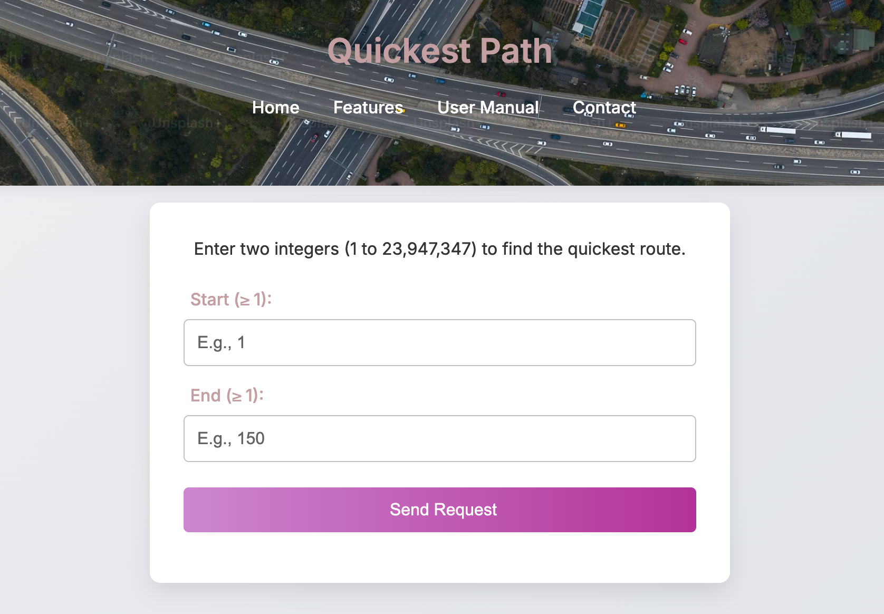

# 🗺️ Quickest Path Algorithm 
Project n°3 of Year 2024-2025 at ALGOSUP

<details>

<summary>

## Table of Contents  

</summary>

- [📋 Project Overview](#-project-overview)
- [👨‍💻 Team 7](#-team-7)
- [📝 Project Documents](#-project-documents)
- [🚀 Features](#-features)
- [📈 Algorithm Explanation](#-algorithm-explanation)
- [📦 Dataset](#-dataset)
- [📂 Project Structure](#-project-structure)
- [⚙️ Setup and Installation](#️-setup-and-installation)
  - [1. Install LFS](#1-install-lfs)
  - [2. Enable LFS for Git](#2-enable-lfs-for-git)
  - [3. Clone the repository](#3-clone-the-repository)
  - [4. Run the project](#4-run-the-project)
- [🌐 Front End](#-front-end)
- [📚 API Documentation](#-api-documentation)
- [🖥️ Server Documentation](#️-server-documentation)
- [📄 License](#-license)

</details>

# 📋 Project Overview

This project provides a high-performance software solution to calculate the quickest path between two landmarks in the United States. The solution is exposed as a REST API, capable of handling requests efficiently and returning responses in JSON or XML formats.
The challenge we reached was to not exceed 1 second for the response time after calculation and API handling.

# 👨‍💻 Team 7

| Name               | Role                | Picture                                                                 | Profile                                                                 |
|--------------------|---------------------|------------------------------------------------------------------------|-------------------------------------------------------------------------|
| Abderrazaq Makran  | Program Manager     |      |  [LinkedIn](https://www.linkedin.com/in/abderrazaq-makran) <br>  [GitHub](https://github.com/Amakran2003) |
| Elone Dellile      | Project Manager     |           |  [LinkedIn](https://www.linkedin.com/in/elonedellile) <br>  [GitHub](https://github.com/HiNett)         |
| Guillaume Deramchi | Technical Lead      |       |  [LinkedIn](https://www.linkedin.com/in/guillaume-deramchi/) <br>  [GitHub](https://github.com/Guillaume18100) |
| Pierre Gorin       | Quality Assurance   |          |  [LinkedIn](https://www.linkedin.com/in/pierre-gorin-61a784221/) <br>  [GitHub](https://github.com/Pierre2103)           |
| Benoît De Keyn     | Software Engineer   |          |  [LinkedIn](https://www.linkedin.com/in/beno%C3%AEt-de-keyn-71611b293/) <br>  [GitHub](https://github.com/benoitdekeyn)       |
| Axel David         | Software Engineer   |            |  [LinkedIn](https://www.linkedin.com/in/axel-david-6384bb32a/) <br>  [GitHub](https://github.com/Fus1onAxel)               |

# 📝 Project Documents

- [Call for Tender](Document/Functional/call_for_tender.pdf)
- [Project Charter](Document/Management/ProjectCharter.md)
- [Functional Specifications](Document/Functional/FunctionalSpecifications.md)
- [Technical Specifications](Document/Technical/TechnicalSpecifications.md)
- [Quality Assurance Strategy](Document/QA/TestStrategy.md)
- [Project Management Artifacts](Document/Management/ManagementArtifacts.md)
- [User Manual](https://quickest-path-team-7.gitbook.io/quickest-path-team-7-docs/)
  
# 🚀 Features

- **Core application**: Calculates the shortest or approximate quickest path between two landmarks.
- **REST API**: Provides a web service for sending requests and receiving responses.
- **Multi-Format Support**: Returns responses in JSON or XML.
- **Performance Optimization**: Designed to handle large datasets efficiently.
- **Debugging Information**: Provides additional information for debugging purposes.
- **Comparator Mode**: Compares the precision of A* and Dijkstra's algorithms.
- **Command Line Interface**: Supports various commands for configuration and control.
- **Front End**: Provides a user-friendly interface to test the API.
- **Cross-Platform**: Works on Windows, macOS, and Linux.
- **Data Integrity Checker**: A tool to ensure the integrity of your dataset.
- **Personalization**: Allows customization of the heuristic weight and number of landmarks: You can tune the heuristic weight from 0 (behaves as Dijkstra's algorithm) to as far as you want (so relying only on the estimation of distance to goal). In the second situation, the algorithm will be faster but may give a poor path due to obstacles not taken into account. 1.02 is a good value to keep a path below 1% of the optimal path.

# 📈 Algorithm Explanation

Imagine you are in a city and want to find the quickest route to a destination. You have a map, but instead of just looking at the map, you also have some "landmarks" that help you estimate distances more accurately. Here's how our algorithm works:

1. **Landmarks**: Think of landmarks as well-known points in the city, like famous buildings or intersections. These landmarks help you estimate how far you are from your destination. For example, if you know the distance from your current location to a landmark and from the landmark to your destination, you can make a good guess about the total distance.

2. **A* Algorithm**: This is like having a smart GPS that not only looks at the direct distance but also considers the estimated distance to the destination. It combines:
   - `g(n)`: The actual cost from the start point to the current point.
   - `h(n)`: The estimated cost from the current point to the destination, using landmarks.

3. **Dijkstra's Algorithm**: This is like a traditional GPS that only looks at the actual distances without any estimation. It finds the shortest path by exploring all possible routes.

4. **Comparator Mode**: This mode compares the paths found by A* and Dijkstra's algorithms. It helps us understand how close the path found with A* algorithm is to the optimal path found by Dijkstra's one, within a far faster time.

5. **Why A\* ?**: A* algorithm with landmarks table (aka A* ALT) is faster because it uses estimates to prioritize which paths to explore, reducing the number of unnecessary calculations by pruning paths that are unlikely to be the shortest. It is a good balance between speed and accuracy.

# 📦 Dataset

The dataset used for this project is the USA road network, which contains a list of ~28 000 000 weighted edges between ~24 000 000 nodes.
The dataset is stored in a CSV file you can find here: [USA-roads.csv](code/path_finder/files/USA-roads.csv).

# 📂 Project Structure

## Global Structure
```plaintext
2024-2025-project-3-quickest-path-team-7/
├── code/
│   ├── front/
│   ├── integrity_checker/
│   ├── path_finder/
├── Document/
│   ├── Functional/
│   ├── Technical/
│   ├── QA/
│   └── Management/
├── README.md
└── LICENSE
```

## Code Structure
```plaintext
code/
├── front/
│   ├── index.html
│   ├── style.css
│   └── main.js
├── integrity_checker/
│   ├── checker.cpp
│   └── checker.hpp
├── path_finder/
│   ├── files/
│   │   ├── USA-roads.csv
│   │   ... (built backups)
│   │   ... (output files)
│   ├── headers/
│   │   ├── algorithms.hpp
│   │   ├── api.hpp
│   │   ├── graph.hpp
│   │   ... (other headers)
│   └── main.cpp
├── macLinuxProjectBuilder.sh
└── windowsProjectBuilder.bat
```

# ⚙️ Setup and Installation

## 1. Install LFS

To deal with large files in Git, you need to install Git LFS (Large File Storage) before cloning the repository.

However, if you use **GitHub Desktop**, go to [step 4](#4-run-the-project) directly.

### For Windows:
```bash
winget install --id=GitHub.GitLFS
```
### For macOS:
```bash
brew install git-lfs
```
### For Linux:
```bash
sudo apt-get install git-lfs
```

## 2. Enable LFS for Git
In any terminal, run the following command:
```sh
git lfs install
```

## 3. Clone the repository
```sh
git clone https://github.com/algosup/2024-2025-project-3-quickest-path-team-7.git
cd 2024-2025-project-3-quickest-path-team-7
```

## 4. Run the project

The 2 scripts provided [here](code) to build and run the project on Windows and macOS/Linux will automatically :
  - Install the compiler if needed
  - Compile the C++ code for path_finder
  - Run the server
  - Open the front end in your default browser

### For Windows:
Run the provided batch script to build and run the project:
```sh
cd code
windowsProjectBuilder.bat
```

### For macOS/Linux:
Run the provided shell script to build and run the project:
```sh
cd code
sh macLinuxProjectBuilder.sh
```
If required, give the execution rights to the script before running it:
```sh
chmod 777 macLinuxProjectBuilder.sh
```


# 🌐 Front End

A front end is provided to conveniently test the API. It is launched automatically by the project builders or can be run manually by opening `code/front/index.html`.



# 📚 API Documentation

## Endpoints

### 1. `GET /path`

Calculates the quickest path between two landmarks.

**Request Parameters**:
- `start` (integer): ID of the start landmark.
- `end` (integer): ID of the destination landmark.
- `format` (optional, string): Response format (`json` or `xml`).

**Example Requests**:
```
GET /path?start=100&end=200
GET /path?start=100&end=200&format=xml
```

**Example Responses**:

**JSON**:
```json
{
    "path_length": "12079",
    "path": ["100", "150", "200"]
}
```

**XML**:
```xml
<response>
    <path_length>12079</path_length>
    <path>
        <node>100</node>
        <node>150</node>
        <node>200</node>
    </path>
</response>
```

### 2. `GET /comp_path`

Compares the quickest path calculated by A* and Dijkstra's algorithms.
Oversize percentage is the percentage of the path length that the A* algorithm can exceed compared to Dijkstra's algorithm which is the optimal path.

**Request Parameters**:
- `start` (integer): ID of the start landmark.
- `end` (integer): ID of the destination landmark.
- `format` (optional, string): Response format (`json` or `xml`).

**Example Request**:
```
GET /comp_path?start=100&end=200
GET /comp_path?start=100&end=200&format=xml
```

**Example Response in JSON**:

```json
{
    "dataset": "USA-roads.csv",
    "start": "100",
    "end": "200",
    "oversize_percentage": "10.0",
    "dijkstra_path_length": "110",
    "astar_path_length": "120",
    "time_unit": "milliseconds",
    "astar_calculation_time": "50",
    "dijkstra_calculation_time": "100",
    "astar_nodes_quantity": "3",
    "dijkstra_nodes_quantity": "3",
    "heuristic_weight": "1.0",
    "landmarks_quantity": "10",
    "compared_path": [
        {
            "astar": {"id": "100", "weight": "0"},
            "dijkstra": {"id": "100", "weight": "0"}
        },
        {
            "astar": {"id": "150", "weight": "60"},
            "dijkstra": {"id": "150", "weight": "55"}
        },
        {
            "astar": {"id": "200", "weight": "120"},
            "dijkstra": {"id": "200", "weight": "110"}
        }
    ]
}
```

### 3. `GET /debug_path`

Calculates the quickest path between two landmarks with additional debugging information.

**Request Parameters**:
- `start` (integer): ID of the start landmark.
- `end` (integer): ID of the destination landmark.
- `format` (optional, string): Response format (`json` or `xml`).

**Example Request**:
```
GET /debug_path?start=100&end=200
GET /debug_path?start=100&end=200&format=xml
```

**Example Response in JSON**:

```json
{
    "dataset": "USA-roads.csv",
    "start": "100",
    "end": "200",
    "path_length": "120",
    "time_unit": "milliseconds",
    "calculation_time": "50",
    "heuristic_weight": "1.0",
    "landmarks_quantity": "10",
    "landmarks": ["1", "2", "3"],
    "nodes_quantity": "3",
    "path": [
        {"id": "100", "weight": "0"},
        {"id": "150", "weight": "60"},
        {"id": "200", "weight": "120"}
    ]
}
```

# 🖥️ Server Documentation

## Commands

The server supports various commands that can be executed from the command line:

- `[integer]`: Ask for a node Y to calculate the path between X and Y.
- `[string]`: Read if it's a keyword for a preloaded path (such as fast, med, longest,...) and run it.
- `"comparator"`: Activate the comparator mode to evaluate the difference between A* and Dijkstra precision.
- `"exit comparator"`: Deactivate the comparator mode.
- `"weight"`: Change the heuristic weight.
- `"qty lm"`: Change the number of landmarks.
- `"build lm"`: Rebuild the landmarks.
- `"build graph"`: Rebuild the graph.
- `"display lm"`: Display the landmarks.
- `"pwd"`: Display the current working directory.
- `"new dataset"`: Change the dataset name.
- `"files location"`: Change the location of input/output files.
- `"display files"`: Display the current files paths.
- `"new port"`: Change the port number.
- `"display api"`: Display/hide the API responses and requests specifically.
- `"stop"`: Exit the program.

## Example Commands

- To change the heuristic weight:
    The weight must be a positive number, it allows to balance the weight of the heuristic function in the A* algorithm as explained above.
  ```
  weight
  Enter the weight: 1.5
  ```

- To change the number of landmarks:
  Landmarks distances are precomputed then read to estimate distances meeded for A* heuristics.
  ```
  qty lm
  Enter the number of landmarks: 10
  ```

- To change the port number of the API:
    The port number must be a positive integer, it allows to change the port access to API server.
  ```
  new port
  Enter the new port number: 8080
  ```

# 📄 License

This project is licensed under the MIT License. See the `LICENSE` file for details.
